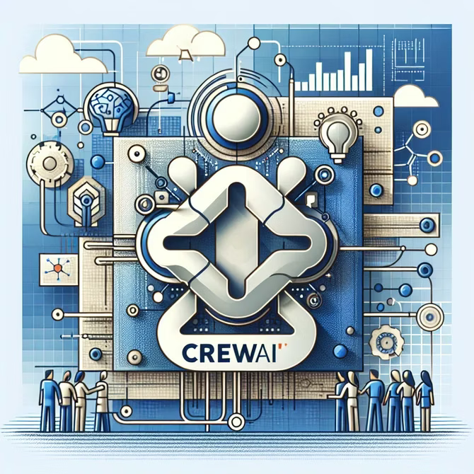

# DALL-E ile Görsel Üretimi

> CrewAI projelerinizde yapay zeka destekli görsel üretimi için DALL-E'yi nasıl kullanacağınızı öğrenin

CrewAI, OpenAI'nin DALL-E'si ile entegrasyonu destekler; yapay zeka ajanlarınızın görevlerinin bir parçası olarak görsel oluşturmasına imkân tanır. Bu kılavuz, CrewAI projelerinizde DALL-E aracını kurma ve kullanma adımlarını açıklamaktadır.

## Ön Koşullar

- crewAI yüklü (en güncel sürüm)
- DALL-E erişimine sahip OpenAI API anahtarı

## DALL-E Aracını Kurma

1. **DALL-E aracını içe aktarın:**

    ```python
    from crewai_tools import DallETool
    ```

2. **DALL-E aracını ajan yapılandırmanıza ekleyin:**

    ```python
    @agent
    def researcher(self) -> Agent:
        return Agent(
            config=self.agents_config['researcher'],
            tools=[SerperDevTool(), DallETool()],  # DallETool'u araç listesine ekleyin
            allow_delegation=False,
            verbose=True
        )
    ```

## DALL-E Aracını Kullanma

Ajanınıza DALL-E aracını ekledikten sonra, araç metin istemlerine göre görsel oluşturabilir. Araç, oluşturulan görsele bir URL döndürür; bu URL ajanın çıktısında kullanılabilir veya daha ileri işleme için diğer ajanlara iletilebilir.

### Örnek Ajan Yapılandırması

```yaml
role: >
    LinkedIn Profili Kıdemli Veri Araştırmacısı
goal: >
    Verilen {name} adı ve {domain} alanına göre ayrıntılı LinkedIn profillerini keşfet
    {domain} alanına göre bir DALL-E görseli oluştur
backstory: >
    En ilgili LinkedIn profillerini ortaya çıkarmada uzman, deneyimli bir araştırmacısınız.
    LinkedIn'de verimli biçimde gezinme yeteneğinizle tanınan; mesleki bilgileri açık
    ve öz şekilde toplama ve sunmada üstünsünüz.
```

### Beklenen Çıktı

DALL-E aracına sahip ajan, görseli oluşturabilecek ve yanıtında bir URL sunacaktır. Ardından görseli indirebilirsiniz.



## En İyi Uygulamalar

1. **Görsel oluşturma istemlerinizde spesifik olun** — En iyi sonuçları almak için ayrıntılı istemler kullanın.
2. **Oluşturma süresini göz önünde bulundurun** — Görsel oluşturma biraz zaman alabilir; görev planlamanızda bunu hesaba katın.
3. **Kullanım politikalarına uyun** — Görsel oluştururken her zaman OpenAI'nin kullanım politikalarına riayet edin.

## Sorun Giderme

1. **API erişimini kontrol edin** — OpenAI API anahtarınızın DALL-E erişimine sahip olduğundan emin olun.
2. **Sürüm uyumluluğu** — crewAI ve crewai-tools'un en güncel sürümlerini kullandığınızı doğrulayın.
3. **Araç yapılandırması** — DALL-E aracının ajanın araç listesine doğru şekilde eklendiğini doğrulayın.
