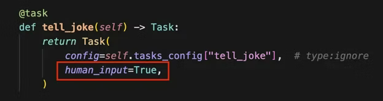
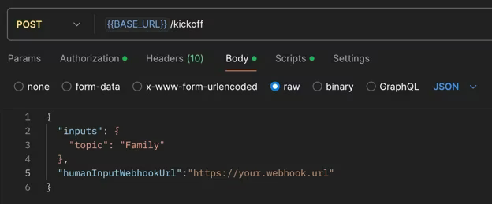
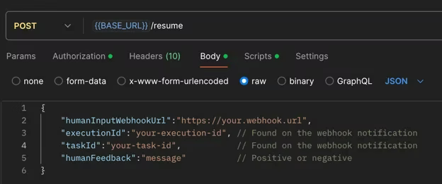

# Döngüde İnsan (HITL) İş Akışları

> Gelişmiş karar alma için CrewAI'de Döngüde İnsan iş akışlarını nasıl uygulayacağınızı öğrenin

Döngüde İnsan (HITL), karar almayı geliştirmek ve görev sonuçlarını iyileştirmek için yapay zekayı insan uzmanlığıyla birleştiren güçlü bir yaklaşımdır. CrewAI, ihtiyaçlarınıza bağlı olarak HITL uygulamak için birden fazla yol sunar.

## HITL Yaklaşımınızı Seçme

CrewAI, döngüde insan iş akışlarını uygulamak için iki temel yaklaşım sunar:

| Yaklaşım | En Uygun Kullanım | Entegrasyon | Sürüm |
| --- | --- | --- | --- |
| **Akış tabanlı** (`@human_feedback` dekoratörü) | Yerel geliştirme, konsol tabanlı inceleme, senkron iş akışları | [Akışlarda İnsan Geri Bildirimi](/en/learn/human-feedback-in-flows) | **1.8.0+** |
| **Webhook tabanlı** (Enterprise) | Üretim dağıtımları, asenkron iş akışları, harici entegrasyonlar (Slack, Teams vb.) | Bu kılavuz | - |

> **İpucu:** Akışlar oluşturuyor ve geri bildirime dayalı yönlendirme içeren insan inceleme adımları eklemek istiyorsanız `@human_feedback` dekoratörü için [Akışlarda İnsan Geri Bildirimi](/en/learn/human-feedback-in-flows) kılavuzuna göz atın.

## Webhook Tabanlı HITL İş Akışlarını Kurma

1. **Görevinizi Yapılandırın**

    Görevinizi insan girdisi etkin olacak şekilde ayarlayın:

    

2. **Webhook URL'si Sağlayın**

    Ekibinizi başlatırken insan girdisi için bir webhook URL'si ekleyin:

    

    Bearer kimlik doğrulamasıyla örnek:

    ```bash
    curl -X POST {BASE_URL}/kickoff \
      -H "Authorization: Bearer YOUR_API_TOKEN" \
      -H "Content-Type: application/json" \
      -d '{
        "inputs": {
          "topic": "AI Research"
        },
        "humanInputWebhook": {
          "url": "https://your-webhook.com/hitl",
          "authentication": {
            "strategy": "bearer",
            "token": "your-webhook-secret-token"
          }
        }
      }'
    ```

    Temel kimlik doğrulamasıyla örnek:

    ```bash
    curl -X POST {BASE_URL}/kickoff \
      -H "Authorization: Bearer YOUR_API_TOKEN" \
      -H "Content-Type: application/json" \
      -d '{
        "inputs": {
          "topic": "AI Research"
        },
        "humanInputWebhook": {
          "url": "https://your-webhook.com/hitl",
          "authentication": {
            "strategy": "basic",
            "username": "your-username",
            "password": "your-password"
          }
        }
      }'
    ```

3. **Webhook Bildirimi Alın**

    Ekip, insan girdisi gerektiren görevi tamamladığında şunları içeren bir webhook bildirimi alırsınız:

    - Yürütme Kimliği
    - Görev Kimliği
    - Görev çıktısı

4. **Görev Çıktısını İnceleyin**

    Sistem `Bekleyen İnsan Girdisi` durumunda duraklar. Görev çıktısını dikkatlice inceleyin.

5. **İnsan Geri Bildirimi Gönderin**

    Ekibinizin devam uç noktasını aşağıdaki bilgilerle çağırın:

    

    > **Uyarı — Kritik: Webhook URL'leri Yeniden Sağlanmalıdır:**
    > Devam çağrısında başlatma çağrısında kullandığınız webhook URL'lerini (`taskWebhookUrl`, `stepWebhookUrl`, `crewWebhookUrl`) **mutlaka** yeniden sağlamanız gerekmektedir. Webhook yapılandırmaları başlatmadan devama **otomatik olarak aktarılmaz** — görev tamamlama, ajan adımları ve ekip tamamlama için bildirim almaya devam edebilmek amacıyla bunların devam isteğine açıkça dahil edilmesi gerekir.

    Webhook'larla devam çağrısı örneği:

    ```bash
    curl -X POST {BASE_URL}/resume \
      -H "Authorization: Bearer YOUR_API_TOKEN" \
      -H "Content-Type: application/json" \
      -d '{
        "execution_id": "abcd1234-5678-90ef-ghij-klmnopqrstuv",
        "task_id": "research_task",
        "human_feedback": "Harika çalışma! Lütfen daha fazla ayrıntı ekleyin.",
        "is_approve": true,
        "taskWebhookUrl": "https://your-server.com/webhooks/task",
        "stepWebhookUrl": "https://your-server.com/webhooks/step",
        "crewWebhookUrl": "https://your-server.com/webhooks/crew"
      }'
    ```

    > **Uyarı — Geri Bildirimin Görev Yürütmesine Etkisi:**
    > Geri bildirim sağlarken dikkatli olmak kritik öneme sahiptir; geri bildirimin tüm içeriği, sonraki görev yürütmeleri için ek bağlam olarak dahil edilir.

    Bu şu anlama gelir:

    - Geri bildiriminizdeki tüm bilgiler görevin bağlamının bir parçası haline gelir.
    - İlgisiz ayrıntılar olumsuz etki yaratabilir.
    - Özlü ve ilgili geri bildirim, görev odağını ve verimliliği korumaya yardımcı olur.
    - Göndermeden önce geri bildiriminizi dikkatlice inceleyin; yalnızca görevin yürütülmesine olumlu katkı sağlayacak ilgili bilgileri içerdiğinden emin olun.

6. **Olumsuz Geri Bildirimi Yönetin**

    Olumsuz geri bildirim sağlarsanız:

    - Ekip, geri bildirimin eklediği bağlamla görevi yeniden dener.
    - Daha ileri inceleme için yeni bir webhook bildirimi alırsınız.
    - Tatmin olana kadar 4-6 arası adımları tekrarlayın.

7. **Yürütmenin Devamı**

    Olumlu geri bildirim gönderdiğinizde yürütme sonraki adımlara devam eder.

## En İyi Uygulamalar

- **Spesifik Olun**: Eldeki görevi doğrudan ele alan net ve uygulanabilir geri bildirimler sağlayın
- **İlgili Kalın**: Yalnızca görev yürütmesini iyileştirmeye yardımcı olacak bilgileri dahil edin
- **Zamanında Yanıt Verin**: İş akışı gecikmelerini önlemek için HITL istemlerine hızlıca yanıt verin
- **Dikkatlice İnceleyin**: Doğruluğu sağlamak için göndermeden önce geri bildiriminizi iki kez kontrol edin

## Yaygın Kullanım Durumları

HITL iş akışları özellikle şunlar için değerlidir:

- Kalite güvencesi ve doğrulama
- Karmaşık karar alma senaryoları
- Hassas veya yüksek riskli operasyonlar
- İnsan yargısı gerektiren yaratıcı görevler
- Uyumluluk ve düzenleyici incelemeler

## Enterprise Özellikleri

**[Akış HITL Yönetim Platformu](/en/enterprise/features/flow-hitl-management)** — CrewAI Enterprise, platform içi inceleme, yanıtlayıcı atama, izinler, yükseltme politikaları, SLA yönetimi, dinamik yönlendirme ve tam analitik içeren Akışlar için kapsamlı bir HITL yönetim sistemi sunar. [Daha fazla bilgi →](/en/enterprise/features/flow-hitl-management)
