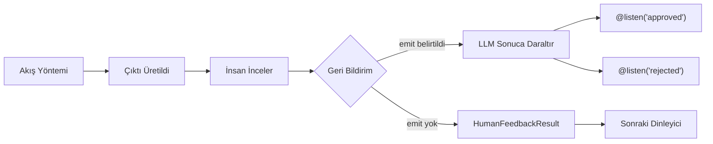

> ## Dokümantasyon Dizini
> Tam dokümantasyon dizinine şu adresten ulaşabilirsiniz: https://docs.crewai.com/llms.txt
> Daha fazla keşfetmeden önce mevcut tüm sayfaları bulmak için bu dosyayı kullanın.

# Akışlarda İnsan Geri Bildirimi

> `@human_feedback` dekoratörünü kullanarak insan geri bildirimini doğrudan CrewAI Akışlarınıza nasıl entegre edeceğinizi öğrenin

## Genel Bakış

> **Not:** `@human_feedback` dekoratörü **CrewAI 1.8.0 veya üzeri sürüm** gerektirir. Bu özelliği kullanmadan önce kurulumunuzu güncellediğinizden emin olun.

`@human_feedback` dekoratörü, doğrudan CrewAI Akışları içinde döngüde insan (HITL) iş akışlarını etkinleştirir. Akış yürütmesini duraklatmanıza, çıktıyı insan incelemesine sunmanıza, geri bildirim toplamanıza ve isteğe bağlı olarak geri bildirimin sonucuna göre farklı dinleyicilere yönlendirmenize imkân tanır.

Bu özellik özellikle şunlar için değerlidir:

- **Kalite güvencesi**: Aşağı akışta kullanılmadan önce yapay zeka tarafından üretilen içeriği inceleyin
- **Karar kapıları**: Otomatik iş akışlarında kritik kararları insanların almasını sağlayın
- **Onay iş akışları**: Onayla/reddet/gözden geçir kalıplarını uygulayın
- **Etkileşimli iyileştirme**: Çıktıları yinelemeli olarak geliştirmek için geri bildirim toplayın



## Hızlı Başlangıç

Bir akışa insan geri bildirimi eklemenin en basit yolu:

```python
from crewai.flow.flow import Flow, start, listen
from crewai.flow.human_feedback import human_feedback

class SimpleReviewFlow(Flow):
    @start()
    @human_feedback(message="Lütfen bu içeriği inceleyin:")
    def generate_content(self):
        return "İnceleme gerektiren yapay zeka tarafından üretilmiş içerik."

    @listen(generate_content)
    def process_feedback(self, result):
        print(f"İçerik: {result.output}")
        print(f"İnsan şunu söyledi: {result.feedback}")

flow = SimpleReviewFlow()
flow.kickoff()
```

Bu akış çalıştığında:

1. `generate_content` yürütülür ve string döndürür
2. Çıktı kullanıcıya istek mesajıyla birlikte gösterilir
3. Kullanıcının geri bildirim yazması beklenir (veya atlamak için Enter'a basması)
4. `process_feedback`'e bir `HumanFeedbackResult` nesnesi iletilir

## @human\_feedback Dekoratörü

### Parametreler

| Parametre | Tür | Gerekli | Açıklama |
| --- | --- | --- | --- |
| `message` | `str` | Evet | Yöntem çıktısının yanında insana gösterilen mesaj |
| `emit` | `Sequence[str]` | Hayır | Olası sonuçlar listesi. Geri bildirim bunlardan birine daraltılır ve `@listen` dekoratörlerini tetikler |
| `llm` | `str \| BaseLLM` | `emit` belirtildiğinde | Geri bildirimi yorumlamak ve sonuca eşlemek için kullanılan LLM |
| `default_outcome` | `str` | Hayır | Geri bildirim sağlanmadığında kullanılacak sonuç. `emit` içinde olmalıdır |
| `metadata` | `dict` | Hayır | Enterprise entegrasyonlar için ek veri |
| `provider` | `HumanFeedbackProvider` | Hayır | Asenkron/bloklamayan geri bildirim için özel sağlayıcı. Bkz. [Asenkron İnsan Geri Bildirimi](#asenkron-insan-geri-bildirimi-bloklamayan) |
| `learn` | `bool` | Hayır | HITL öğrenimini etkinleştirir: geri bildirimden dersler çıkarır ve gelecekteki çıktıyı önceden inceler. Varsayılan `False`. Bkz. [Geri Bildirimden Öğrenme](#geri-bildirimden-ogrenme) |
| `learn_limit` | `int` | Hayır | Ön inceleme için hatırlanacak maksimum geçmiş ders sayısı. Varsayılan `5` |

### Temel Kullanım (Yönlendirme Olmadan)

`emit` belirtmediğinizde dekoratör yalnızca geri bildirim toplar ve sonraki dinleyiciye bir `HumanFeedbackResult` iletir:

```python
@start()
@human_feedback(message="Bu analiz hakkında ne düşünüyorsunuz?")
def analyze_data(self):
    return "Analiz sonuçları: Gelir %15 arttı, maliyetler %8 düştü"

@listen(analyze_data)
def handle_feedback(self, result):
    # result bir HumanFeedbackResult nesnesidir
    print(f"Analiz: {result.output}")
    print(f"Geri bildirim: {result.feedback}")
```

### emit ile Yönlendirme

`emit` belirttiğinizde dekoratör bir yönlendirici olur. İnsanın serbest biçimli geri bildirimi bir LLM tarafından yorumlanır ve belirtilen sonuçlardan birine daraltılır:

```python
from crewai.flow.flow import Flow, start, listen, or_
from crewai.flow.human_feedback import human_feedback

class ReviewFlow(Flow):
    @start()
    def generate_content(self):
        return "Taslak blog yazısı içeriği..."

    @human_feedback(
        message="Bu içeriği yayınlamak için onaylıyor musunuz?",
        emit=["approved", "rejected", "needs_revision"],
        llm="gpt-4o-mini",
        default_outcome="needs_revision",
    )
    @listen(or_("generate_content", "needs_revision"))
    def review_content(self):
        return "Taslak blog yazısı içeriği..."

    @listen("approved")
    def publish(self, result):
        print(f"Yayınlanıyor! Kullanıcı şunu söyledi: {result.feedback}")

    @listen("rejected")
    def discard(self, result):
        print(f"Atılıyor. Neden: {result.feedback}")
```

İnsan "daha fazla ayrıntı gerekiyor" gibi bir şey söylediğinde LLM bunu `"needs_revision"` olarak daraltır; bu da `or_()` aracılığıyla `review_content`'i yeniden tetikler — bir revizyon döngüsü oluşturur. Döngü, sonuç `"approved"` veya `"rejected"` olana kadar devam eder.

> **İpucu:** LLM, yanıtın belirttiğiniz sonuçlardan biri olduğunu garantilemek için mümkün olduğunda yapılandırılmış çıktılar (fonksiyon çağırma) kullanır. Bu, yönlendirmeyi güvenilir ve öngörülebilir kılar.

> **Uyarı:** `@start()` yöntemi akışın başında yalnızca bir kez çalışır. Revizyon döngüsüne ihtiyaç duyuyorsanız başlangıç yöntemini inceleme yönteminden ayırın ve inceleme yöntemi üzerinde `@listen(or_("tetikleyici", "revizyon_sonucu"))` kullanarak öz döngüyü etkinleştirin.

## HumanFeedbackResult

`HumanFeedbackResult` veri sınıfı, bir insan geri bildirimi etkileşimine ait tüm bilgileri içerir:

```python
from crewai.flow.human_feedback import HumanFeedbackResult

@dataclass
class HumanFeedbackResult:
    output: Any              # İnsana gösterilen orijinal yöntem çıktısı
    feedback: str            # İnsandan gelen ham geri bildirim metni
    outcome: str | None      # Daraltılmış sonuç (emit belirtildiyse)
    timestamp: datetime      # Geri bildirimin alındığı zaman
    method_name: str         # Dekore edilmiş yöntemin adı
    metadata: dict           # Dekoratöre iletilen herhangi bir meta veri
```

### Dinleyicilerde Erişim

Bir dinleyici `emit` ile `@human_feedback` yöntemi tarafından tetiklendiğinde `HumanFeedbackResult` alır:

```python
@listen("approved")
def on_approval(self, result: HumanFeedbackResult):
    print(f"Orijinal çıktı: {result.output}")
    print(f"Kullanıcı geri bildirimi: {result.feedback}")
    print(f"Sonuç: {result.outcome}")  # "approved"
    print(f"Alındığı zaman: {result.timestamp}")
```

## Geri Bildirim Geçmişine Erişim

`Flow` sınıfı, insan geri bildirimine erişmek için iki nitelik sağlar:

### last\_human\_feedback

En son `HumanFeedbackResult`'ı döndürür:

```python
@listen(some_method)
def check_feedback(self):
    if self.last_human_feedback:
        print(f"Son geri bildirim: {self.last_human_feedback.feedback}")
```

### human\_feedback\_history

Akış sırasında toplanan tüm `HumanFeedbackResult` nesnelerinin listesi:

```python
@listen(final_step)
def summarize(self):
    print(f"Toplam toplanan geri bildirim: {len(self.human_feedback_history)}")
    for i, fb in enumerate(self.human_feedback_history):
        print(f"{i+1}. {fb.method_name}: {fb.outcome or 'yönlendirme yok'}")
```

> **Uyarı:** Her `HumanFeedbackResult`, `human_feedback_history`'e eklenir; bu nedenle birden fazla geri bildirim adımı birbirinin üzerine yazılmaz. Akış sırasında toplanan tüm geri bildirimlere erişmek için bu listeyi kullanın.

## Tam Örnek: İçerik Onay İş Akışı

Revizyon döngüsü içeren tam bir içerik inceleme ve onay iş akışı örneği:

```python
from crewai.flow.flow import Flow, start, listen, or_
from crewai.flow.human_feedback import human_feedback, HumanFeedbackResult
from pydantic import BaseModel


class ContentState(BaseModel):
    draft: str = ""
    revision_count: int = 0
    status: str = "pending"


class ContentApprovalFlow(Flow[ContentState]):
    """İnsan onaylayıncaya kadar içerik oluşturup döngü yapan bir akış."""

    @start()
    def generate_draft(self):
        self.state.draft = "# Yapay Zeka Güvenliği\n\nBu, Yapay Zeka Güvenliği hakkında bir taslaktır..."
        return self.state.draft

    @human_feedback(
        message="Lütfen bu taslağı inceleyin. Onaylayın, reddedin veya nelerin değişmesi gerektiğini açıklayın:",
        emit=["approved", "rejected", "needs_revision"],
        llm="gpt-4o-mini",
        default_outcome="needs_revision",
    )
    @listen(or_("generate_draft", "needs_revision"))
    def review_draft(self):
        self.state.revision_count += 1
        return f"{self.state.draft} (v{self.state.revision_count})"

    @listen("approved")
    def publish_content(self, result: HumanFeedbackResult):
        self.state.status = "published"
        print(f"İçerik onaylandı ve yayınlandı! İnceleyici şunu söyledi: {result.feedback}")
        return "published"

    @listen("rejected")
    def handle_rejection(self, result: HumanFeedbackResult):
        self.state.status = "rejected"
        print(f"İçerik reddedildi. Neden: {result.feedback}")
        return "rejected"


flow = ContentApprovalFlow()
result = flow.kickoff()
print(f"\nAkış tamamlandı. Durum: {flow.state.status}, İnceleme sayısı: {flow.state.revision_count}")
```

```text
==================================================
İNCELENECEK ÇIKTI:
==================================================
# Yapay Zeka Güvenliği

Bu, Yapay Zeka Güvenliği hakkında bir taslaktır... (v1)
==================================================

Lütfen bu taslağı inceleyin. Onaylayın, reddedin veya nelerin değişmesi gerektiğini açıklayın:
(Atlamak için Enter'a basın veya geri bildiriminizi yazın)

Geri bildiriminiz: Hizalama araştırması hakkında daha fazla ayrıntı gerekiyor

==================================================
İNCELENECEK ÇIKTI:
==================================================
# Yapay Zeka Güvenliği

Bu, Yapay Zeka Güvenliği hakkında bir taslaktır... (v2)
==================================================

Lütfen bu taslağı inceleyin. Onaylayın, reddedin veya nelerin değişmesi gerektiğini açıklayın:
(Atlamak için Enter'a basın veya geri bildiriminizi yazın)

Geri bildiriminiz: Güzel görünüyor, onaylandı!

İçerik onaylandı ve yayınlandı! İnceleyici şunu söyledi: Güzel görünüyor, onaylandı!

Akış tamamlandı. Durum: published, İnceleme sayısı: 2
```

Temel kalıp `@listen(or_("generate_draft", "needs_revision"))` şeklindedir — inceleme yöntemi hem ilk tetikleyiciyi hem de kendi revizyon sonucunu dinler; insan onaylayıncaya veya reddedince kadar tekrarlanan bir öz döngü oluşturur.

## Diğer Dekoratörlerle Birleştirme

`@human_feedback` dekoratörü `@start()`, `@listen()` ve `or_()` ile birlikte çalışır. Her iki dekoratör sıralaması da çalışır ancak önerilen kalıplar şunlardır:

```python
# Akışın başında tek seferlik inceleme (öz döngü yok)
@start()
@human_feedback(message="Bunu inceleyin:", emit=["approved", "rejected"], llm="gpt-4o-mini")
def my_start_method(self):
    return "içerik"

# Dinleyici üzerinde doğrusal inceleme (öz döngü yok)
@listen(other_method)
@human_feedback(message="Bunu da inceleyin:", emit=["good", "bad"], llm="gpt-4o-mini")
def my_listener(self, data):
    return f"işlendi: {data}"

# Öz döngü: revizyonlar için geri dönebilen inceleme
@human_feedback(message="Onaylayın veya gözden geçirin?", emit=["approved", "revise"], llm="gpt-4o-mini")
@listen(or_("upstream_method", "revise"))
def review_with_loop(self):
    return "incelenecek içerik"
```

### Öz Döngü Kalıbı

Revizyon döngüsü oluşturmak için inceleme yöntemi `or_()` kullanarak hem yukarı akış tetikleyicisini hem de kendi revizyon sonucunu dinlemelidir:

```python
@start()
def generate(self):
    return "ilk taslak"

@human_feedback(
    message="Onaylayın veya değişiklik isteyin?",
    emit=["revise", "approved"],
    llm="gpt-4o-mini",
    default_outcome="approved",
)
@listen(or_("generate", "revise"))
def review(self):
    return "içerik"

@listen("approved")
def publish(self):
    return "yayınlandı"
```

Sonuç `"revise"` olduğunda akış, `review`'a geri yönlenir (çünkü `or_()` aracılığıyla `"revise"`'ı dinler). Sonuç `"approved"` olduğunda akış `publish`'e devam eder.

### Zincirlenmiş Yönlendiriciler

Bir yönlendiricinin sonucu tarafından tetiklenen bir dinleyici kendisi de yönlendirici olabilir:

```python
@start()
def generate(self):
    return "taslak içerik"

@human_feedback(message="İlk inceleme:", emit=["approved", "rejected"], llm="gpt-4o-mini")
@listen("generate")
def first_review(self):
    return "taslak içerik"

@human_feedback(message="Son inceleme:", emit=["publish", "hold"], llm="gpt-4o-mini")
@listen("approved")
def final_review(self, prev):
    return "son içerik"

@listen("publish")
def on_publish(self, prev):
    return "yayınlandı"

@listen("hold")
def on_hold(self, prev):
    return "sonraya ertelendi"
```

### Sınırlamalar

- **`@start()` yöntemleri bir kez çalışır**: `@start()` yöntemi öz döngü yapamaz. Revizyon döngüsüne ihtiyaç duyuyorsanız giriş noktası olarak ayrı bir `@start()` yöntemi kullanın ve `@human_feedback`'i bir `@listen()` yöntemi üzerine yerleştirin.
- **Aynı yöntemde `@start()` + `@listen()` olmaz**: Bu bir Flow çerçevesi kısıtlamasıdır. Bir yöntem ya başlangıç noktasıdır ya dinleyicidir, ikisi birden olamaz.

## En İyi Uygulamalar

### 1. Net İstek Mesajları Yazın

`message` parametresi insanın gördüğü şeydir. Uygulanabilir hale getirin:

```python
# ✅ İyi - net ve uygulanabilir
@human_feedback(message="Bu özet temel noktaları doğru şekilde yansıtıyor mu? 'Evet' yazın veya eksikleri açıklayın:")

# ❌ Kötü - belirsiz
@human_feedback(message="Bunu inceleyin:")
```

### 2. Anlamlı Sonuçlar Seçin

`emit` kullanırken insan yanıtlarıyla doğal şekilde eşleşen sonuçlar seçin:

```python
# ✅ İyi - doğal dil sonuçları
emit=["approved", "rejected", "needs_more_detail"]

# ❌ Kötü - teknik veya belirsiz
emit=["state_1", "state_2", "state_3"]
```

### 3. Her Zaman Varsayılan Sonuç Belirtin

Kullanıcıların hiçbir şey yazmadan Enter'a bastığı durumları yönetmek için `default_outcome` kullanın:

```python
@human_feedback(
    message="Onaylıyor musunuz? (revizyon istemek için Enter'a basın)",
    emit=["approved", "needs_revision"],
    llm="gpt-4o-mini",
    default_outcome="needs_revision",  # Güvenli varsayılan
)
```

### 4. Denetim İzleri İçin Geri Bildirim Geçmişini Kullanın

Denetim günlükleri oluşturmak için `human_feedback_history`'e erişin:

```python
@listen(final_step)
def create_audit_log(self):
    log = []
    for fb in self.human_feedback_history:
        log.append({
            "adım": fb.method_name,
            "sonuç": fb.outcome,
            "geri_bildirim": fb.feedback,
            "zaman_damgası": fb.timestamp.isoformat(),
        })
    return log
```

### 5. Yönlendirmeli ve Yönlendirmesiz Geri Bildirimi Yönetin

Akışlar tasarlarken yönlendirmeye ihtiyaç duyup duymadığınızı göz önünde bulundurun:

| Senaryo | Kullanım |
| --- | --- |
| Basit inceleme, yalnızca geri bildirim metni gerekli | `emit` yok |
| Yanıta göre farklı yollara dallanma gerekiyor | `emit` kullan |
| Onayla/reddet/gözden geçir kalıplı onay kapıları | `emit` kullan |
| Yalnızca günlükleme için yorum toplama | `emit` yok |

## Asenkron İnsan Geri Bildirimi (Bloklamayan)

Varsayılan olarak `@human_feedback`, konsol girdisini beklerken yürütmeyi bloklar. Üretim uygulamaları için Slack, e-posta, webhook'lar veya API'lerle entegre olan **asenkron/bloklamayan** geri bildirime ihtiyaç duyabilirsiniz.

### Sağlayıcı Soyutlaması

Özel bir geri bildirim toplama stratejisi belirtmek için `provider` parametresini kullanın:

```python
from crewai.flow import Flow, start, human_feedback, HumanFeedbackProvider, HumanFeedbackPending, PendingFeedbackContext

class WebhookProvider(HumanFeedbackProvider):
    """Akışı durduran ve webhook geri çağrısını bekleyen sağlayıcı."""

    def __init__(self, webhook_url: str):
        self.webhook_url = webhook_url

    def request_feedback(self, context: PendingFeedbackContext, flow: Flow) -> str:
        # Harici sistemi bildir (ör. Slack mesajı gönder, bilet oluştur)
        self.send_notification(context)

        # Yürütmeyi durdur - çerçeve kalıcılığı otomatik olarak yönetir
        raise HumanFeedbackPending(
            context=context,
            callback_info={"webhook_url": f"{self.webhook_url}/{context.flow_id}"}
        )

class ReviewFlow(Flow):
    @start()
    @human_feedback(
        message="Bu içeriği inceleyin:",
        emit=["approved", "rejected"],
        llm="gpt-4o-mini",
        provider=WebhookProvider("https://myapp.com/api"),
    )
    def generate_content(self):
        return "Yapay zeka tarafından üretilen içerik..."

    @listen("approved")
    def publish(self, result):
        return "Yayınlandı!"
```

> **İpucu:** Akış çerçevesi, `HumanFeedbackPending` fırlatıldığında durumu **otomatik olarak kalıcı hale getirir**. Sağlayıcınızın yalnızca harici sistemi bildirmesi ve istisnayı fırlatması yeterlidir — manuel kalıcılık çağrısı gerekmez.

### Duraklatılmış Akışları Yönetme

Asenkron sağlayıcı kullanıldığında `kickoff()`, istisna fırlatmak yerine bir `HumanFeedbackPending` nesnesi döndürür:

```python
flow = ReviewFlow()
result = flow.kickoff()

if isinstance(result, HumanFeedbackPending):
    # Akış duraklatıldı, durum otomatik olarak kalıcı hale getirildi
    print(f"Şu adreste geri bildirim bekleniyor: {result.callback_info['webhook_url']}")
    print(f"Akış Kimliği: {result.context.flow_id}")
else:
    # Normal tamamlama
    print(f"Akış tamamlandı: {result}")
```

### Duraklatılmış Akışı Sürdürme

Geri bildirim geldiğinde (ör. webhook aracılığıyla) akışı sürdürün:

```python
# Senkron yönetici:
def handle_feedback_webhook(flow_id: str, feedback: str):
    flow = ReviewFlow.from_pending(flow_id)
    result = flow.resume(feedback)
    return result

# Asenkron yönetici (FastAPI, aiohttp vb.):
async def handle_feedback_webhook(flow_id: str, feedback: str):
    flow = ReviewFlow.from_pending(flow_id)
    result = await flow.resume_async(feedback)
    return result
```

### Temel Türler

| Tür | Açıklama |
| --- | --- |
| `HumanFeedbackProvider` | Özel geri bildirim sağlayıcıları için protokol |
| `PendingFeedbackContext` | Duraklatılmış bir akışı sürdürmek için gereken tüm bilgiler |
| `HumanFeedbackPending` | Akış geri bildirim için duraklatıldığında `kickoff()` tarafından döndürülür |
| `ConsoleProvider` | Varsayılan bloklanyan konsol girdi sağlayıcısı |

### PendingFeedbackContext

Bağlam, sürdürme için gereken her şeyi içerir:

```python
@dataclass
class PendingFeedbackContext:
    flow_id: str           # Bu akış yürütmesi için benzersiz tanımlayıcı
    flow_class: str        # Tam nitelikli sınıf adı
    method_name: str       # Geri bildirimi tetikleyen yöntem
    method_output: Any     # İnsana gösterilen çıktı
    message: str           # İstek mesajı
    emit: list[str] | None # Yönlendirme için olası sonuçlar
    default_outcome: str | None
    metadata: dict         # Özel meta veri
    llm: str | None        # Sonuç daraltma için LLM
    requested_at: datetime
```

### Tam Asenkron Akış Örneği

```python
from crewai.flow import (
    Flow, start, listen, human_feedback,
    HumanFeedbackProvider, HumanFeedbackPending, PendingFeedbackContext
)

class SlackNotificationProvider(HumanFeedbackProvider):
    """Slack bildirimleri gönderen ve asenkron geri bildirim için duraklayana sağlayıcı."""

    def __init__(self, channel: str):
        self.channel = channel

    def request_feedback(self, context: PendingFeedbackContext, flow: Flow) -> str:
        # Slack bildirimi gönder (kendi uygulamanızı yazın)
        slack_thread_id = self.post_to_slack(
            channel=self.channel,
            message=f"İnceleme gerekli:\n\n{context.method_output}\n\n{context.message}",
        )

        # Yürütmeyi durdur - çerçeve kalıcılığı otomatik olarak yönetir
        raise HumanFeedbackPending(
            context=context,
            callback_info={
                "slack_channel": self.channel,
                "thread_id": slack_thread_id,
            }
        )

class ContentPipeline(Flow):
    @start()
    @human_feedback(
        message="Bu içeriği yayınlamak için onaylıyor musunuz?",
        emit=["approved", "rejected"],
        llm="gpt-4o-mini",
        default_outcome="rejected",
        provider=SlackNotificationProvider("#content-reviews"),
    )
    def generate_content(self):
        return "Yapay zeka tarafından üretilen blog yazısı içeriği..."

    @listen("approved")
    def publish(self, result):
        print(f"Yayınlanıyor! İnceleyici şunu söyledi: {result.feedback}")
        return {"status": "published"}

    @listen("rejected")
    def archive(self, result):
        print(f"Arşivlendi. Neden: {result.feedback}")
        return {"status": "archived"}


# Akışı başlatma (duraklar ve Slack yanıtını bekler)
def start_content_pipeline():
    flow = ContentPipeline()
    result = flow.kickoff()

    if isinstance(result, HumanFeedbackPending):
        return {"status": "pending", "flow_id": result.context.flow_id}

    return result


# Slack webhook tetiklendiğinde sürdürme (senkron yönetici)
def on_slack_feedback(flow_id: str, slack_message: str):
    flow = ContentPipeline.from_pending(flow_id)
    result = flow.resume(slack_message)
    return result


# Asenkron yöneticiniz varsa (FastAPI, aiohttp, Slack Bolt asenkron vb.)
async def on_slack_feedback_async(flow_id: str, slack_message: str):
    flow = ContentPipeline.from_pending(flow_id)
    result = await flow.resume_async(slack_message)
    return result
```

> **Uyarı:** Asenkron bir web çerçevesi (FastAPI, aiohttp, Slack Bolt asenkron modu) kullanıyorsanız `flow.resume()` yerine `await flow.resume_async()` kullanın. Çalışan bir olay döngüsü içinden `resume()` çağırmak `RuntimeError` fırlatır.

### Asenkron Geri Bildirim İçin En İyi Uygulamalar

1. **Dönüş türünü kontrol edin**: `kickoff()`, duraklatıldığında `HumanFeedbackPending` döndürür — try/except gerekmez
2. **Doğru sürdürme yöntemini kullanın**: Senkron kodda `resume()`, asenkron kodda `await resume_async()` kullanın
3. **Geri çağırma bilgisini saklayın**: Webhook URL'lerini, bilet kimliklerini vb. saklamak için `callback_info` kullanın
4. **Idempotency uygulayın**: Güvenlik için sürdürme yöneticiniz idempotent olmalıdır
5. **Otomatik kalıcılık**: `HumanFeedbackPending` fırlatıldığında durum otomatik olarak kaydedilir; varsayılan olarak `SQLiteFlowPersistence` kullanır
6. **Özel kalıcılık**: Gerekirse `from_pending()`'e özel bir kalıcılık örneği iletin

## Geri Bildirimden Öğrenme

`learn=True` parametresi, insan inceleyiciler ile bellek sistemi arasında bir geri bildirim döngüsü etkinleştirir. Etkinleştirildiğinde sistem, geçmiş insan düzeltmelerinden öğrenerek çıktılarını kademeli olarak iyileştirir.

### Nasıl Çalışır

1. **Geri bildirimden sonra**: LLM, çıktı ve geri bildirimden genelleştirilebilir dersler çıkarır ve bunları `source="hitl"` ile bellekte saklar. Geri bildirim yalnızca onaydan ibaretse (ör. "iyi görünüyor") hiçbir şey saklanmaz.
2. **Sonraki incelemeden önce**: Geçmiş HITL dersleri bellekten hatırlanır ve LLM tarafından çıktıyu iyileştirmek için uygulanır.

Zamanla insan, her düzeltme gelecekteki incelemeleri bilgilendirdiğinden giderek daha iyi ön incelenmiş çıktılar görür.

### Örnek

```python
class ArticleReviewFlow(Flow):
    @start()
    def generate_article(self):
        return self.crew.kickoff(inputs={"topic": "Yapay Zeka Güvenliği"}).raw

    @human_feedback(
        message="Bu makale taslağını inceleyin:",
        emit=["approved", "needs_revision"],
        llm="gpt-4o-mini",
        learn=True,  # HITL öğrenimini etkinleştir
    )
    @listen(or_("generate_article", "needs_revision"))
    def review_article(self):
        return self.last_human_feedback.output if self.last_human_feedback else "makale taslağı"

    @listen("approved")
    def publish(self):
        print(f"Yayınlanıyor: {self.last_human_feedback.output}")
```

**İlk çalışma**: İnsan ham çıktıyı görür ve "Olgusal iddialar için her zaman kaynak ekleyin" der. Ders çıkarılır ve bellekte saklanır.

**İkinci çalışma**: Sistem kaynak dersini hatırlar, kaynak eklemek için çıktıyu ön inceler ve ardından geliştirilmiş sürümü gösterir. İnsanın işi "her şeyi düzelt"ten "sistemin gözden kaçırdıklarını yakala"ya kayar.

### Yapılandırma

| Parametre | Varsayılan | Açıklama |
| --- | --- | --- |
| `learn` | `False` | HITL öğrenimini etkinleştir |
| `learn_limit` | `5` | Ön inceleme için hatırlanacak maksimum geçmiş ders sayısı |

### Temel Tasarım Kararları

- **Her şey için aynı LLM**: Dekoratördeki `llm` parametresi, sonuç daraltma, ders çıkarma ve ön inceleme tarafından paylaşılır. Birden fazla model yapılandırması gerekmez.
- **Yapılandırılmış çıktı**: Hem çıkarım hem de ön inceleme, LLM desteklediğinde Pydantic modelleriyle fonksiyon çağırmayı kullanır; aksi takdirde metin ayrıştırmaya geri döner.
- **Bloklamayan depolama**: Dersler, arka plan iş parçacığında çalışan `remember_many()` aracılığıyla saklanır — akış hemen devam eder.
- **Zarif bozunma**: LLM çıkarım sırasında başarısız olursa hiçbir şey saklanmaz. Ön inceleme sırasında başarısız olursa ham çıktı gösterilir. Hiçbir başarısızlık akışı engellemez.
- **Kapsam/kategori gerekmez**: Dersler saklanırken yalnızca `source` iletilir. Kodlama hattı kapsam, kategoriler ve önemi otomatik olarak çıkarır.

> **Not:** `learn=True`, Akışın bellekle kullanılabilir olmasını gerektirir. Akışlar varsayılan olarak belleği otomatik alır; ancak `_skip_auto_memory` ile devre dışı bıraktıysanız HITL öğrenimi sessizce atlanır.

## İlgili Dokümantasyon

- [Akışlara Genel Bakış](/en/concepts/flows) - CrewAI Akışları hakkında bilgi edinin
- [Akış Durum Yönetimi](/en/guides/flows/mastering-flow-state) - Akışlarda durumu yönetme
- [Akış Kalıcılığı](/en/concepts/flows#persistence) - Akış durumunu kalıcı hale getirme
- [@router ile Yönlendirme](/en/concepts/flows#router) - Koşullu yönlendirme hakkında daha fazla bilgi
- [Yürütme Sırasında İnsan Girdisi](/en/learn/human-input-on-execution) - Görev düzeyinde insan girdisi
- [Bellek](/en/concepts/memory) - HITL öğrenimi tarafından kullanılan birleşik bellek sistemi
