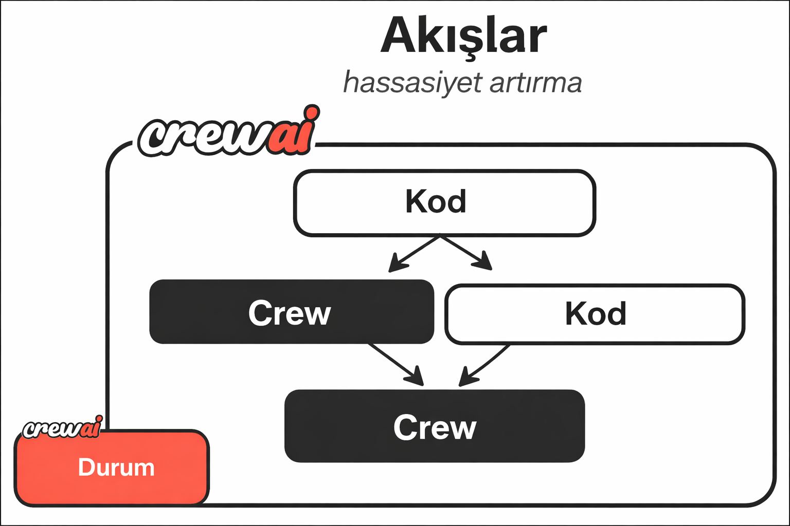
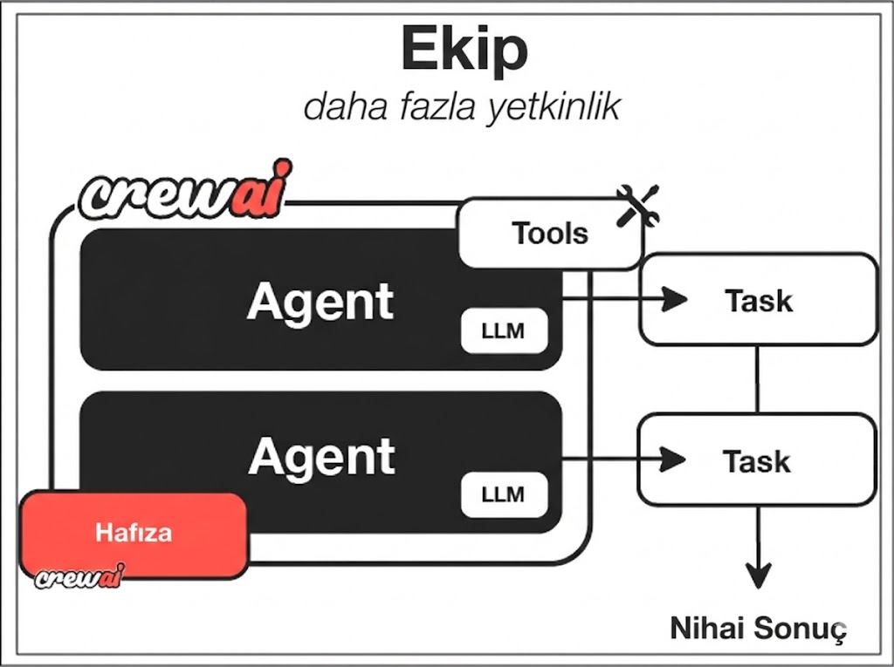

# Giriş
Birlikte çalışarak karmaşık görevleri çözebilen yapay zeka aracısı ekipleri oluşturun

# CrewAI Nedir?

**CrewAI, özerk yapay zeka ajanlarını düzenlemek ve karmaşık iş akışları oluşturmak için önde gelen açık kaynaklı çerçevedir.**

**Crew'ların** ortak zekasını **Flow'ların** kesin kontrolüyle birleştirerek, geliştiricilerin üretim kullanıma hazır çoklu ajan sistemleri oluşturmasını sağlar.

- **[CrewAI Flow'ları](/en/guides/flows/first-flow)**: Yapay zeka uygulamanızın omurgası. Flow'lar, durumu yönetmenizi ve yürütmeyi kontrol etmenizi sağlayan yapılandırılmış, olay odaklı iş akışları oluşturmanıza olanak tanır. Bunlar, yapay zeka ajanlarınızın içinde çalışması için bir temel oluşturur.
- **[CrewAI Crew'ları](/en/guides/crews/first-crew)**: Flow içinde çalışan birimlerdir. Crew'lar, Flow tarafından onlara devredilen belirli görevleri çözmek için işbirliği yapan özerk ajanlardan oluşan ekiplerdir.

Topluluk derslerimiz aracılığıyla sertifika alan 100.000'den fazla geliştirici ile CrewAI, kurumsal kullanıma hazır yapay zeka otomasyonu için standarttır.

## CrewAI Mimarisi

CrewAI'nin mimarisi, özerklik ile kontrolü dengelemek için tasarlanmıştır.

### 1. Flow'lar: Omurga

  Bir Flow'u uygulamanızın "yönetici"si veya "süreç tanımı" olarak düşünün. Adımları, mantığı ve verinin sisteminizdeki nasıl hareket ettiğini tanımlar.

  

Flow'lar şunları sağlar:
- **Durum Yönetimi**: Verileri adımlar ve yürütmeler arasında kalıcı hale getirin.
- **Olay Odaklı Yürütme**: Olaylara veya harici girdilere göre eylemleri tetikleyin.
- **Akış Kontrolü**: Koşullu mantık, döngüler ve dallanma kullanın.

### 2. Crew'lar: Zeka

  Crew'lar, ağır işleri yapan "ekiplerdir". Bir Flow içinde, yaratıcılık ve işbirliği gerektiren karmaşık bir sorunu çözmek için bir Crew tetikleyebilirsiniz.

  

Crew'lar şunları sağlar:
- **Rol Yapma Ajanları**: Belirli hedeflere ve araçlara sahip uzmanlaşmış ajanlar.
- **Özerk İşbirliği**: Ajanlar görevleri çözmek için birlikte çalışır.
- **Görev Delege Etme**: Görevler, ajan yeteneklerine göre atanır ve yürütülür.

## Her Şey Nasıl Birlikte Çalışır

1.  **Flow**, bir olayı tetikler veya bir süreci başlatır.
2.  **Flow**, durumu yönetir ve ne yapılması gerektiğini karar verir.
3.  **Flow**, karmaşık bir görevi bir **Crew'a** devreder.
4.  **Crew'ın** ajanları görevi tamamlamak için işbirliği yapar.
5.  **Crew**, sonucu **Flow'a** döndürür.
6.  **Flow**, sonuç temelinde yürütmeye devam eder.

## Temel Özellikler

  ### Üretim Kalitesinde Flow'lar

    Uzun süren işlemler ve karmaşık mantığı kaldırabilen güvenilir, durumlu iş akışları oluşturun.
  
  ### Özerk Crew'lar

    Yüksek seviyeli hedeflere ulaşmak için planlayabilen, yürütebilen ve işbirliği yapabilen ajan ekiplerini devreye alın.
  
  ### Esnek Araçlar

     Ajanlarınızı herhangi bir API, veritabanı veya yerel araca bağlayın.
  
  ### Kurumsal Güvenlik

    Kurumsal dağıtımlar için güvenlik ve uyumluluk göz önünde bulundurularak tasarlanmıştır.
  

## Crew'ları vs. Flow'ları Ne Zaman Kullanmalı

**Kısa cevap: İkisini de kullanın.**

Herhangi bir üretim kullanıma hazır uygulama için **Flow ile başlayın**.

- **Flow'u** uygulamanızın genel yapısını, durumunu ve mantığını tanımlamak için **kullanın**.
- **Flow adımında** bir ekibin özerklik gerektiren belirli, karmaşık bir görevi gerçekleştirmesi gerektiğinde bir **Crew** kullanın.

| Kullanım Senaryosu | Mimari |
| :--- | :--- |
| **Basit Otomasyon** | Tek Flow ile Python görevleri |
| **Karmaşık Araştırma** | Durum yöneten Flow -> Araştırma yapan Crew |
| **Uygulama Backend'i** | API isteklerini işleyen Flow -> İçerik oluşturan Crew -> Veritabanına kaydeden Flow |

## Neden CrewAI'ı Seçmelisiniz?

- 🧠 **Özerk Çalışma**: Ajanlar, rollerine ve mevcut araçlarına göre akıllı kararlar verir
- 📝 **Doğal Etkileşim**: Ajanlar, insan ekip üyeleri gibi iletişim kurar ve işbirliği yapar
- 🛠️ **Genişletilebilir Tasarım**: Yeni araçlar, roller ve yetenekler eklemek kolaydır
- 🚀 **Üretim Hazır**: Gerçek dünya uygulamalarında güvenilirlik ve ölçeklenebilirlik için tasarlanmıştır
- 🔒 **Güvenlik Odaklı**: Kurumsal güvenlik gereksinimleri göz önünde bulundurularak tasarlanmıştır
- 💰 **Maliyet Verimli**: Token kullanımını ve API çağrılarını en aza indirmek için optimize edilmiştir

## Başlamaya Hazır mısınız?

  ### İlk Flow'unuzu Oluşturun

    Yapılandırılmış, olay odaklı iş akışları oluşturmayı ve yürütmeyi kesin olarak kontrol etmeyi öğrenin.
  
  ### İlk Crew'unuzu Oluşturun

    Birlikte çalışarak karmaşık problemleri çözmek için çalışan işbirliği yapabilen bir yapay zeka ekibi oluşturmak için adım adım bir eğitim.
  

  ### CrewAI'ı Yükleyin

    Geliştirme ortamınızda CrewAI ile başlayın.
  
  ### Hızlı Başlangıç

    İlk CrewAI ajanınızı oluşturmak ve deneyim kazanmak için hızlı başlangıç ​​kılavuzumuzu izleyin.
  
  ### Topluluğa Katılın

    Diğer geliştiricilerle iletişim kurun, yardım alın ve CrewAI deneyimlerinizi paylaşın.