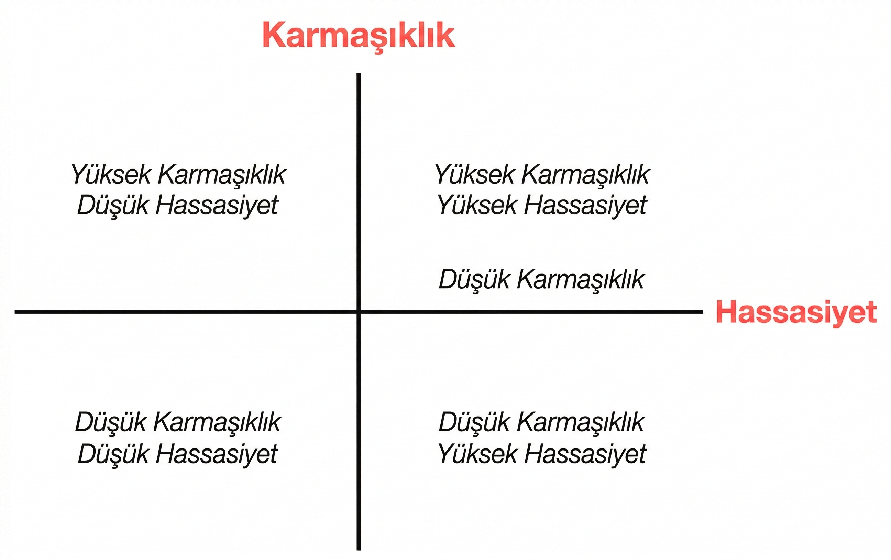

## Anlamını Değerlendirme Kılavuzu

CrewAI ile yapay zeka uygulamaları geliştirirken, kullanım durumunuz için doğru yaklaşımı seçmek yapacağınız en önemli kararlardan biridir. Bir Mürettebat mı? Bir Akış mı? İkisinin bir kombinasyonu mu? Bu kılavuz, gereksinimlerinizi değerlendirmenize ve mimari seçimleriniz hakkında bilinçli kararlar vermenize yardımcı olacaktır.

Bu kararın merkezinde uygulamanızdaki **karmaşıklık** ve **doğruluk** arasındaki ilişkiyi anlamak yer alır:


  


Bu matris, farklı yaklaşımların karmaşıklık ve doğruluk gereksinimlerindeki değişen beklentilere nasıl uyduğunu görselleştirmeye yardımcı olur. Her bölümün ne anlama geldiğini ve mimari seçimlerinizi nasıl yönlendirdiğini inceleyelim.

## Karmaşıklık-Doğruluk Matrisi Açıklaması

### Karmaşıklık Nedir?

CrewAI uygulamaları bağlamında **karmaşıklık**, şunları ifade eder:

- Gereken farklı adımlar veya işlemler sayısı
- Gerçekleştirilmesi gereken çeşitli görevler
- Farklı bileşenler arasındaki bağımlılıklar
- Koşullu mantık ve dallanma ihtiyacı
- Genel iş akışının karmaşıklığı

### Doğruluk Nedir?

Bu bağlamda **doğruluk**, şunları ifade eder:

- Nihai çıktıdaki gereken doğruluk
- Yapılandırılmış, öngörülebilir sonuçlar ihtiyacı
- Üretilebilirlik ihtiyacı
- Her adım üzerindeki kontrol düzeyi
- Çıktıdaki varyasyona tolerans

### Dört Bölüm

#### 1. Düşük Karmaşıklık, Düşük Doğruluk

**Özellikler:**
- Basit, doğrudan görevler
- Çıktıdaki bazı varyasyonlara tolerans
- Sınırlı sayıda adım
- Yaratıcı veya keşifsel uygulamalar

**Önerilen Yaklaşım:** Minimum sayıda ajan içeren basit Mürettebatlar

**Örnek Kullanım Durumları:**
- Temel içerik oluşturma
- Fikir beyin fırtınası
- Basit özetleme görevleri
- Yaratıcı yazma yardımı

#### 2. Düşük Karmaşıklık, Yüksek Doğruluk

**Özellikler:**
- Kesin, yapılandırılmış çıktılar gerektiren basit iş akışları
- Üretilebilir sonuçlar ihtiyacı
- Sınırlı sayıda adım ancak yüksek doğruluk gereksinimleri
- Genellikle veri işleme veya dönüştürme içerir

**Önerilen Yaklaşım:** Doğrudan LLM çağrıları veya yapılandırılmış çıktılar içeren Akışlar veya basit Mürettebatlar

**Örnek Kullanım Durumları:**
- Veri çıkarma ve dönüştürme
- Form doldurma ve doğrulama
- Yapılandırılmış içerik oluşturma (JSON, XML)
- Basit sınıflandırma görevleri

#### 3. Yüksek Karmaşıklık, Düşük Doğruluk

**Özellikler:**
- Çok aşamalı süreçler ve çok sayıda adım
- Yaratıcı veya keşifsel çıktılar
- Bileşenler arasındaki karmaşık etkileşimler
- Nihai sonuçlardaki varyasyona tolerans

**Önerilen Yaklaşım:** Çok sayıda uzmanlaşmış ajan içeren karmaşık Mürettebatlar

**Örnek Kullanım Durumları:**
- Araştırma ve analiz
- İçerik oluşturma hatları
- Keşfedici veri analizi
- Yaratıcı problem çözme

#### 4. Yüksek Karmaşıklık, Yüksek Doğruluk

**Özellikler:**
- Yapılandırılmış çıktılar gerektiren karmaşık iş akışları
- Katı doğruluk gereksinimleri ile birbirine bağlı çok sayıda adım
- Hem sofistike işleme hem de hassas sonuçlar ihtiyacı
- Genellikle kritik görev uygulamaları

**Önerilen Yaklaşım:** Doğrulama adımları olan çok sayıda Mürettebatı orkestrasyon eden Akışlar

**Örnek Kullanım Durumları:**
- Kurumsal karar destek sistemleri
- Karmaşık veri işleme hatları
- Çok aşamalı belge işleme
- Düzenlenmiş sektör uygulamaları

## Mürettebatlar ve Akışlar Arasında Seçim Yapma

### Mürettebatları Ne Zaman Seçmeli

Mürettebatlar şunlar için idealdir:

1. **İşbirliğine dayalı zekaya ihtiyaç duyduğunuzda** - Birlikte çalışması gereken farklı uzmanlık alanlarına sahip çoklu ajanlar
- **Problem, ortaya çıkan düşünmeyi gerektirdiğinde** - Çözüm, farklı bakış açılarından ve yaklaşımlardan fayda sağlar
- **Görev öncelikle yaratıcı veya analitik olduğunda** - Çalışma, araştırma, içerik oluşturma veya analiz içerir
- **Sıkı yapı yerine uyarlanabilirliğe değer verdiğinizde** - İş akışı, ajan özerkliğinden faydalanabilir
- **Çıktı biçimi konusunda biraz esneklik olduğunda** - Çıktı yapısı konusunda bazı varyasyonlar kabul edilebilir

```python
# Örnek: Pazar analizi için Araştırma Mürettebatı
from crewai import Agent, Crew, Process, Task

# Uzmanlaşmış ajanlar oluşturun
researcher = Agent(
    role="Pazar Araştırması Uzmanı",
    goal="Yükselen teknolojilerde kapsamlı pazar verilerini bulun",
    backstory="Pazar eğilimlerini keşfetme ve veri toplama konusunda uzmansınız."
)

analyst = Agent(
    role="Pazar Analisti",
    goal="Pazar verilerini analiz edin ve temel fırsatları belirleyin",
    backstory="Pazar verilerini yorumlama ve değerli içgörüler tespit etme konusunda mükemmel olursunuz."
)

# Görevlerini tanımlayın
research_task = Task(
    description="AI destekli sağlık çözümleri için mevcut pazar manzarasını araştırın",
    expected_output="Temel oyuncular, pazar büyüklüğü ve büyüme eğilimlerini içeren kapsamlı pazar verileri",
    agent=researcher
)

analysis_task = Task(
    description="Pazar verilerini analiz edin ve en iyi 3 yatırım fırsatını belirleyin",
    expected_output="3 önerilen yatırım fırsatıyla ve gerekçeyle analiz raporu",
    agent=analyst,
    context=[research_task]
)

# Mürettebatı oluşturun
market_analysis_crew = Crew(
    agents=[researcher, analyst],
    tasks=[research_task, analysis_task],
    process=Process.sequential,
    verbose=True
)

# Mürettebatı çalıştırın
result = market_analysis_crew.kickoff()
```

### Akışları Ne Zaman Seçmeli

Akışlar şunlar için idealdir:

1. **Uygulama yürütmesi üzerinde kesin kontrol ihtiyacınız olduğunda** - İş akışı kesin sıralama ve durum yönetimi gerektirir
2. **Uygulamanın karmaşık durum gereksinimleri olduğunda** - Birden çok adım arasında durumu korumanız ve dönüştürmeniz gerekir
3. **Yapılandırılmış, öngörülebilir çıktılara ihtiyacınız olduğunda** - Uygulama tutarlı, biçimlendirilmiş sonuçlar gerektirir
4. **İş akışının koşullu mantık içerdiğinde** - Ara sonuçlara göre farklı yollar izlenmesi gerekir
5. **Yapay zekayı işlemsel kodla birleştirmeniz gerektiğinde** - Çözüm hem yapay zeka yetenekleri hem de geleneksel programlama gerektirir

```python
# Örnek: Yapılandırılmış işleme ile Müşteri Destek Akışı
from crewai.flow.flow import Flow, listen, router, start
from pydantic import BaseModel
from typing import List, Dict

# Yapılandırılmış durumu tanımlayın
class SupportTicketState(BaseModel):
    ticket_id: str = ""
    customer_name: str = ""
    issue_description: str = ""
    category: str = ""
    priority: str = "orta"
    resolution: str = ""
    satisfaction_score: int = 0

class CustomerSupportFlow(Flow[SupportTicketState]):
    @start()
    def receive_ticket(self):
        # Gerçek bir uygulamada bu bir API'den gelebilir
        self.state.ticket_id = "TKT-12345"
        self.state.customer_name = "Alex Johnson"
        self.state.issue_description = "Ödeme yaptıktan sonra premium özelliklere erişemiyor"
        return "Bilet alındı"

    @listen(receive_ticket)
    def categorize_ticket(self, _):
        # Doğrudan LLM çağrısı kullanarak kategorileştirme
        from crewai import LLM
        llm = LLM(model="openai/gpt-4o-mini")

        prompt = f"""
        Aşağıdaki müşteri destek sorununu bu kategorilerden birine sınıflandırın:
        - Faturalama
        - Hesap Erişimi
        - Teknik Sorun
        - Özellik İsteği
        - Diğer

        Sorun: {self.state.issue_description}

        Sadece kategori adını döndürün.
        """

        self.state.category = llm.call(prompt).strip()
        return self.state.category

    @router(categorize_ticket)
    def route_by_category(self, category):
        # Kategoriye göre farklı işleyicilere yönlendirin
        return category.lower().replace(" ", "_")

    @listen("faturalama")
    def handle_billing_issue(self):
        # Faturalamaya özgü mantığı işleyin
        self.state.priority = "yüksek"
        # Daha fazla faturalama spesifik işleme...
        return "Faturalama sorunu çözüldü"

    @listen("hesap_erişimi")
    def handle_access_issue(self):
        # Erişim spesifik mantığını işleyin
        self.state.priority = "yüksek"
        # Daha fazla erişim spesifik işleme...
        return "Erişim sorunu çözüldü"

    # Ek kategori işleyicileri...

    @listen("faturalama", "hesap_erişimi", "teknik_sorun", "özellik_isteği", "diğer")
    def resolve_ticket(self, resolution_info):
        # Son çözüm adımı
        self.state.resolution = f"Sorun çözüldü: {resolution_info}"
        return self.state.resolution

# Akışı çalıştırın
support_flow = CustomerSupportFlow()
result = support_flow.kickoff()
```

### Mürettebatları ve Akışları Ne Zaman Birleştirmeli

En sofistike uygulamalar genellikle Mürettebatları ve Akışları birleştirmekten fayda sağlar:

1. **Karmaşık çok aşamalı süreçler** - Akışları genel süreci orkestrasyon etmek ve karmaşık alt görevler için Mürettebatlar kullanmak için kullanın
2. **Hem yaratıcılığı hem de yapıyı gerektiren uygulamalar** - Yaratıcı görevler için Mürettebatları ve yapılandırılmış işleme için Akışları kullanın
3. **Kurumsal düzeydeki yapay zeka uygulamaları** - Durum yönetimi ve iş akışı için Akışları kullanırken aynı zamanda özel çalışmalar için Mürettebatları kullanın

```python
# Örnek: Mürettebatları ve Akışları birleştiren İçerik Üretim Hattı
from crewai.flow.flow import Flow, listen, start
from crewai import Agent, Crew, Process, Task
from pydantic import BaseModel
from typing import List, Dict

class ContentState(BaseModel):
    topic: str = ""
    target_audience: str = ""
    content_type: str = ""
    outline: Dict = {}
    draft_content: str = ""
    final_content: str = ""
    seo_score: int = 0

class ContentProductionFlow(Flow[ContentState]):
    @start()
    def initialize_project(self):
        # Başlangıç parametrelerini ayarlayın
        self.state.topic = "Sürdürülebilir Yatırım"
        self.state.target_audience = "Yarasa Nesli Yatırımcıları"
        self.state.content_type = "Blog Yazısı"
        return "Proje başlatıldı"

    @listen(initialize_project)
    def create_outline(self, _):
        # Bir araştırma mürettebatı kullanarak bir özet oluşturun
        researcher = Agent(
            role="İçerik Araştırmacısı",
            goal=f"{self.state.topic} hakkında {self.state.target_audience} için araştırma yapın",
            backstory="İçerik oluşturma konusunda derin bilgi sahibi yetenekli bir araştırmacısınız."
        )

        outliner = Agent(
            role="İçerik Stratejisti",
            goal=f"{self.state.content_type} için ilgi çekici bir özet oluşturun",
            backstory="Maksimum etkileşim için içeriği yapılandırmada yeteneklisiniz."
        )

        research_task = Task(
            description=f"{self.state.topic} hakkında araştırma yapın ve {self.state.target_audience} için ne ilgilendirecek",
            expected_output="Kilit noktaları ve istatistikleri içeren kapsamlı araştırma notları",
            agent=researcher
        )

        outline_task = Task(
            description=f"{self.state.content_type} hakkında bir özet oluşturun {self.state.topic}",
            expected_output="Bölümler ve kilit noktalarla ayrıntılı içerik özeti",
            agent=outliner,
            context=[research_task]
        )

        outline_crew = Crew(
            agents=[researcher, outliner],
            tasks=[research_task, outline_task],
            process=Process.sequential,
            verbose=True
        )

        # Mürettebatı çalıştırın ve sonucu saklayın
        result = outline_crew.kickoff()

        # Özet ayrıştırın (gerçek bir uygulamada daha sağlam bir ayrıştırma yaklaşımı kullanabilirsiniz)
        import json
        try:
            self.state.outline = json.loads(result.raw)
        except:
            # Geçerli JSON değilse yedek alın
            self.state.outline = {"sections": result.raw}

        return "Özet oluşturuldu"

    @listen(create_outline)
    def write_content(self, _):
        # İçeriği oluşturmak için bir yazma mürettebatı kullanın
        writer = Agent(
            role="İçerik Yazarı",
            goal=f"{self.state.target_audience} için ilgi çekici içerik yazın",
            backstory="İkna edici içerik oluşturan yetenekli bir yazarsınız."
        )

        editor = Agent(
            role="İçerik Editörü",
            goal="İçeriğin net, doğru ve ilgi çekici olmasını sağlayın",
            backstory="Detaylara keskin bir bakışınız ve içeriği iyileştirme yeteneğiniz vardır."
        )

        writing_task = Task(
            description=f"{self.state.topic} hakkında bir {self.state.content_type} yazın: {self.state.outline}",
            expected_output="Markdown biçiminde tam taslak içeriği",
            agent=writer
        )

        editing_task = Task(
            description="Netlik, ilgi ve doğruluk için taslak içeriği düzenleyin ve iyileştirin",
            expected_output="Polished son içerik Markdown biçiminde",
            agent=editor,
            context=[writing_task]
        )

        writing_crew = Crew(
            agents=[writer, editor],
            tasks=[writing_task, editing_task],
            process=Process.sequential,
            verbose=True
        )

        # Mürettebatı çalıştırın ve sonucu saklayın
        result = writing_crew.kickoff()
        self.state.final_content = result.raw

        return "İçerik oluşturuldu"

    @listen(write_content)
    def optimize_for_seo(self, _):
        # SEO optimizasyonu için doğrudan LLM çağrısı kullanın
        from crewai import LLM
        llm = LLM(model="openai/gpt-4o-mini")

        prompt = f"""
        "{self.state.topic}" anahtar kelimesi için SEO etkinliği açısından bu içeriği analiz edin.
        1-100 ölçeğinde bir puan verin ve iyileştirme için 3 özel öneride bulunun.

        İçerik: {self.state.final_content[:1000]}... (özet için kısaltılmıştır)

        Yanıtınızı aşağıdaki yapıya sahip JSON olarak biçimlendirin:
        {{
            "puan": 85,
            "öneriler": [
                "Öneri 1",
                "Öneri 2",
                "Öneri 3"
            ]
        }}
        """

        seo_analysis = llm.call(prompt)

        # SEO analizini ayrıştırın
        import json
        try:
            analysis = json.loads(seo_analysis)
            self.state.seo_score = analysis.get("score", 0)
            return analysis
        except:
            self.state.seo_score = 50
            return {"puan": 50, "öneriler": ["SEO analizi ayrıştırılamadı"]}

# Akışı çalıştırın
content_flow = ContentProductionFlow()
result = content_flow.kickoff()
```

## Mürettebatlar ve Akışlar Arasında Seçim Yapma

### Mürettebatları Ne Zaman Seçmelisiniz

Mürettebatları seçmek için pratik bir değerlendirme çerçevesi:

### Adım 1: Karmaşıklığı Değerlendirin

Uygulamanızın karmaşıklığını 1-10 ölçeğinde derecelendirin:

1. **Adım sayısı**: Kaç farklı işlem gereklidir?
   - 1-3 adım: Düşük karmaşıklık (1-3)
   - 4-7 adım: Orta karmaşıklık (4-7)
   - 8+ adım: Yüksek karmaşıklık (8-10)

2. **Bağımlılıklar**: Farklı parçalar ne kadar bağlantılıdır?
   - Az sayıda bağımlılık: Düşük karmaşıklık (1-3)
   - Bazı bağımlılıklar: Orta karmaşıklık (4-7)
   - Birçok karmaşık bağımlılık: Yüksek karmaşıklık (8-10)

3. **Koşullu mantık**: Ne kadar dallanma ve karar verme gereklidir?
   - Doğrusal süreç: Düşük karmaşıklık (1-3)
   - Bazı dallanma: Orta karmaşıklık (4-7)
   - Karmaşık karar ağaçları: Yüksek karmaşıklık (8-10)

4. **Alan bilgisi**: Gereken uzmanlık düzeyi ne kadar?
   - Genel bilgi: Düşük karmaşıklık (1-3)
   - Bazı uzmanlık bilgisi: Orta karmaşıklık (4-7)
   - Birden çok alanda derin uzmanlık: Yüksek karmaşıklık (8-10)

Genel karmaşıklığı belirlemek için ortalama puanınızı hesaplayın.

### Adım 2: Doğruluk Gereksinimlerini Değerlendirin

Doğruluk gereksinimlerinizi 1-10 ölçeğinde derecelendirin:

1. **Çıktı yapısı**: Çıktı ne kadar yapılandırılmış olmalı?
   - Serbest biçimli metin: Düşük doğruluk (1-3)
   - Yarı yapılandırılmış: Orta doğruluk (4-7)
   - Kesin biçimlendirme (JSON, XML): Yüksek doğruluk (8-10)

2. **Doğruluk ihtiyacı**: Nihai doğruluğun önemi ne kadar?
   - Yaratıcı içerik: Düşük doğruluk (1-3)
   - Bilgilendirici içerik: Orta doğruluk (4-7)
   - Kritik bilgi: Yüksek doğruluk (8-10)

3. **Yine edilebilirlik**: Sonuçlar çalıştırmalar arasında ne kadar tutarlı olmalı?
   - Varyasyon kabul edilebilir: Düşük doğruluk (1-3)
   - Bazı tutarlılık gerekli: Orta doğruluk (4-7)
   - Tam yeniden üretilebilirlik gerekli: Yüksek doğruluk (8-10)

4. **Hata toleransı**: Hataların etkisi ne?
   - Düşük etki: Düşük doğruluk (1-3)
   - Orta etki: Orta doğruluk (4-7)
   - Yüksek etki: Yüksek doğruluk (8-10)

Genel doğruluk gereksinimlerini belirlemek için ortalama puanınızı hesaplayın.

### Adım 3: Matrisin Haritası

Karmaşıklık ve doğruluk puanlarınızı matris üzerinde çizin:

- **Düşük Karmaşıklık (1-4), Düşük Doğruluk (1-4)**: Basit Mürettebatlar
- **Düşük Karmaşıklık (1-4), Yüksek Doğruluk (5-10)**: Doğrudan LLM çağrıları olan Akışlar
- **Yüksek Karmaşıklık (5-10), Düşük Doğruluk (1-4)**: Karmaşık Mürettebatlar
- **Yüksek Karmaşıklık (5-10), Yüksek Doğruluk (5-10)**: Doğrulama adımları olan Mürettebatları orkestrasyon eden Akışlar

### Adım 4: Ek Faktörleri Göz Önüne Alın

Karmaşıklık ve doğruluğun ötesinde, aşağıdakileri göz önünde bulundurun:

1. **Geliştirme süresi**: Mürettebatlar genellikle prototip oluşturmak için daha hızlıdır
2. **Bakım ihtiyaçları**: Akışlar daha iyi uzun vadeli bakım yapılabilirliği sağlar
3. **Takım uzmanlığı**: Takımınızın farklı yaklaşımlara olan aşinalığını göz önünde bulundurun
4. **Ölçeklenebilirlik gereksinimleri**: Akışlar tipik olarak karmaşık uygulamalar için daha iyi ölçeklenir
5. **Entegrasyon ihtiyaçları**: Çözümün mevcut sistemlerle nasıl entegre olacağını göz önünde bulundurun

## Sonuç

Mürettebatlar ve Akışlar—veya bunları birleştirme—arasından seçim yapmak, CrewAI uygulamanızın etkinliğini, bakılabilirliğini ve ölçeklenebilirliğini etkileyen kritik bir mimari karardır. Kullanım durumunuzu karmaşıklık ve doğruluk boyutlarında değerlendirerek, özel gereksinimlerinizi karşılayan bilinçli kararlar verebilirsiniz.

En iyi yaklaşımın genellikle uygulamanız olgunlaştıkça evrimleştiğini unutmayın. İhtiyaçlarınızı karşılayan en basit çözümle başlayın ve gereksinimleriniz daha net hale geldikçe mimarinizi iyileştirmeye hazırlıklı olun.


Artık CrewAI kullanım durumlarını değerlendirmek ve karmaşıklık ve doğruluk gereksinimlerine göre doğru yaklaşımı seçmek için bir çerçeveniz bulunmaktadır. Bu, daha etkili, bakılabilir ve ölçeklenebilir yapay zeka uygulamaları oluşturmanıza yardımcı olacaktır.


## Sonraki Adımlar

- [Etkili ajanlar oluşturma](/en/guides/agents/crafting-effective-agents) hakkında daha fazla bilgi edinin
- İlk mürettebatınızı [ilk mürettebatınızı oluşturma](/en/guides/crews/first-crew)
- [Akış durum yönetimi konusunda ustalaşma](/en/guides/flows/mastering-flow-state)
- [Temel kavramlara göz atın](/en/concepts/agents) daha derin bir anlayış için