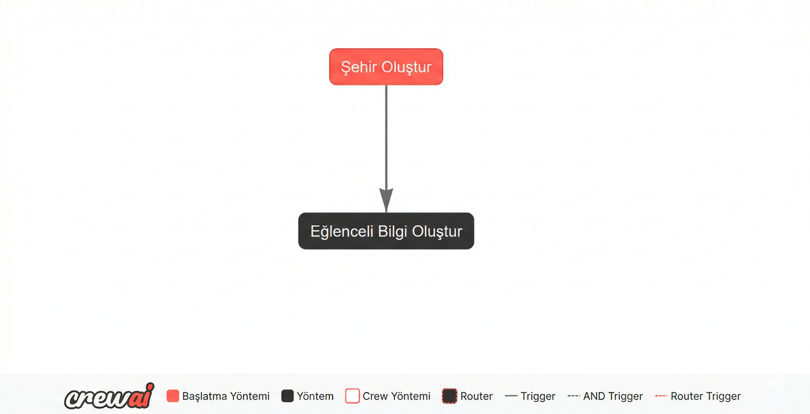
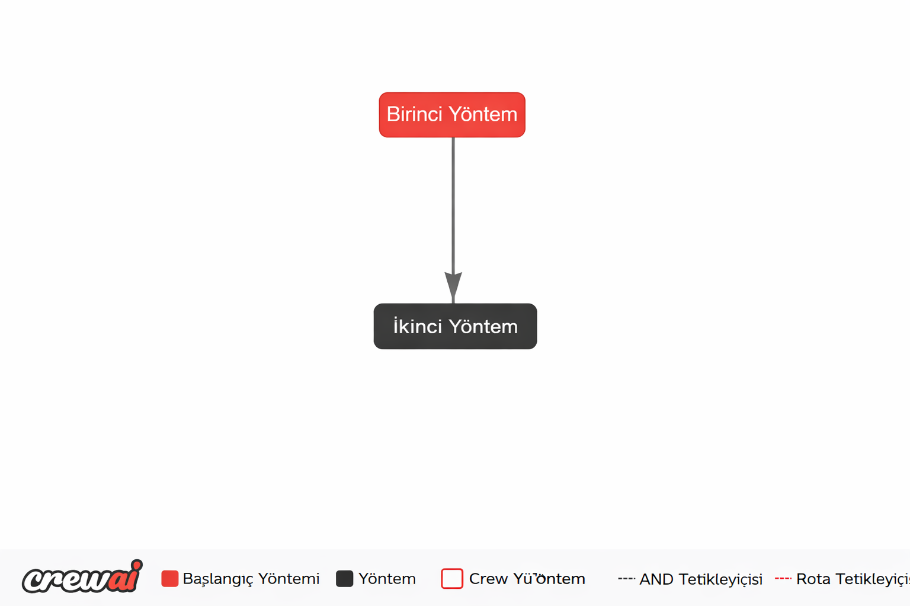

## Akışlar (Flows)

[Açıklama](#açıklama)
[Başlangıç](#başlangıç)
[Akış Durum Yönetimi](#akış-durum-yönetimi)
[Akış Kontrolü](#akış-kontrolü)
[Sonraki Adımlar](#sonraki-adımlar)
[Akışları Çalıştırma](#akışları-çalıştırma)
[Bellek](#akışlarda-bellek)
[CLI Kullanımı](#cli-kullanımı)

### Açıklama

CrewAI Akışları, yapay zeka iş akışlarını oluşturma ve yönetme sürecini kolaylaştırmak için tasarlanmış güçlü bir özelliktir. Akışlar, kodlama görevlerini ve ekipleri (Crews) verimli bir şekilde birleştirmenize ve koordine etmenize olanak tanıyarak, gelişmiş yapay zeka otomasyonları oluşturmak için sağlam bir çerçeve sunar.

Akışlar, yapılandırılmış, olay odaklı iş akışları oluşturmanızı sağlar. Çoklu görevleri bağlamanın, durumu yönetmenin ve yapay zeka uygulamalarınızdaki yürütme akışını kontrol etmenin sorunsuz bir yolunu sunar. Akışlar sayesinde, CrewAI'nin yeteneklerinin tamamından yararlanan çok aşamalı süreçleri kolayca tasarlayıp uygulayabilirsiniz.

1. **Basitleştirilmiş İş Akışı Oluşturma**: Karmaşık yapay zeka iş akışları oluşturmak için birden çok Ekibi (Crew) ve görevi kolayca birbirine bağlayın.
2. **Durum Yönetimi**: Akışlar, iş akışınızdaki farklı görevler arasında durumu yönetmeyi ve paylaşmayı son derece kolaylaştırır.
3. **Olay Odaklı Mimari**: Dinamik ve duyarlı iş akışları için olay odaklı bir model üzerine kurulmuştur.
4. **Esnek Kontrol Akışı**: İş akışlarınızda koşullu mantık, döngüler ve dallanma uygulayın.

### Başlangıç

Şimdi OpenAI'ı kullanarak dünyadaki rastgele bir şehri bir görevde ve ardından o şehrin eğlenceli bir gerçeğini başka bir görevde üreteceğiniz basit bir Akış oluşturalım.

```python
from crewai.flow.flow import Flow, listen, start
from dotenv import load_dotenv
from litellm import completion


class ExampleFlow(Flow):
    model = "gpt-4o-mini"

    @start()
    def generate_city(self):
        print("Akışı başlatma")
        # Her akış durumu otomatik olarak benzersiz bir ID alır
        print(f"Akış Durumu ID'si: {self.state['id']}")

        response = completion(
            model=self.model,
            messages=[
                {
                    "role": "user",
                    "content": "Dünyadaki rastgele bir şehrin adını döndür.",
                },
            ],
        )

        random_city = response["choices"][0]["message"]["content"]
        # Şehri durumumuzda sakla
        self.state["city"] = random_city
        print(f"Rastgele Şehir: {random_city}")

        return random_city

    @listen(generate_city)
    def generate_fun_fact(self, random_city):
        response = completion(
            model=self.model,
            messages=[
                {
                    "role": "user",
                    "content": f"{random_city} hakkında eğlenceli bir gerçek oluştur",
                },
            ],
        )

        fun_fact = response["choices"][0]["message"]["content"]
        # Eğlenceli gerçeği durumumuzda sakla
        self.state["fun_fact"] = fun_fact
        return fun_fact


flow = ExampleFlow()
flow.plot()
result = flow.kickoff()

print(f"Oluşturulan eğlenceli gerçek: {result}")
```



Yukarıdaki örnekte, OpenAI kullanarak rastgele bir şehir oluşturan ve ardından o şehir hakkında eğlenceli bir gerçek oluşturan basit bir Akış oluşturduk. Akış, `generate_city` ve `generate_fun_fact` olmak üzere iki görevden oluşur. `generate_city` görevi Akışın başlangıç noktasıdır ve `generate_fun_fact` görevi `generate_city` görevinin çıktısını dinler.

Her Akış örneği otomatik olarak benzersiz bir tanımlayıcı (UUID) alır (durumunda bulunur), bu da akış yürütmelerini izlemeye ve yönetmeye yardımcı olur. Durum ayrıca oluşturulan şehir ve eğlenceli gerçek gibi ek verileri de saklayabilir (akışın yürütülmesi boyunca kalıcıdır).

Akışı çalıştırdığınızda şunları yapar:
1. Akış durumu için benzersiz bir ID oluşturur
2. Rastgele bir şehir oluşturur ve durumu içinde saklar
3. Bu şehir hakkında eğlenceli bir gerçek oluşturur ve durumu içinde saklar
4. Sonuçları konsola yazdırır

Durumun benzersiz ID'si ve saklanan verileri, akış yürütmelerini izlemek ve görevler arasında bağlamı korumak için faydalı olabilir.

**Not:** `OPENAI_API_KEY`'inizi saklamak için `.env` dosyanızı ayarladığınızdan emin olun. Bu anahtar, OpenAI API isteklerini kimlik doğrulamak için gereklidir.

### @start()

`@start()` dekoratörü, bir Akış için başlangıç noktalarını işaretler. Şunları yapabilirsiniz:

- Birden çok koşulsuz başlangıç bildir: `@start()`
- Bir yöntem veya yönlendirici etiketinin bir önündeki başlangıcı kapalı hale getirin: `@start("method_or_label")`
- Bir başlangıcın ne zaman ateşleneceğini kontrol etmek için çağrılabilir bir koşul sağlayın

Tüm memnun `@start()` yöntemleri, Akış başladığında veya yeniden başlatıldığında (genellikle paralel olarak) yürütülür.

### @listen()

`@listen()` dekoratörü, bir Akış içindeki başka bir görevin çıktısı için bir dinleyici olarak bir yöntemi işaretlemek için kullanılır. `@listen()` dekoratörü ile işaretlenmiş yöntem, belirtilen görev bir çıktı yaydığında yürütülür. Yöntem, dinlediği görevin çıktısını bir argüman olarak erişebilir.

### Akış Çıktısı

Bir Akışın çıktısına erişmek ve işlemek, yapay zeka iş akışlarınızı daha büyük uygulamalara veya sistemlere entegre etmek için çok önemlidir. CrewAI Akışları, nihai çıktıyı, ara sonuçları almak ve Akışınızın genel durumunu kontrol etmek için basit mekanizmalar sağlar.

#### Nihai Çıktıyı Alma

Bir Akışı çalıştırdığınızda, nihai çıktı, tamamlanan son yöntemin çıktısı olarak belirlenir. `kickoff()` yöntemi, bu son yöntemin çıktısını döndürür.

İşte nihai çıktıyı nasıl alabileceğinize ilişkin bir örnek:

```python
from crewai.flow.flow import Flow, listen, start

class OutputExampleFlow(Flow):
    @start()
    def first_method(self):
        return "Birinci yöntemden çıktı"

    @listen(first_method)
    def second_method(self, first_output):
        return f"İkinci yöntem alındı: {first_output}"


flow = OutputExampleFlow()
flow.plot("my_flow_plot")
final_output = flow.kickoff()

print("---- Nihai Çıktı ----")
print(final_output)
```

```text
---- Nihai Çıktı ----
İkinci yöntem alındı: Birinci yöntemden çıktı
```



Bu örnekte, `second_method` son yöntem olarak tamamlanır, bu nedenle Akışın nihai çıktısı bu yöntemin çıktısı olacaktır.
`kickoff()` yöntemi nihai çıktıyı döndürür ve ardından konsola yazdırılır. `plot()` yöntemi etkileşimli HTML dosyasını oluşturur ve bu da iş akışını anlamanıza yardımcı olur.

#### Durumu Erişme ve Güncelleme

Nihai çıktıyı alma ek olarak, iş akışınızdaki durumu da erişebilir ve güncelleyebilirsiniz. Durum, farklı yöntemler arasında veri depolamak ve paylaşmak için kullanılabilir. Akış çalıştırıldıktan sonra, yürütme sırasında eklenen veya güncellenen bilgileri almak için durumu erişebilirsiniz.

İşte durumu güncelleme ve erişme örneği:

```python
from crewai.flow.flow import Flow, listen, start
from pydantic import BaseModel

class ExampleState(BaseModel):
    counter: int = 0
    message: str = ""

class StateExampleFlow(Flow[ExampleState]):

    @start()
    def first_method(self):
        self.state.message = "Merhaba birinci yöntemden"
        self.state.counter += 1

    @listen(first_method)
    def second_method(self):
        self.state.message += " - ikinci yöntem tarafından güncellendi"
        self.state.counter += 1
        return self.state.message

flow = StateExampleFlow()
flow.plot("my_flow_plot")
final_output = flow.kickoff()
print(f"Nihai Çıktı: {final_output}")
print("Nihai Durum:")
print(flow.state)
```

```text
Nihai Çıktı: Merhaba birinci yöntemden - ikinci yöntem tarafından güncellendi
Nihai Durum:
counter=2 message='Merhaba birinci yöntemden - ikinci yöntem tarafından güncellendi'
```


Bu örnekte, durum hem `first_method` hem de `second_method` tarafından güncellenir.
Akış çalıştırıldıktan sonra, bu yöntemler tarafından yapılan güncellemeleri görmek için nihai durumu erişebilirsiniz.

Nihai çıktının nasıl alınmasını ve durumun erişilebilir ve güncellenebilir olmasını sağlayarak, CrewAI Akışları, yapay zeka iş akışlarınızın daha büyük uygulamalara veya sistemlere entegre edilmesini kolaylaştırır ve aynı zamanda Akış yürütmesi boyunca bağlamı korur.

### Akış Durum Yönetimi

Etkili durum yönetimi, güvenilir ve bakımı kolay yapay zeka iş akışları oluşturmak için çok önemlidir. CrewAI Akışları, geliştiricilerin uygulamalarının ihtiyaçlarına en uygun olan yaklaşımı seçmelerini sağlayan hem yapılandırılmamış hem de yapılandırılmış durum yönetimi için sağlam mekanizmalar sağlar.

### Yapılandırılmamış Durum Yönetimi

Yapılandırılmamış durum yönetiminde, tüm durum `Flow` sınıfının `state` özelliği içinde saklanır. Bu yaklaşım esneklik sunarak, geliştiricilerin bir şema tanımlamadan anında durum özniteliklerini eklemesine veya değiştirmesine olanak tanır. Yapılandırılmamış durumlarla bile, CrewAI Akışları her durum örneği için benzersiz bir tanımlayıcı (UUID) otomatik olarak oluşturur ve korur.

```python
from crewai.flow.flow import Flow, listen, start

class UnstructuredExampleFlow(Flow):

    @start()
    def first_method(self):
        # Durum otomatik olarak 'id' alanını içerir
        print(f"Durum ID'si: {self.state['id']}")
        self.state['counter'] = 0
        self.state['message'] = "Yapılandırılmamış akıştan merhaba"

    @listen(first_method)
    def second_method(self):
        self.state['counter'] += 1
        self.state['message'] += " - güncellendi"

    @listen(second_method)
    def third_method(self):
        self.state['counter'] += 1
        self.state['message'] += " - tekrar güncellendi"

        print(f"Üçüncü yöntemden sonraki durum: {self.state}")


flow = UnstructuredExampleFlow()
flow.plot("my_flow_plot")
flow.kickoff()
```


**Not:** `id` alanı otomatik olarak oluşturulur ve akışın yürütmesi boyunca korunur. Manuel olarak yönetmenize veya ayarlamanıza gerek yoktur ve yeni verilerle durumu güncellerken bile korunacaktır.

**Temel Noktalar:**

- **Esneklik:** `self.state`'e öznitelikleri önceden tanımlanmış kısıtlamalar olmaksızın dinamik olarak ekleyebilirsiniz.
- **Basitlik:** Minimal veya önemli ölçüde farklılık gösteren bir durum yapısı olan basit iş akışları için idealdir.

### Yapılandırılmış Durum Yönetimi

Yapılandırılmış durum yönetimi, tutarlılığı ve tip güvenliğini sağlamak için önceden tanımlanmış şemaları kullanır. Geliştiriciler, durumun kesin şeklini tanımlamak için Pydantic'in `BaseModel`'ini kullanarak, çalışma zamanı hatalarını azaltan daha iyi doğrulama ve geliştirme ortamlarında otomatik tamamlama sağlayabilirler.

Her Akış durumu, durumlara yardımcı olan ve bunları yöneten benzersiz bir tanımlayıcı (UUID) otomatik olarak alır. Bu ID otomatik olarak Flow sistemi tarafından oluşturulur ve yönetilir.

```python
from crewai.flow.flow import Flow, listen, start
from pydantic import BaseModel


class ExampleState(BaseModel):
    # Not: 'id' alan otomatik olarak tüm durumlara eklenir
    counter: int = 0
    message: str = ""


class StructuredExampleFlow(Flow[ExampleState]):

    @start()
    def first_method(self):
        # Otomatik olarak oluşturulan ID'ye erişin
        print(f"Durum ID'si: {self.state.id}")
        self.state.message = "Yapılandırılmış akıştan merhaba"

    @listen(first_method)
    def second_method(self):
        self.state.counter += 1
        self.state.message += " - güncellendi"

    @listen(second_method)
    def third_method(self):
        self.state.counter += 1
        self.state.message += " - tekrar güncellendi"

        print(f"Üçüncü yöntemden sonraki durum: {self.state}")


flow = StructuredExampleFlow()
flow.plot("my_flow_plot")
flow.kickoff()
```


**Temel Noktalar:**

- **Tanımlanmış Şema:** `ExampleState` durumu yapısını açıkça ana hatlarıyla belirtir ve kod okunabilirliğini ve bakımını artırır.
- **Tip Güvenliği:** Pydantic'i kullanmak, durum özniteliklerinin belirtilen tiplere uymasını sağlayarak çalışma zamanı hatalarını azaltır.
- **Otomatik Tamamlama:** IDE'ler, tanımlanmış durum modeli temelli daha iyi otomatik tamamlama ve tip denetimi sağlayabilir.

### Yapılandırılmış ve Yapılandırılmamış Durum Yönetimi Arasında Seçim Yapma

- **Yapılandırılmamış Durum Yönetimi kullanın:**

  - İş akışının durumu basit veya son derece dinamik olduğunda.
  - Esneklik, katı durum tanımlamalarından daha fazla önceliklendirildiğinde.
  - Öngörülemeyen bir ortamda hızlı prototipleme gerekliliği olduğunda.

- **Yapılandırılmış Durum Yönetimi kullanın:**
  - İş akışının iyi tanımlanmış ve tutarlı bir durum yapısı gerektirdiğinde.
  - Uygulamanızın güvenilirliği için tip güvenliği ve doğrulama önemli olduğunda.
  - Daha iyi bir geliştirici deneyimi için IDE özelliklerinden (otomatik tamamlama gibi) yararlanmak istediğinizde.

Her iki yapılandırılmış ve yapılandırılmamış durum yönetimi seçeneklerini sağlayarak, CrewAI Akışları, hem esnek hem de sağlam olan yapay zeka iş akışları oluşturmak için geliştiricilere yetki verir.

### Akış Kalıcılığı

`@persist` dekoratörü, CrewAI Akışlarında otomatik durum kalıcılığını sağlar, böylece akış durumu yeniden başlatmalar veya farklı iş akışı yürütmeler arasında korunabilir. Bu dekoratör, hem sınıf düzeyinde hem de yöntem düzeyinde uygulanabilir ve durum yönetimi için esneklik sağlar.

### Sınıf Düzeyi Kalıcılık

Sınıf düzeyinde uygulandığında, `@persist` dekoratörü tüm akış yöntemlerinin durumunu otomatik olarak kalıcı hale getirir:

```python
@persist  # Varsayılan olarak SQLiteFlowPersistence kullanır
class MyFlow(Flow[MyState]):
    @start()
    def initialize_flow(self):
        # Bu yöntem otomatik olarak durumunun kalıcı hale getirilmesini sağlar
        self.state.counter = 1
        print("Akış başlatıldı. Durum Kimliği:", self.state.id)

    @listen(initialize_flow)
    def next_step(self):
        # Durum (self.state.id dahil) otomatik olarak yeniden yüklenir
        self.state.counter += 1
        print("Durum kalıcı hale getirildi. Sayaç:", self.state.counter)
```

### Yöntem Düzeyi Kalıcılık

Daha ayrıntılı kontrol için, `@persist` dekoratörünü belirli yöntemlere uygulayabilirsiniz:

```python
class AnotherFlow(Flow[dict]):
    @persist  # Yalnızca bu yöntemin durumunu kalıcı hale getirir
    @start()
    def begin(self):
        if "runs" not in self.state:
            self.state["runs"] = 0
        self.state["runs"] += 1
        print("Yöntem düzeyinde kalıcı çalıştırmalar:", self.state["runs"])
```

### Nasıl Çalışır

1. **Benzersiz Durum Tanımlama**
   - Her akış durumu otomatik olarak benzersiz bir UUID alır
   - ID, durum güncellemeleri ve yöntem çağrıları boyunca korunur
   - Yapılandırılmamış (sözlük) ve yapılandırılmış (Pydantic BaseModel) durumları destekler

2. **Varsayılan SQLite Arka Ucu**
   - SQLiteFlowPersistence varsayılan depolama arka ucudur
   - Durumlar otomatik olarak yerel bir SQLite veritabanına kaydedilir
   - Sağlam hata işleme, veritabanı işlemlerinin başarısız olması durumunda açık mesajlar sağlar

3. **Hata İşleme**
   - Veritabanı işlemleri için kapsamlı hata mesajları
   - Kaydetme ve yükleme sırasında otomatik durum doğrulama
   - Durum kalıcılık işlemlerinin sorunlarla karşılaştığında açık geri bildirim

### Önemli Hususlar

- **Durum Tipleri**: Hem yapılandırılmış (Pydantic BaseModel) hem de yapılandırılmamış (sözlük) durumlar desteklenir
- **Otomatik ID**: Yoksa `id` alanı otomatik olarak eklenir
- **Durum Kurtarma**: Başarısız veya yeniden başlatılan akışlar, önceki durumlarını otomatik olarak yeniden yükleyebilir
- **Özel Uygulama**: Özelleştirilmiş depolama ihtiyaçları için kendi FlowPersistence uygulamanızı sağlayabilirsiniz

### Teknik Avantajlar

1. **Düşük Seviyeli Erişime Sahip Hassas Kontrol**
   - İleri düzey kullanım durumları için kalıcılık işlemlerine doğrudan erişim
   - Yöntem düzeyinde kalıcılık dekoratörleri aracılığıyla ince ayarlı kontrol
   - Durum denetimi ve hata ayıklama yetenekleri
   - Durum değişiklikleri ve kalıcılık işlemleri üzerine tam görünürlük

2. **Gelişmiş Güvenilirlik**
   - Sistem arızaları veya yeniden başlatmalar sonrası otomatik durum kurtarma
   - Veri bütünlüğünü sağlamak için işlemli durum güncellemeleri
   - Açık hata mesajlarıyla kapsamlı hata işleme
   - Durum kaydetme ve yükleme işlemlerinde doğrulama

3. **Genişletilebilir Mimari**
   - FlowPersistence arayüzü aracılığıyla özelleştirilebilir kalıcılık arka ucu
   - SQLite'den daha geniş depolama çözümleri desteği
   - Hem yapılandırılmış (Pydantic) hem de yapılandırılmamış (sözlük) durumlarla uyumlu
   - Mevcut CrewAI akış kalıplarıyla sorunsuz entegrasyon

Kalıcılık sisteminin mimarisi, teknik hassasiyet ve özelleştirme seçeneklerine vurgu yaparak, geliştiricilerin durum yönetiminin kontrolünü korurken yerleşik güvenilirlik özelliklerinden yararlanmasını sağlar.

### Akış Kontrolü

### Koşullu Mantık: `or_`

Akışlardaki `or_` fonksiyonu, birden çok yönteme dinleme imkanı tanır ve belirtilen yöntemlerden herhangi birinin çıktı yaymasıyla dinleyici yöntemini tetikler.

```python
from crewai.flow.flow import Flow, listen, or_, start

class OrExampleFlow(Flow):

    @start()
    def start_method(self):
        return "Başlangıç yönteminden merhaba"

    @listen(start_method)
    def second_method(self):
        return "İkinci yöntemden merhaba"

    @listen(or_(start_method, second_method))
    def logger(self, result):
        print(f"Günlükleyici: {result}")


flow = OrExampleFlow()
flow.plot("my_flow_plot")
flow.kickoff()
```

Bu Akışı çalıştırdığınızda, `logger` yöntemi hem `start_method` hem de `second_method` çıktılarının herhangi birine yanıt olarak tetiklenecektir. `or_` fonksiyonu, birden çok yönteme dinleme imkanı tanır ve belirtilen yöntemlerden herhangi birinin çıktı yaymasıyla dinleyici yöntemini tetikler.

### Koşullu Mantık: `and_`

Akışlardaki `and_` fonksiyonu, birden çok yönteme dinleme imkanı tanır ve yalnızca belirtilen yöntemlerin tümü çıktı yaydığında dinleyici yöntemini tetikler.

```python
from crewai.flow.flow import Flow, and_, listen, start

class AndExampleFlow(Flow):

    @start()
    def start_method(self):
        self.state["greeting"] = "Başlangıç yönteminden merhaba"

    @listen(start_method)
    def second_method(self):
        self.state["joke"] = "Bilgisayarlar ne yer? Mikroçipler."

    @listen(and_(start_method, second_method))
    def logger(self):
        print("---- Günlükleyici ----")
        print(self.state)


flow = AndExampleFlow()
flow.plot("my_flow_plot")
flow.kickoff()
```

Bu Akışı çalıştırdığınızda, `logger` yöntemi yalnızca `start_method` ve `second_method` yöntemlerinin her ikisi de çıktı yaydığında tetiklenecektir. `and_` fonksiyonu, birden çok yönteme dinleme imkanı tanır ve yalnızca belirtilen yöntemlerin tümü çıktı yaydığında dinleyici yöntemini tetikler.

### Yönlendirici

Akışlardaki `@router()` dekoratörü, bir yöntemin çıktısına dayalı olarak koşullu yönlendirme mantığı tanımlamanıza olanak tanır. Yöntemin çıktısına bağlı olarak farklı rotalar belirterek yürütme akışını dinamik olarak kontrol edebilirsiniz.

```python
from crewai.flow.flow import Flow, listen, router, start
from pydantic import BaseModel

class ExampleState(BaseModel):
    success_flag: bool = False

class RouterFlow(Flow[ExampleState]):

    @start()
    def start_method(self):
        print("Yapılandırılmış akışı başlatma")
        random_boolean = random.choice([True, False])
        self.state.success_flag = random_boolean

    @router(start_method)
    def second_method(self):
        if self.state.success_flag:
            return "başarı"
        else:
            return "başarısız"

    @listen("approved")
    def third_method(self):
        print("Üçüncü yöntem çalışıyor")

    @listen("rejected")
    def fourth_method(self):
        print("Dördüncü yöntem çalışıyor")


flow = RouterFlow()
flow.plot("my_flow_plot")
flow.kickoff()
```

Bu örnekte, `start_method` rastgele bir boolean değeri oluşturur ve bunu duruma ayarlar. `second_method`, boolean'ın değerine göre koşullu yönlendirme mantığı tanımlamak için `@router()` dekoratörünü kullanır. Boolean `True` ise, yöntem `"success"`'ı döndürür ve `False` ise, yöntem `"failed"`'ı döndürür. `third_method` ve `fourth_method`, `second_method`'un çıktısını dinler ve döndürülen değere göre yürütülür.

Bu Akışı çalıştırdığınızda, çıktı, `start_method` tarafından oluşturulan rastgele boolean değerine bağlı olarak değişecektir.

### İnsan Döngüsü (insan geri bildirimi)

`@human_feedback` dekoratörü **CrewAI sürüm 1.8.0 veya üstü gerektirir.**

`@human_feedback` dekoratörü, insan geri bildirimini almak için akış yürütmesini duraklatarak insan Döngüsü iş akışlarını etkinleştirir. Bu, insan yargısı gerektiren onay geçitleri, kalite incelemesi ve karar noktaları için kullanışlıdır.

```python
from crewai.flow.flow import Flow, start, listen
from crewai.flow.human_feedback import human_feedback, HumanFeedbackResult

class ReviewFlow(Flow):
    @start()
    @human_feedback(
        message="Bu içeriği onaylıyor musunuz?",
        emit=["onaylandı", "reddedildi", "revize_gerekiyor"],
        llm="gpt-4o-mini",
        default_outcome="revize_gerekiyor",
    )
    def generate_content(self):
        return "İncelemeye açık içerik..."

    @listen("approved")
    def on_approval(self, result: HumanFeedbackResult):
        print(f"Onaylandı! Geri bildirim: {result.feedback}")

    @listen("rejected")
    def on_rejection(self, result: HumanFeedbackResult):
        print(f"Reddedildi. Neden: {result.feedback}")
```

`emit` belirtildiğinde, insanın serbest biçimdeki geri bildirimi bir LLM tarafından yorumlanır ve belirtilen sonuçlardan birine indirgenir ve ardından ilgili `@listen` dekoratörünü tetikler.

Ayrıca, basitçe geri bildirim toplamak için yönlendirme yapmadan `@human_feedback`'i de kullanabilirsiniz:

```python
@start()
@human_feedback(message="Bu çıktı hakkında yorumlarınız var mı?")
def my_method(self):
    return "İncelemeye açık çıktı"

@listen(my_method)
def next_step(self, result: HumanFeedbackResult):
    # Geri bildirimi result.feedback aracılığıyla erişin
    # Orijinal çıktıyı result.output aracılığıyla erişin
    pass
```

Bir akış sırasında toplanan tüm geri bildirimleri `self.last_human_feedback` (en son) veya `self.human_feedback_history` (tüm geri bildirimler listesi olarak) aracılığıyla erişebilirsiniz.

İnsan geri bildirimleri ile ilgili kapsamlı bir kılavuz için, Slack, webhook'lar vb. gibi özel sağlayıcılarla **asenkron/bloksuz geri bildirim** içerdiğini görmek için [Akışlarda İnsan Geri Bildirimi](/en/learn/human-feedback-in-flows) bölümüne bakın.

### Akışlara Aracılar (Agent) Ekleme

Aracılar, basit ve odaklanmış görev yürütmesi gerektirdiğinizde tam ekipler (Crews) yerine akışlarınıza sorunsuz bir şekilde entegre edilebilir. İşte bir araç kullanarak pazar araştırması yapmak için bir Aracıyı bir akışta nasıl kullanacağınıza dair bir örnek:

```python
from typing import Any, Dict, List

from crewai_tools import SerperDevTool
from pydantic import BaseModel, Field

from crewai.agent import Agent
from crewai.flow.flow import Flow, listen, start


# Yapılandırılmış bir çıktı biçimini tanımlayın
class MarketAnalysis(BaseModel):
    key_trends: List[str] = Field(description="Tanımlanan pazar trendlerinin listesi")
    market_size: str = Field(description="Tahmini pazar büyüklüğü")
    competitors: List[str] = Field(description="Pazardaki başlıca rakipler")


# Akış durumu tanımla
class MarketResearchState(BaseModel):
    product: str = ""
    analysis: MarketAnalysis | None = None


# Akış sınıfı oluştur
class MarketResearchFlow(Flow[MarketResearchState]):
    @start()
    def initialize_research(self) -> Dict[str, Any]:
        print(f"{self.state.product} için pazar araştırması başlatılıyor")
        return {"product": self.state.product}

    @listen(initialize_research)
    async def analyze_market(self) -> Dict[str, Any]:
        # Pazar araştırması için bir Aracılar oluştur
        analyst = Agent(
            role="Pazar Araştırması Analisti",
            goal=f"{self.state.product} için pazarı analiz et",
            backstory="Deneyimli bir pazar analistisiniz ve pazar trendlerini ve fırsatlarını belirleme konusunda uzmansınız.",
            tools=[SerperDevTool()],
            verbose=True,
        )

        # Araştırma sorgusunu tanımla
        query = f"""
        {self.state.product} için pazarı araştırın. Şunları dahil edin:
        1. Temel pazar trendleri
        2. Pazar büyüklüğü
        3. Başlıca rakipler

        Yanıtınızı belirtilen yapıya göre biçimlendirin.
        """

        # Yapılandırılmış çıktı biçimi ile analizi yürüt
        result = await analyst.kickoff_async(query, response_format=MarketAnalysis)
        if result.pydantic:
            print("sonuç", result.pydantic)
        else:
            print("sonuç", result)

        # Durumu güncellemek için analizi döndür
        return {"analysis": result.pydantic}

    @listen(analyze_market)
    def present_results(self, analysis) -> None:
        print("\nPazar Analizi Sonuçları")
        print("=====================")

        if isinstance(analysis, dict):
            # Eğer 'analysis' anahtarı olan bir sözlük alırsak, gerçek analiz nesnesini çıkarın
            market_analysis = analysis.get("analysis")
        else:
            market_analysis = analysis

        if market_analysis and isinstance(market_analysis, MarketAnalysis):
            print("\nTemel Pazar Trendleri:")
            for trend in market_analysis.key_trends:
                print(f"- {trend}")

            print(f"\nPazar Büyüklüğü: {market_analysis.market_size}")

            print("\nBaşlıca Rakipler:")
            for competitor in market_analysis.competitors:
                print(f"- {competitor}")
        else:
            print("Yapılandırılmış analiz verisi mevcut değil.")
            print("Ham analiz:", analysis)


# Kullanım örneği
async def run_flow():
    flow = MarketResearchFlow()
    flow.plot("MarketResearchFlowPlot")
    result = await flow.kickoff_async(inputs={"product": "AI destekli sohbet robotları"})
    return result


# Akışı çalıştır
if __name__ == "__main__":
    asyncio.run(run_flow())
```

Bu örnek, akışlarda Aracılar kullanmanın anahtar özelliklerini göstermektedir:

1. **Yapılandırılmış Çıktı**: `MarketAnalysis` (Pydantic modeli) kullanarak beklenen çıktı biçimini tanımlamak, akış boyunca tip güvenliğini ve yapılandırılmış verileri sağlar.

2. **Durum Yönetimi**: Akış durumu (`MarketResearchState`), adımlar arasında bağlamı korur ve hem girdileri hem de çıktıları depolar.

3. **Araç Entegrasyonu**: Aracılar (örneğin, `WebsiteSearchTool`), yeteneklerini geliştirmek için araçları kullanabilir.

### Akışlara Ekipler (Crews) Ekleme

Çoklu ekipler içeren bir akış oluşturmak için, her ekibin kendi yapılandırma ve betik dosyalarını içeren kendi klasörüyle birlikte, aşağıdakine benzer bir klasör yapısı oluşturun:

| Dizin/Dosya | Açıklama |
| :--------------------- | :----------------------------------------------------------------- |
| `name_of_flow/`        | Akış için kök dizin.                                       |
| ├── `crews/`           | Belirli ekipler için dizinler içerir.                           |
| │ └── `poem_crew/`     | "poem_crew" için dizin, yapılandırmalarını ve komut dosyalarını içerir. |
| │ ├── `config/`        | "poem_crew" için yapılandırma dosyaları dizini.                 |
| │ │ ├── `agents.yaml`  | "poem_crew" için aracı tanımlayan YAML dosyası.                     |
| │ │ └── `tasks.yaml`   | "poem_crew" için görevleri tanımlayan YAML dosyası.                      |
| │ ├── `poem_crew.py`   | "poem_crew" işlevselliğini içeren betik.                              |
| ├── `tools/`           | Ek araçlar için dizin. |
| │ └── `custom_tool.py` | Özel araç uygulaması. |
| ├── `main.py`          | Akışı çalıştırmak için ana betik.                                  |
| ├── `README.md`        | Proje açıklaması ve talimatları.                              |
| ├── `pyproject.toml`   | Proje bağımlılıkları ve ayarları için yapılandırma dosyası.          |
| └── `.gitignore`       | Sürüm kontrolünde yok sayılacak dosyalar ve dizinler belirtir.      |

### Akışları Çalıştırma

(İsteğe bağlı) Akışı çalıştırmadan önce bağımlılıkları kurmak için aşağıdaki komutu çalıştırabilirsiniz:

```bash
crewai install
```

Tüm bağımlılıklar yüklendikten sonra, sanal ortamı etkinleştirerek aşağıdaki komutu çalıştırabilirsiniz:

```bash
source .venv/bin/activate
```

Sanal ortam etkinleştirildikten sonra, akışı aşağıdaki komutlardan birini çalıştırarak çalıştırabilirsiniz:

```bash
crewai flow kickoff
```

Akış yürütülecek ve çıktı konsolda görülecektir.

## Plot Akışları

Yapay zeka iş akışlarınızın yapısını ve yürütme yollarını anlamak için akışlarınızı görselleştirmek değerli bilgiler sağlayabilir. CrewAI, akışlarınızın etkileşimli çizimlerini oluşturmanıza olanak tanıyan güçlü bir görselleştirme aracı sunar.

### Çizimler Nedir?

CrewAI çizimleri, yapay zeka iş akışlarınızın grafiksel göstergeleridir. Görevlerin çeşitli yönlerini, bağlantılarını ve verilerin akışını gösterirler. Bu görselleştirme, yapının anlaşılmasını, darboğazların belirlenmesini ve iş akışı mantığının beklentilerinizle uyumlu olmasını sağlamayı kolaylaştırır.

### Bir Çizim Oluşturma Yöntemleri

CrewAI, çizimler oluşturmak için iki uygun yöntem sağlar:

#### Seçenek 1: `plot()` Yöntemi

Bir akış örneğiyle çalışıyorsanız, akış nesnesindeki `plot()` yöntemini çağırarak bir çizim oluşturabilirsiniz. Bu yöntem, etkileşimli çizimi içeren bir HTML dosyası oluşturur.

```python
# Akış örneğiniz olduğunu varsayarak
flow.plot("my_flow_plot")
```

Bu, mevcut dizinde `my_flow_plot.html` adlı bir dosya oluşturacaktır. Etkileşimli çizimi görüntülemek için bu dosyayı bir web tarayıcısında açabilirsiniz.

#### Seçenek 2: Komut Satırı

Yapılandırılmış bir CrewAI projesi içinde çalışıyorsanız, komut satırını kullanarak bir çizim oluşturabilirsiniz. Bu özellikle, yapının tamamını görselleştirmek istediğiniz daha büyük projeler için kullanışlıdır.

```bash
crewai flow plot
```

Bu komut, `plot()` yöntemiyle aynı şekilde bir HTML dosyası oluşturur. Dosya, projenizin dizininde kaydedilir ve akışı keşfetmek için bir web tarayıcısında açabilirsiniz.

### Çizimi Anlamak

Oluşturulan çizim, akışınızdaki görevleri temsil eden düğümler ve bunları gösteren yönlü kenarlar gösterecektir. Çizim etkileşimlidir, böylece yakınlaştırabilir ve uzaklaştırabilir ve ek ayrıntıları görmek için düğmelere bakabilirsiniz.

İş akışlarınızın yapısını görselleştirerek, iş akışlarınızın yapısını anlamayı kolaylaştıran hem geliştirme hem de sunum için hem de iş akışlarını iyileştirmenize yardımcı olursunuz.

### Sonraki Adımlar

Akışların ek örneklerini keşfetmekle ilgileniyorsanız, çeşitli kullanım durumlarına yardımcı olmak için özel olarak hazırlanmış örneklere sahip örnek deposumuz bulunmaktadır. İşte dört özel akış örneği:

1. **E-posta Otomatik Yanıtlama Akışı**: Bu örnek, sürekli olarak e-posta yanıtlarını otomatik hale getirmek için sonsuz bir döngü oluşturur. Bu, manuel müdahale olmaksızın tekrar tekrar gerçekleştirilmesi gereken görevler için ideal bir kullanım durumudur. [Örneği Görüntüleyin](https://github.com/crewAIInc/crewAI-examples/tree/main/email_auto_responder_flow)

2. **Potansiyel Skorlama Akışı**: Bu akış, insan geri bildirimi eklemeyi ve yönlendirici kullanarak farklı koşullu dalları işlemenizi gösterir. İş akışlarınıza dinamik karar verme ve insan denetimi dahil etmek için mükemmel bir örnektir. [Örneği Görüntüleyin](https://github.com/crewAIInc/crewAI-examples/tree/main/lead-score-flow)

3. **Bir Kitap Yazma Akışı**: Bu örnek, birden çok ekibin bir araya gelmesini mükemmel bir şekilde gösterir. Bir ekip bir kitap için bir taslak oluşturur ve başka bir ekip taslağa göre bölümler oluşturur. Sonunda, her şey bir kitap oluşturmak için birbirine bağlanır. Bu akış, birden çok görev gerektiren karmaşık, çok aşamalı işlemler için idealdir. [Örneği Görüntüleyin](https://github.com/crewAIInc/crewAI-examples/tree/main/write_a_book_with_flows)

4. **Toplantı Asistanı Akışı**: Bu akış, tek bir olaydan birden çok takip eylemini tetiklemeyi göstermektedir. Örneğin, bir toplantı tamamlandıktan sonra, akış bir Trello tahtasını güncelleyebilir, bir Slack mesajı gönderebilir ve sonuçları kaydedebilir. Bu, kapsamlı görev yönetimi ve bildirim sistemleri için idealdir. [Örneği Görüntüleyin](https://github.com/crewAIInc/crewAI-examples/tree/main/meeting_assistant_flow)

Bu örnekleri keşfederek, çeşitli kullanım durumları için CrewAI Akışlarını nasıl kullanacağınız konusunda fikir edinebilirsiniz; tekrarlayan görevleri otomatik hale getirmekten dinamik karar verme ve insan geri bildirimi içeren karmaşık, çok aşamalı süreçleri yönetmeye kadar.

Ayrıca, CrewAI'de akışların nasıl kullanılacağını gösteren aşağıdaki YouTube videomuza da göz atın!

[](https://www.youtube.com/watch?v=MTb5my6VOT8)

### Akışları Çalıştırma

Akışı programatik olarak çalıştırmak için akış sınıfınızın bir örneğini oluşturup `kickoff()` yöntemini çağırabilirsiniz:

```python
flow = ExampleFlow()
result = flow.kickoff()
```

### Gerçek Zamanlı Akış Yürütmesi

Akış yürütmesine gerçek zamanlı görünürlük sağlamak için, aşağıdakileri yaparak akışı gerçek zamanlı olarak etkinleştirebilirsiniz:

```python
class StreamingFlow(Flow):
    stream = True  # Akışı etkinleştir

    @start()
    def research(self):
        # Akış uygulamanız
        pass

# Akış çıktısını yineleyin
flow = StreamingFlow()
streaming = flow.kickoff()
for chunk in streaming:
    print(chunk.content, end="", flush=True)

# Nihai sonucu erişin
result = streaming.result
```

Gerçek zamanlı akış yürütme hakkında daha fazla bilgi için [Akış Yürütmesi](/en/learn/streaming-flow-execution) kılavuzuna bakın.

### Akışlarda Bellek

Her Akış, CrewAI'nin birleşik [Bellek](/concepts/memory) sistemine otomatik olarak erişebilir. Herhangi bir akış yönteminin içinde üç yerleşik kolay yöntem kullanarak doğrudan bellekleri depolayabilir, geri çağırabilir ve ayıklayabilirsiniz.

### Yerleşik Yöntemler

| Yöntem | Açıklama |
| :--- | :--- |
| `self.remember(content, **kwargs)` | İçeriği belleğe depolayın. İsteğe bağlı `kapsam`, `kategoriler`, `metaveriler` ve `önem` kabul eder. |
| `self.recall(query, **kwargs)` | İlgili bellekleri geri alın. İsteğe bağlı `kapsam`, `kategoriler`, `sınır` ve `derinlik` kabul eder. |
| `self.extract_memories(content)` | Ham metni ayrık, kendi kendine yeterli bellek beyanlarına ayırın. |

Varsayılan bir `Memory()` örneği, Akış başlatıldığında otomatik olarak oluşturulur. Ayrıca özel birini de geçirebilirsiniz:

```python
from crewai.flow.flow import Flow
from crewai import Memory

custom_memory = Memory(
    recency_weight=0.5,
    recency_half_life_days=7,
    embedder={"provider": "ollama", "config": {"model_name": "mxbai-embed-large"}},
)

flow = MyFlow(memory=custom_memory)
```

### Araştırma ve Analiz Akışı Örneği

```python
from crewai.flow.flow import Flow, listen, start


class ResearchAnalysisFlow(Flow):
    @start()
    def gather_data(self):
        # Araştırma bulgularını simüle et
        findings = (
            "PostgreSQL, bağlantı havuzu ile 10 bin eşzamanlı bağlantıyı işler. "
            "MySQL yaklaşık 5 bin'de sınırlandırılır. MongoDB yatay olarak ölçeklenir ancak karmaşıklık ekler."
        )

        # Ayrık gerçekleri ayıklayın ve her birini hatırlayın
        memories = self.extract_memories(findings)
        for mem in memories:
            self.remember(mem, scope="/research/databases")

        return findings

    @listen(gather_data)
    def analyze(self, raw_findings):
        # Bu çalıştırmadan veya önceki çalıştırmalardan ilgili geçmiş araştırmayı geri çağırın
        past = self.recall("veritabanı performansı ve ölçeklenebilirlik", limit=10, depth="sığ")

        context_lines = [f"- {m.record.content}" for m in past]
        context = "\n".join(context_lines) if context_lines else "Önceki bağlam yok."

        return {
            "new_findings": raw_findings,
            "prior_context": context,
            "total_memories": len(past),
        }


flow = ResearchAnalysisFlow()
result = flow.kickoff()
print(result)
```

Çünkü bellek disk üzerinde LanceDB tarafından kalıcıdır, `analyze` adımı önceki çalıştırmalardan da bulguları geri çağırabilir - bu da akışların zaman içinde bilgi biriktirerek öğrenmesine olanak tanır.

Bellek kavramı hakkında ayrıntılı bilgi için [Bellek belgelerine](/concepts/memory) bakın.

### CLI Kullanımı

Sürüm 0.103.0'dan başlayarak, akışları `crewai run` komutunu kullanarak çalıştırabilirsiniz:

```shell
crewai run
```

Bu komut, projenizin bir akış olup olmadığını (`pyproject.toml` dosyanızdaki `type = "flow"` ayarı temelinde) otomatik olarak algılar ve buna göre çalıştırır. Bu, komut satırından akışları çalıştırmak için önerilen yöntemdir.

Geriye dönük uyumluluk için, aşağıdaki komutu da kullanabilirsiniz:

```shell
crewai flow kickoff
```

Ancak, `crewai run` komutu, ekipler ve akışlar için tercih edilen yöntemdir.