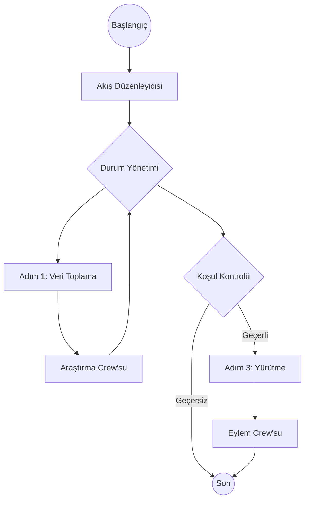

# Üretim Mimarisi

CrewAI ile üretim kullanıma hazır yapay zeka uygulamaları oluşturmak için en iyi uygulamalar


# Akış Odaklı Düşünce

CrewAI ile üretim yapay zeka uygulamaları oluştururken, **önce bir Akış ile başlamanızı öneririz**.

Bireysel Crew veya Agent'ları çalıştırmak mümkün olsa da, bunları bir Akış'a sarmak sağlam, ölçeklenebilir bir uygulama için gerekli yapıyı sağlar.

## Neden Akışlar?

1.  **Durum Yönetimi**: Akışlar, uygulamanızın farklı adımlarını genelinde durum yönetiminin yerleşik bir yolunu sağlar. Bu, Crew'lar arasında veri aktarmak, bağlamı korumak ve kullanıcı girdilerini işlemek için çok önemlidir.
2.  **Kontrol**: Akışlar, döngüler, koşullu ifadeler ve dallanma mantığı dahil olmak üzere kesin yürütme yollarını tanımlamanıza olanak tanır. Bu, uç durumları ele almak ve uygulamanızın öngörülebilir davranmasını sağlamak için gereklidir.
3.  **Gözlemlenebilirlik**: Akışlar, yürütmeyi izlemeyi, sorunları ayıklamayı ve performansı izlemeyi kolaylaştıran net bir yapı sağlar. Ayrıntılı bilgiler için [CrewAI İzleme](/en/observability/tracing) kullanmanızı öneririz. Ücretsiz gözlemlenebilirlik özelliklerini etkinleştirmek için `crewai login` komutunu çalıştırın.

## Mimari

Tipik bir üretim CrewAI uygulaması aşağıdaki gibi görünür:



### 1. Akış Sınıfı
`Akış` sınıfınız giriş noktasıdır. Durum şemasını ve mantığınızı yürütmek için yöntemleri tanımlar.

```python
from crewai.flow.flow import Flow, listen, start
from pydantic import BaseModel

class AppState(BaseModel):
    user_input: str = ""
    research_results: str = ""
    final_report: str = ""

class ProductionFlow(Flow[AppState]):
    @start()
    def gather_input(self):
        # ... girdi almak için mantık ...
        pass

    @listen(gather_input)
    def run_research_crew(self):
        # ... bir Crew'yu tetikleyin ...
        pass
```

### 2. Durum Yönetimi
Durumunuzu tanımlamak için Pydantic modellerini kullanın. Bu, tür güvenliğini sağlar ve her adımda hangi verilerin mevcut olduğunu açıkça gösterir.

-   **Mümkün olduğunca minimum tutun**: Adımlar arasında kalıcı olarak saklanması gerekenleri depolayın.
-   **Yapılandırılmış veri kullanın**: Mümkün olduğunda yapılandırılmamış sözlüklerden kaçının.

### 3. Crew'lar İş Birimleri Olarak
Karmaşık görevleri Crew'lara devredin. Bir Crew'nun belirli bir hedefe (örneğin, "Bir konuyu araştır", "Bir blog yazısı yaz") odaklanması gerekir.

-   **Crew'ları aşırı mühendislemeyin**: Odaklarını koruyun.
-   **Durumu açıkça geçirin**: Akış durumundan Crew girdilerine gerekli verileri geçirin.

```python
    @listen(gather_input)
    def run_research_crew(self):
        crew = ResearchCrew()
        result = crew.kickoff(inputs={"topic": self.state.user_input})
        self.state.research_results = result.raw
```

## Kontrol Birimleri

CrewAI'nin kontrol birimlerini kullanarak Crew'larınıza sağlamlık ve kontrol ekleyin.

### 1. Görev Kılavuzları
Görev çıktılarını kabul edilmeden önce doğrulamak için [Görev Kılavuzları](/en/concepts/tasks#task-guardrails) kullanın. Bu, agent'larınızın yüksek kaliteli sonuçlar üretmesini sağlar.

```python
def validate_content(result: TaskOutput) -> Tuple[bool, Any]:
    if len(result.raw) < 100:
        return (False, "İçerik çok kısa. Lütfen genişletin.")
    return (True, result.raw)

task = Task(
    ...,
    guardrail=validate_content
)
```

### 2. Yapılandırılmış Çıktılar
Görevler arasında veya uygulamanıza veri aktarırken her zaman yapılandırılmış çıktıları (`output_pydantic` veya `output_json`) kullanın. Bu, ayrıştırma hatalını önler ve tür güvenliğini sağlar.

```python
class ResearchResult(BaseModel):
    summary: str
    sources: List[str]

task = Task(
    ...,
    output_pydantic=ResearchResult
)
```

### 3. LLM Kancaları
LLM'ye gönderilen mesajları incelemek veya değiştirmek veya yanıtları temizlemek için [LLM Kancaları](/en/learn/llm-hooks) kullanın.

```python
@before_llm_call
def log_request(context):
    print(f"Agent {context.agent.role} LLM'yi çağırıyor...")
```

## Dağıtım Desenleri

Akışınızı dağıtırken aşağıdaki hususları göz önünde bulundurun:

### CrewAI Enterprise
Akışınızı dağıtmanın en kolay yolu CrewAI Enterprise'ı kullanmaktır. Altyapıyı, kimlik doğrulamayı ve izlemeyi sizin için yönetir.

Başlamak için [Dağıtım Kılavuzuna](/en/enterprise/guides/deploy-crew) bakın.

```bash
crewai deploy create
```

### Asenkron Yürütme
Uzun süren görevler için, API'nizi engellememek için `kickoff_async`'yi kullanın.

### Kalıcılık
Akışınızın durumunu bir veritabanına kaydetmek için `@persist` dekoratörünü kullanın. Bu, işlemin çökmesi veya insan girdisi beklememiz gerekmesi durumunda yürütmeyi sürdürmenizi sağlar.

```python
@persist
class ProductionFlow(Flow[AppState]):
    # ...
```

## Özet

-   **Bir Akış ile başlayın.**
-   **Net bir Durum tanımlayın.**
-   **Karmaşık görevler için Crew'ları kullanın.**
-   **Bir API ve kalıcılık ile dağıtın.**