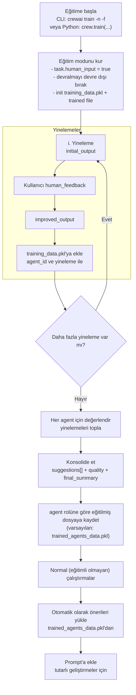

## Eğitim

CrewAI agent'larınızı erken geri bildirim vererek eğitin ve tutarlı sonuçlar elde etmeyi öğrenin.

## Genel Bakış

CrewAI'daki eğitim özelliği, komut satırı arabirimini (CLI) kullanarak yapay zeka agent’larınızı eğitmenize olanak tanır. `crewai train -n <n_iterations>` komutunu çalıştırarak eğitim sürecinin yineleme sayısını belirtebilirsiniz.

Eğitim sırasında CrewAI, agent’larınızın performansını optimize etmek için teknikleri, insan geri bildirimi ile birlikte kullanır. Bu, agent’ların anlayışlarını, karar alma becerilerini ve problem çözme yeteneklerini geliştirmelerine yardımcı olur.

### CLI ile Mürettebatınızı Eğitmek

Eğitim özelliğini kullanmak için aşağıdaki adımları izleyin:

1. Terminalinizi veya komut isteminizi açın.
2. CrewAI projenizin bulunduğu dizine gidin.
3. Aşağıdaki komutu çalıştırın:

```shell
crewai train -n <n_iterations> -f <filename.pkl>
```

`<n_iterations>`'ı istenen eğitim yineleme sayısı ve `<filename>`'ı `.pkl` ile biten uygun dosya adı ile değiştirin.

Eğer `-f`'yi atlayarak devam ederseniz, çıktı varsayılan olarak geçerli çalışma dizininde `trained_agents_data.pkl` olarak kaydedilir. Dosyanın nereye yazılacağını kontrol etmek için mutlak bir yol da belirtebilirsiniz.

### Mürettebatınızı Programatik Olarak Eğitmek

Mürettebatınızı programatik olarak eğitmek için aşağıdaki adımları izleyin:

1. Eğitim için yineleme sayısını tanımlayın.
2. Eğitim süreci için girdi parametrelerini belirtin.
3. Olası hataları gidermek için bir try-except bloğu içinde eğitim komutunu çalıştırın.

```python Code
n_iterations = 2
inputs = {"topic": "CrewAI Training"}
filename = "your_model.pkl"

try:
    YourCrewName_Crew().crew().train(
      n_iterations=n_iterations,
      inputs=inputs,
      filename=filename
    )

except Exception as e:
    raise Exception(f"Mürettebat eğitilirken bir hata oluştu: {e}")
```

## Eğitilmiş Verilerin Agent’lar Tarafından Kullanımı

CrewAI, eğitim çıktılarını iki şekilde kullanır: eğitim sırasında insan geri bildiriminizi dahil etmek ve eğitimden sonra, konsolide edilmiş önerilerle agent'ları yönlendirmek için.

### Eğitim Veri Akışı



### Eğitim Çalıştırmaları Sırasında

- Her yinelemede, sistem her agent için şunları kaydeder:
  - `initial_output`: agent'ın ilk cevabı
  - `human_feedback`: istendiğinde sizden gelen geri bildirim
  - `improved_output`: geri bildirimden sonra agent'ın takip cevabı
- Bu veriler, agent'ın dahili kimliği ve yineleme ile anahtarlanan `training_data.pkl` adlı bir çalışma dosyasında saklanır.
- Eğitim aktifken, agent otomatik olarak sizden gelen önceki insan geri bildirimini, eğitim oturumu içindeki sonraki denemelerde bu talimatları uygulamak için prompt'una ekler.
  Eğitim interaktiftir: görevler `human_input = true` olarak ayarlanır, bu nedenle etkileşimli olmayan bir ortamda çalışmak kullanıcı girdisinde bloklanacaktır.

### Eğitim Tamamlandıktan Sonra

- `train(...)` bittiğinde, CrewAI toplanan eğitim verilerini her agent için değerlendirir ve şu sonuçları içeren konsolide edilmiş bir sonuç üretir:
  - `suggestions`: geri bildiriminize ve initial/improved çıktıları arasındaki farktan damıtılmış net, eyleme geçirilebilir talimatlar
  - `quality`: 0–10 ölçeğinde iyileşmeyi gösteren bir puan
  - `final_summary`: gelecekteki görevler için adım adım eylem öğeleri seti
- Bu konsolide edilmiş sonuçlar `train(...)` fonksiyonuna (CLI'deki varsayılan `trained_agents_data.pkl`) ilettiğiniz dosya adına kaydedilir. Girişler, agent'ın `role`'ü ile anahtarlıdır, böylece farklı oturumlarda uygulanabilirler.
- Normal (eğitimli olmayan) yürütme sırasında, her agent otomatik olarak konsolide edilmiş `suggestions`'ını yükler ve bunları görev istemine zorunlu talimatlar olarak ekler. Bu, agent tanımlarınızı değiştirmeden tutarlı geliştirmeler sağlar.

### Dosya Özeti

- `training_data.pkl` (geçici, oturum bazlı):
  - Yapı: `agent_id -> { iteration_number: { initial_output, human_feedback, improved_output } }`
  - Amaç: eğitim sırasında ham verileri ve insan geri bildirimini yakalamak
  - Konum: geçerli çalışma dizininde (CWD) kaydedilir
- `trained_agents_data.pkl` (veya özel dosya adınız):
  - Yapı: `agent_role -> { suggestions: string[], quality: number, final_summary: string }`
  - Amaç: gelecekteki çalıştırmalar için konsolide edilmiş rehberliği sürdürmek
  - Konum: varsayılan olarak CWD'ye yazılır; özel (mutlak dahil) bir yol belirlemek için `-f` kullanın

## Küçük Dil Modeli Hususları

Daha küçük dil modellerini (≤7B parametre) eğitim verisi değerlendirmesi için kullanırken, yapılandırılmış çıktılar üretmede ve karmaşık talimatları izlemede zorluklarla karşılaşabileceklerini unutmayın.

### Küçük Modellerin Eğitim Değerlendirmesindeki Sınırlamaları

### JSON Çıktı Doğruluğu

Küçük modeller, genellikle yapılandırılmış eğitim değerlendirmeleri için gereken geçerli JSON yanıtları üretmede zorlanarak ayrıştırma hatalarına ve eksik verilere yol açar.

### Değerlendirme Kalitesi

7B parametrenin altındaki modeller, daha büyük modellere kıyasla sınırlı muhakeme derinliğine sahip daha nüanslı değerlendirmeler sağlayamayabilir.

### Talimat Takibi

Karmaşık eğitim değerlendirme kriterleri, küçük modeller tarafından tam olarak takip edilmeyebilir veya dikkate alınmayabilir.

### Tutarlılık

Çoklu eğitim yinelemelerinde yapılan değerlendirmeler, küçük modellerde tutarsız olabilir.

### Öneriler için Eğitim

Optimal eğitim kalitesi ve güvenilir değerlendirmeler için en az 7B parametreli veya daha büyük modeller kullanmanızı önemle tavsiye ederiz:

```python
from crewai import Agent, Crew, Task, LLM

# Eğitim değerlendirmesi için önerilen minimum
llm = LLM(model="mistral/open-mistral-7b")

# Daha güvenilir eğitim değerlendirmesi için daha iyi seçenekler
llm = LLM(model="anthropic/claude-3-sonnet-20240229-v1:0")
llm = LLM(model="gpt-4o")

# Bu LLM'yi agent'larınızla kullanın
agent = Agent(
    role="Eğitim Değerlendiricisi",
    goal="Doğru eğitim geri bildirimi sağlayın",
    llm=llm
)
```

Daha güçlü modeller, daha iyi muhakemeyle daha yüksek kaliteli geri bildirim sağlar ve bu da daha etkili eğitim yinelemelerine yol açar.

Eğitim değerlendirmesi için küçük modelleri kullanmak zorundaysanız, bu sınırlamalara dikkat edin:

```python
# Daha küçük bir model kullanma (bazı sınırlamalar bekleyin)
llm = LLM(model="huggingface/microsoft/Phi-3-mini-4k-instruct")
```

CrewAI, küçük modellere yönelik optimizasyonlar içerse de, eğitim sırasında daha az güvenilir ve daha az nüanslı değerlendirme sonuçları bekleyin ve bunun insan müdahalesi gerektirebileceğini unutmayın.

### Dikkat Edilmesi Gereken Önemli Noktalar

- **Pozitif Tamsayı Gerekliliği:** Eğitim yineleme sayısı (`n_iterations`) için pozitif bir tamsayı olduğundan emin olun. Bu koşul karşılanmazsa kod bir `ValueError` hatası verecektir.
- **Dosya Adı Gerekliliği:** Dosya adının `.pkl` ile bittiğinden emin olun. Bu koşul karşılanmazsa kod bir `ValueError` hatası verecektir.
- **Hata İşleme:** Kod, alt süreç hatalarını ve beklenmedik istisnaları işleyerek kullanıcıya hata mesajları sağlar.
- Eğitilmiş rehberlik, prompt zamanında uygulanır; Python/YAML agent tanımlarınızı değiştirmez.
- Agent'lar otomatik olarak `trained_agents_data.pkl` adlı bir dosyadan konsolide edilmiş `suggestions`'ını yükler, bu dosya geçerli çalışma dizininde bulunur. Farklı bir dosya adına eğitim yapmışsanız, çalıştırmadan önce bunu `trained_agents_data.pkl` olarak yeniden adlandırın veya kodda yükleyiciyi ayarlayın.
- `crewai train`'i `-f/--filename` ile çağırarak çıktı dosya adını değiştirebilirsiniz. Dış CWD'de kaydetmek isterseniz mutlak yollar desteklenir.

Eğitim sürecinin zaman alabileceğini, ayrıca her yinelemede sizden geri bildirim gerektireceğini unutmamak önemlidir.

Eğitim tamamlandıktan sonra agent'larınız, karmaşık görevleri ele almaya ve daha tutarlı ve değerli bilgiler sağlamaya hazır olacak şekilde geliştirilmiş yeteneklere ve bilgiye sahip olacaktır.

Agent'larınızı en son bilgilerle ve alandaki gelişmelerle güncel tutmak için düzenli olarak güncelleyin ve yeniden eğitin.
