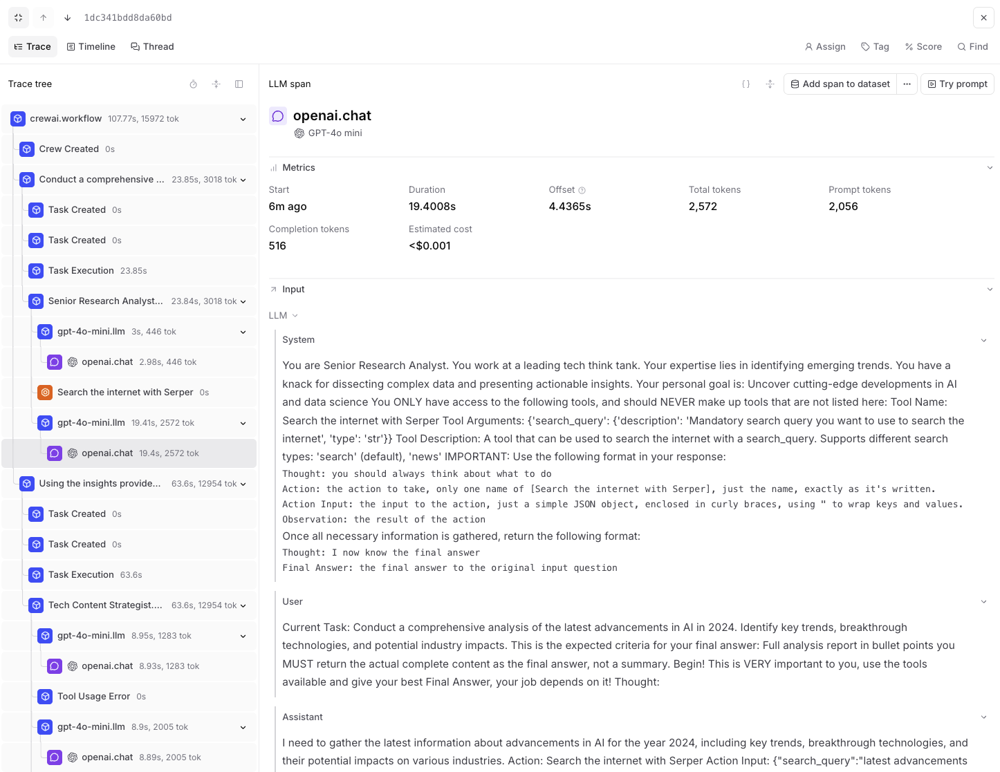
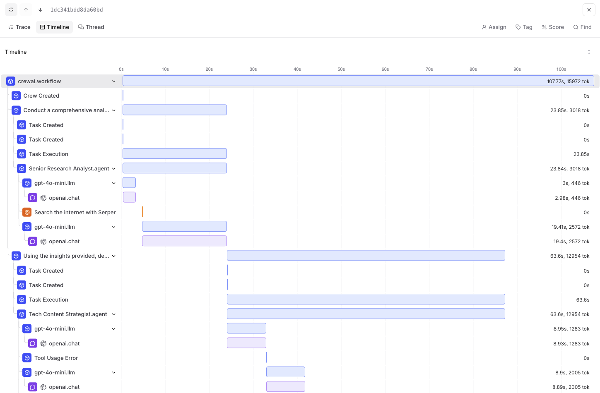
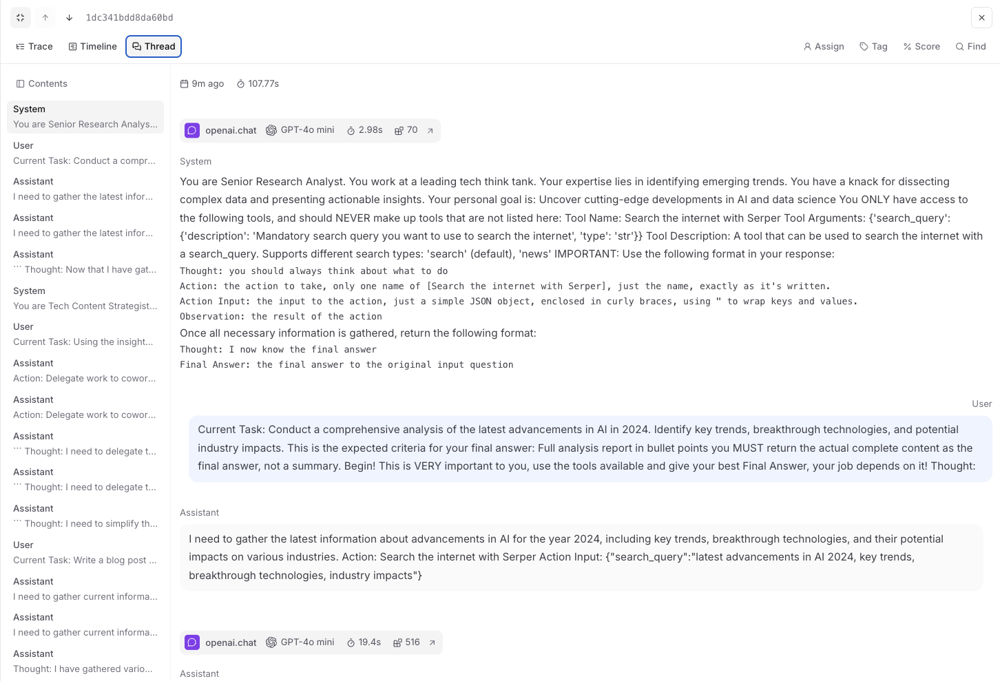

# Braintrust Entegrasyonu

Bu kılavuz, **Braintrust**'ı **CrewAI** ile OpenTelemetry kullanarak kapsamlı izleme ve değerlendirme için nasıl entegre edeceğinizi göstermektedir. Bu kılavuzun sonunda, CrewAI ajanlarınızı izleyebilecek, performanslarını izleyebilecek ve Braintrust'ın güçlü gözlemlenebilirlik platformunu kullanarak çıktılarını değerlendirebileceksiniz.

> **Braintrust Nedir?** [Braintrust](https://www.braintrust.dev), yerleşik deney denetimi ve performans analitiğine sahip yapay zeka uygulamaları için kapsamlı izleme, değerlendirme ve izleme sağlayan bir yapay zeka değerlendirme ve gözlemlenebilirlik platformudur.

## Başlangıç

Kapsamlı gözlemlenebilirlik ve değerlendirme için CrewAI'ı kullanmak ve OpenTelemetry aracılığıyla Braintrust ile entegre etmek için basit bir örnek üzerinden geçeceğiz.

### 1. Adım: Bağımlılıkları Yükleyin

```bash
uv add braintrust[otel] crewai crewai-tools opentelemetry-instrumentation-openai opentelemetry-instrumentation-crewai python-dotenv
```

### 2. Adım: Ortam Değişkenlerini Ayarlayın

Braintrust API anahtarlarını ayarlayın ve OpenTelemetry'i Braintrust'a izlemeler göndermesi için yapılandırın. Bir Braintrust API anahtarına ve OpenAI API anahtarınıza ihtiyacınız olacaktır.

```python
from getpass import getpass

# Braintrust kimlik bilgilerini alın
BRAINTRUST_API_KEY = getpass("🔑 Braintrust API Anahtarınızı girin: ")

# Hizmetler için API anahtarlarını alın
OPENAI_API_KEY = getpass("🔑 OpenAI API anahtarınızı girin: ")

# Ortam değişkenlerini ayarlayın
os.environ["BRAINTRUST_API_KEY"] = BRAINTRUST_API_KEY
os.environ["BRAINTRUST_PARENT"] = "project_name:crewai-demo"
os.environ["OPENAI_API_KEY"] = OPENAI_API_KEY
```

### 3. Adım: Braintrust ile OpenTelemetry'i Başlatın

İzlemeleri yakalamaya başlayıp Braintrust'a göndermek için Braintrust OpenTelemetry enstrümantasyonunu başlatın.

```python
from typing import Any, Dict

from braintrust.otel import BraintrustSpanProcessor
from crewai import Agent, Crew, Task
from crewai.llm import LLM
from opentelemetry import trace
from opentelemetry.instrumentation.crewai import CrewAIInstrumentor
from opentelemetry.instrumentation.openai import OpenAIInstrumentor
from opentelemetry.sdk.trace import TracerProvider

def setup_tracing() -> None:
    """OpenTelemetry izlemeyi Braintrust ile ayarlayın."""
    current_provider = trace.get_tracer_provider()
    if isinstance(current_provider, TracerProvider):
        provider = current_provider
    else:
        provider = TracerProvider()
        trace.set_tracer_provider(provider)

    provider.add_span_processor(BraintrustSpanProcessor())
    CrewAIInstrumentor().instrument(tracer_provider=provider)
    OpenAIInstrumentor().instrument(tracer_provider=provider)


setup_tracing()
```

### 4. Adım: Bir CrewAI Uygulaması Oluşturun

Kapsamlı izlemenin etkin olduğu iki aracının işbirliği yaptığı bir CrewAI uygulaması oluşturacağız ve bir blog yazısı yapay zeka gelişmelerini araştırıp yazacağız.

```python
from crewai import Agent, Crew, Process, Task
from crewai_tools import SerperDevTool

def create_crew() -> Crew:
    """Kapsamlı izleme için birden çok aracı içeren bir ekip oluşturun."""
    llm = LLM(model="gpt-4o-mini")
    search_tool = SerperDevTool()

    # Belirli rollere sahip ajanları tanımlayın
    researcher = Agent(
        role="Kıdemli Araştırma Analisti",
        goal="Yapay zeka ve veri bilimindeki en son gelişmeleri ortaya çıkarın",
        backstory="""Önde gelen bir teknoloji düşünce kuruluşunda çalışıyorsunuz.
        Uzmanlığınız, ortaya çıkan eğilimleri belirlemekte yatmaktadır.
        Karmaşık verileri kesme ve eyleme geçirilebilir bilgiler sunma konusunda bir yeteneğiniz var.""",
        verbose=True,
        allow_delegation=False,
        llm=llm,
        tools=[search_tool],
    )

    writer = Agent(
        role="Teknik İçerik Stratejisti",
        goal="Teknolojik gelişmeler hakkında ilgi çekici içerik oluşturun",
        backstory="""Siz tanınmış bir İçerik Stratejisisiniz, karmaşık kavramları ilgi çekici anlatılara dönüştürme konusunda biliniyorsunuz.""",
        verbose=True,
        allow_delegation=True,
        llm=llm,
    )

    # Ajanlarınız için görevler oluşturun
    research_task = Task(
        description="""{konu} konusundaki en son gelişmeleri kapsamlı bir şekilde analiz edin.
        Ana eğilimleri, çığır açan teknolojileri ve olası endüstri etkilerini belirleyin.""",
        expected_output="Tam analiz raporu madde işaretleriyle",
        agent=researcher,
    )

    writing_task = Task(
        description="""Sağlanan içgörülere göre, en önemli {konu} gelişmelerini vurgulayan ilgi çekici bir blog yazısı geliştirin.
        Yazınız bilgilendirici olmalı ancak teknik bilgisi olan bir kitleye hitap edecek şekilde anlaşılabilir olmalıdır.
        Havalı bir şekilde yazın, karmaşık kelimelerden kaçının, bu yüzden yapay zeka gibi ses çıkarmayın.""",
        expected_output="En az 4 paragraflık tam blog yazısı",
        agent=writer,
        context=[research_task],
    )

    # Aracılarla sıralı bir süreç kullanarak ekibinizi başlatın
    crew = Crew(
        agents=[researcher, writer], 
        tasks=[research_task, writing_task], 
        verbose=True, 
        process=Process.sequential
    )

    return crew

def run_crew():
    """Ekibi çalıştırın ve sonuçları döndürün."""
    crew = create_crew()
    result = crew.kickoff(inputs={"topic": "AI developments"})
    return result

# Ekibinizi çalıştırın
if __name__ == "__main__":
    # Enstrümantasyon, bu modülde yukarıda başlatılmıştır
    result = run_crew()
    print(result)
```

### 5. Adım: Braintrust'ta İzlemeleri Görüntüleyin

Ekibinizi çalıştırdıktan sonra, Braintrust'ta farklı perspektiflerle kapsamlı izlemeleri görüntüleyebilirsiniz:

    

    

  
  
    

    
  


### 6. Adım: SDK (Deneyler) ile Değerlendirme

Ayrıca Braintrust'ın Eval SDK'sını kullanarak değerlendirme de yapabilirsiniz. Bu, sürümleri karşılaştırmak veya çıktıları çevrimdışı olarak puanlamak için kullanışlıdır. Aşağıda, yukarıda oluşturduğumuz ekiple bir `Eval` sınıfı kullanarak bir Python örneği verilmiştir:

```python
# eval_crew.py
from braintrust import Eval
from autoevals import Levenshtein

def evaluate_crew_task(input_data):
    """Değerlendirme için ekibimizi saran görev fonksiyonu."""
    crew = create_crew()
    result = crew.kickoff(inputs={"topic": input_data["topic"]})
    return str(result)

Eval(
    "AI Research Crew",  # Proje adı
    {
        "data": lambda: [
            {"topic": "artificial intelligence trends 2024"},
            {"topic": "machine learning breakthroughs"},
            {"topic": "AI ethics and governance"},
        ],
        "task": evaluate_crew_task,
        "scores": [Levenshtein],
    },
)
```

API anahtarınızı ayarlayın ve çalıştırın:

```bash
braintrust eval eval_crew.py
```

Daha fazla ayrıntı için [Braintrust Eval SDK kılavızına](https://www.braintrust.dev/docs/start/eval-sdk) bakın.

### Braintrust Entegrasyonunun Temel Özellikleri

- **Kapsamlı İzleme**: Tüm ajan etkileşimlerini, araç kullanımını ve LLM çağrılarını izleyin
- **Performans İzleme**: Yürütme sürelerini, belirteç kullanımını ve başarı oranlarını izleyin
- **Deney Takibi**: Farklı ekip yapılandırmalarını ve modellerini karşılaştırın
- **Otomatik Değerlendirme**: Ekip çıktıları için özel değerlendirme ölçütleri ayarlayın
- **Hata İzleme**: Ekip yürütmelerinizdeki hataları izleyin ve hata ayıklayın
- **Maliyet Analizi**: Belirteç kullanımını ve ilişkili maliyetleri izleyin

### Sürüm Uyumluluk Bilgileri
- Python 3.8+
- CrewAI >= 0.86.0
- Braintrust >= 0.1.0
- OpenTelemetry SDK >= 1.31.0

### Referanslar
- [Braintrust Belgeleri](https://www.braintrust.dev/docs) - Braintrust platformunun genel görünümü
- [Braintrust CrewAI Entegrasyonu](https://www.braintrust.dev/docs/integrations/crew-ai) - Resmi CrewAI entegrasyonu kılavuzu
- [Braintrust Eval SDK](https://www.braintrust.dev/docs/start/eval-sdk) - SDK aracılığıyla deneyleri çalıştırın
- [CrewAI Belgeleri](https://docs.crewai.com/) - CrewAI çerçevesinin genel görünümü
- [OpenTelemetry Belgeleri](https://opentelemetry.io/docs/) - OpenTelemetry kılavuzu
- [Braintrust GitHub](https://github.com/braintrustdata/braintrust) - Braintrust SDK için kaynak kodu