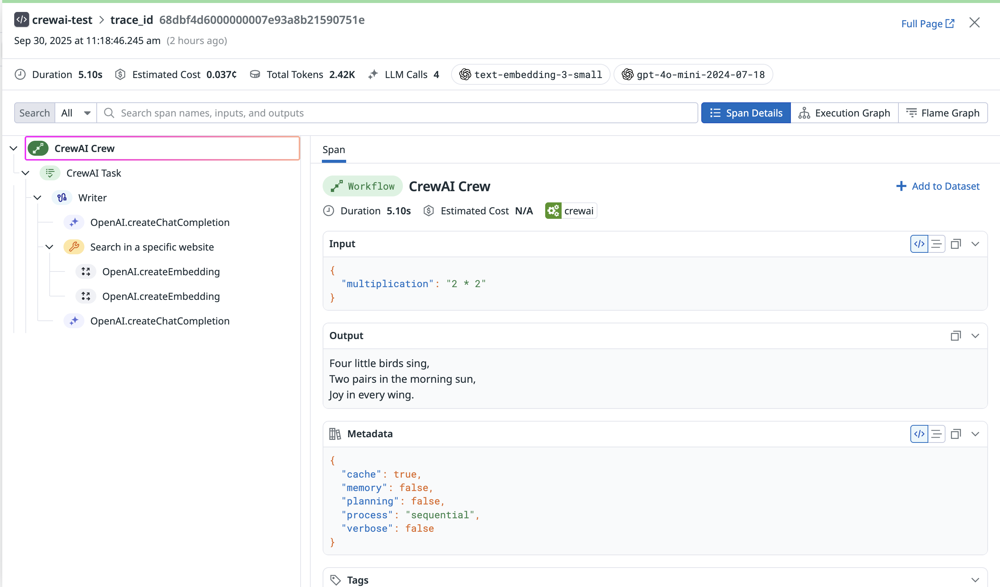
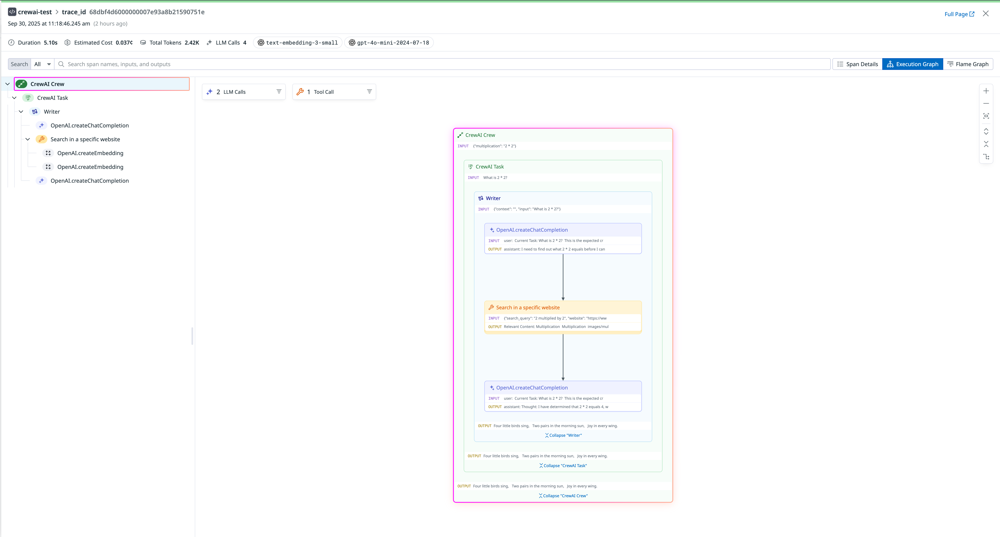

# Datadog Entegrasyonu

**CrewAI** ile **[Datadog LLM Gözlemlenebilirliği](https://docs.datadoghq.com/llm_observability/)** entegrasyonunu öğrenin ve LLM Gözlemlenebilirlik izlerini Datadog'a göndermek için [Datadog otomatik enstrümantasyonu](https://docs.datadoghq.com/llm_observability/instrumentation/auto_instrumentation?tab=python) kullanın.


# Datadog ile CrewAI Entegrasyonu

Bu kılavuz, **[Datadog LLM Gözlemlenebilirliği](https://www.datadoghq.com/product/llm-observability/)** ile **CrewAI** entegrasyonunu [Datadog otomatik enstrümantasyonu](https://docs.datadoghq.com/llm_observability/instrumentation/auto_instrumentation?tab=python) kullanarak nasıl yapılacağını göstermektedir. Bu kılavuzun sonunda, LLM Gözlemlenebilirlik izlerini Datadog'a gönderebilecek ve CrewAI agent çalıştırmalarınızı Datadog LLM Gözlemlenebilirliği'nin [Agentic Execution View](https://docs.datadoghq.com/llm_observability/monitoring/agent_monitoring) bölümünde görüntüleyebileceksiniz.

## Datadog LLM Gözlemlenebilirliği Nedir?

[Datadog LLM Gözlemlenebilirliği](https://www.datadoghq.com/product/llm-observability/), yapay zeka mühendisleri, veri bilimcileri ve uygulama geliştiricilerinin LLM uygulamalarını hızla geliştirmesine, değerlendirmesine ve izlemesine yardımcı olur. Yapılandırılmış deneyler, yapay zeka agent'lar arasında uçtan uca izleme ve değerlendirmeler ile çıktı kalitesini, performansı, maliyetleri ve genel riski güvenle iyileştirin.

## Başlangıç

### Bağımlılıkları Yükleyin

```shell
pip install ddtrace crewai crewai-tools
```

### Ortam Değişkenlerini Ayarlayın

Datadog API anahtaranız yoksa, [bir hesap oluşturabilirsiniz](https://www.datadoghq.com/) ve [API anahtarınızı alabilirsiniz](https://docs.datadoghq.com/account_management/api-app-keys/#api-keys).

Ayrıca, aşağıdaki ortam değişkenlerinde bir ML Uygulama adı belirtmeniz gerekecektir. Bir ML Uygulaması, belirli bir LLM tabanlı uygulama ile ilişkilendirilen LLM Gözlemlenebilirlik izlerinin bir gruplandırmasıdır. ML Uygulama adları ile ilgili sınırlamalar hakkında daha fazla bilgi için [ML Uygulama Adlandırma Yönergeleri](https://docs.datadoghq.com/llm_observability/instrumentation/sdk?tab=python#application-naming-guidelines) bölümüne bakın.

```shell
export DD_API_KEY=<YOUR_DD_API_KEY>
export DD_SITE=<YOUR_DD_SITE>
export DD_LLMOBS_ENABLED=true
export DD_LLMOBS_ML_APP=<YOUR_ML_APP_NAME>
export DD_LLMOBS_AGENTLESS_ENABLED=true
export DD_APM_TRACING_ENABLED=false
```

Ek olarak, LLM sağlayıcı API anahtarlarını yapılandırın

```shell
export OPENAI_API_KEY=<YOUR_OPENAI_API_KEY>
export ANTHROPIC_API_KEY=<YOUR_ANTHROPIC_API_KEY>
export GEMINI_API_KEY=<YOUR_GEMINI_API_KEY>
...
...
```

### Bir CrewAI Agent Uygulaması Oluşturun

```python
# crewai_agent.py
from crewai import Agent, Task, Crew

from crewai_tools import (
    WebsiteSearchTool
)

web_rag_tool = WebsiteSearchTool()

writer = Agent(
    role="Yazar",
    goal="Çocuklar için matematik şiirlerle ilgi çekici ve anlaşılır hale getireceksiniz",
    backstory="Haiku yazma konusunda uzmansınız ancak matematikle hiçbir şey bilmezsiniz.",
    tools=[web_rag_tool],
)

task = Task(
    description=("{Çarpma} nedir?"),
    expected_output=("Cevabı içeren bir haiku bestele."),
    agent=writer
)

crew = Crew(
    agents=[writer],
    tasks=[task],
    share_crew=False
)

output = crew.kickoff(dict(multiplication="2 * 2"))
```

### Uygulamayı Datadog Otomatik Enstrümantasyonu ile Çalıştırın

[Ortam değişkenleri](#set-environment-variables) ayarlandıktan sonra, uygulamayı Datadog otomatik enstrümantasyonu ile çalıştırabilirsiniz.

```shell
ddtrace-run python crewai_agent.py
```

### İzleri Datadog'da Görüntüleyin

Uygulamayı çalıştırdıktan sonra, izleri [Datadog LLM Gözlemlenebilirliği'nin Traces View](https://app.datadoghq.com/llm/traces) bölümünde, soldaki üst köşedeki açılır menüden seçtiğiniz ML Uygulama adı ile görüntüleyebilirsiniz.

Bir izlemeye tıklamak, kullanılan toplam jetonları, LLM çağrı sayısını, kullanılan modelleri ve tahmini maliyeti içeren izlemenin ayrıntılarını gösterecektir. Belirli bir span'e tıklamak bu ayrıntıları daraltacak ve ilgili girdi, çıktı ve meta verileri gösterecektir.





Ek olarak, izlemenin kontrol ve veri akışını gösteren yürütme grafiği görünümünü görüntüleyebilirsiniz; bu, daha büyük agent'lar için el değiştirmelerini ve LLM çağrıları, araç çağrıları ve agent etkileşimleri arasındaki ilişkileri göstermek için ölçeklenecektir.





## Referanslar

- [Datadog LLM Gözlemlenebilirliği](https://www.datadoghq.com/product/llm-observability/)
- [Datadog LLM Gözlemlenebilirlik CrewAI Otomatik Enstrümantasyonu](https://docs.datadoghq.com/llm_observability/instrumentation/auto_instrumentation?tab=python#crew-ai)