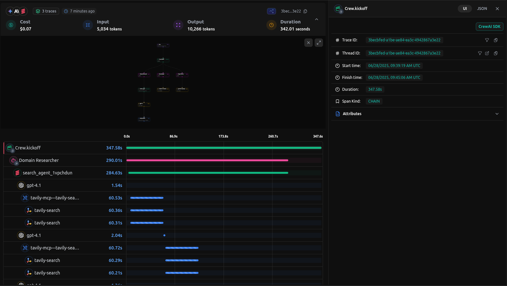
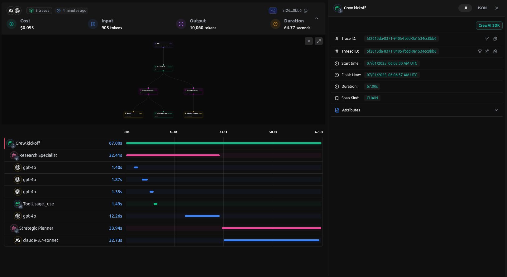

# LangDB Entegrasyonu
CrewAI iş akışlarınızı LangDB AI Gateway ile yönetin, güvenliğini sağlayın ve optimize edin—350'den fazla modeli kullanın, otomatik yönlendirmeyi sağlayın, maliyet optimizasyonu yapın ve tam gözlemlenebilirlik elde edin.


# Giriş

[LangDB AI Gateway](https://langdb.ai), birden fazla Büyük Dil Modeli (LLM) ile bağlantı kurmak için OpenAI uyumlu API'ler sağlar ve CrewAI iş akışlarını uçtan uca izlemeyi kolaylaştıran bir gözlemlenebilirlik platformudur ve aynı zamanda 350'den fazla dil modeline erişim sağlar. Tek bir `init()` çağrısıyla, tüm agent etkileşimleri, görev yürütmeleri ve LLM çağrıları kaydedilir, böylece uygulamalarınız için kapsamlı gözlemlenebilirlik ve üretim odaklı yapay zeka altyapısı sağlanır.


  


**İnceleyin:** [Canlı izleme örneğini görüntüleyin](https://app.langdb.ai/sharing/threads/3becbfed-a1be-ae84-ea3c-4942867a3e22)

## Özellikler

### Yapay Zeka Ağ Geçidi Yetenekleri
- **350'den fazla LLM'ye erişim**: Tek bir entegrasyon ile tüm büyük dil modellerine bağlanın
- **Sanal Modeller**: Belirli parametreler ve yönlendirme kuralları ile özel model yapılandırmaları oluşturun
- **Sanal MCP**: Gelişmiş agent iletişimi için Model Bağlam Protokolü (MCP) sistemleriyle uyumluluğu ve entegrasyonu etkinleştirin
- **Koruyucular**: Agent davranışları için güvenlik önlemleri ve uyumluluk kontrolleri uygulayın

### Gözlemlenebilirlik ve İzleme
- **Otomatik İzleme**: Tek bir `init()` çağrısı tüm CrewAI etkileşimlerini yakalar
- **Uçtan Uca Görünürlük**: Agent iş akışlarını başından sonuna kadar izleyin
- **Araç Kullanımı Takibi**: Agent'ların kullandığı araçları ve sonuçlarını izleyin
- **Model Çağrı İzlemesi**: LLM etkileşimleri hakkında ayrıntılı bilgiler
- **Performans Analitiği**: Gecikme, jeton kullanımı ve maliyetleri izleyin
- **Hata Ayıklama Desteği**: Sorun giderme için adım adım yürütme
- **Gerçek Zamanlı İzleme**: Canlı izleme ve ölçümler gösterge paneli

## Kurulum Talimatları


  
    LangDB istemciyi CrewAI özellik bayrağıyla birlikte yükleyin:
    ```bash
    pip install 'pylangdb[crewai]'
    ```
  
  
    LangDB kimlik bilgilerini yapılandırın:
    ```bash
    export LANGDB_API_KEY="<your_langdb_api_key>"
    export LANGDB_PROJECT_ID="<your_langdb_project_id>"
    export LANGDB_API_BASE_URL='https://api.us-east-1.langdb.ai'
    ```
  
  
    CrewAI kodunuzu yapılandırmadan önce LangDB'yi içe aktarın ve başlatın:
    ```python
    from pylangdb.crewai import init
    # LangDB'yi başlatın
    init()
    ```
  
  
    LLM'nizi LangDB başlıklarıyla ayarlayın:
    ```python
    from crewai import Agent, Task, Crew, LLM
    import os

    # LLM'yi LangDB başlıklarıyla yapılandırın
    llm = LLM(
        model="openai/gpt-4o", # Kullanmak istediğiniz modeli değiştirin
        api_key=os.getenv("LANGDB_API_KEY"),
        base_url=os.getenv("LANGDB_API_BASE_URL"),
        extra_headers={"x-project-id": os.getenv("LANGDB_PROJECT_ID")}
    )
    ```
  


## Hızlı Başlangıç Örneği

LangDB ve CrewAI ile başlayabilmeniz için basit bir örnek:

```python
from pylangdb.crewai import init
from crewai import Agent, Task, Crew, LLM

# CrewAI içe aktarmalarından önce LangDB'yi başlatın
init()

def create_llm(model):
    return LLM(
        model=model,
        api_key=os.environ.get("LANGDB_API_KEY"),
        base_url=os.environ.get("LANGDB_API_BASE_URL"),
        extra_headers={"x-project-id": os.environ.get("LANGDB_PROJECT_ID")}
    )

# Agent'ınızı tanımlayın
researcher = Agent(
    role="Araştırma Uzmanı",
    goal="Konuları kapsamlı bir şekilde araştırın",
    backstory="Bilgi bulma konusunda uzmanlaşmış araştırmacı",
    llm=create_llm("openai/gpt-4o"), # Kullanmak istediğiniz modeli değiştirin
    verbose=True
)

# Bir görev oluşturun
task = Task(
    description="Verilen konuyu araştırın ve kapsamlı bir özet sağlayın",
    agent=researcher,
    expected_output="Ayrıntılı araştırma özeti ve kilit bulgular"
)

# Ekibi oluşturun ve çalıştırın
crew = Crew(agents=[researcher], tasks=[task])
result = crew.kickoff()
print(result)
```

## Kapsamlı Örnek: Araştırma ve Planlama Agent'ı

Bu kapsamlı örnek, araştırma ve planlama yeteneklerine sahip çoklu-agent iş akışını göstermektedir.

### Gereklilikler

```bash
pip install crewai 'pylangdb[crewai]' crewai_tools setuptools python-dotenv
```

### Ortam Kurulumu

```bash
# LangDB kimlik bilgileri

# Ek API anahtarları (isteğe bağlı)
```

### Kapsamlı Uygulama

```python
#!/usr/bin/env python3

from pylangdb.crewai import init
init()  # Herhangi bir CrewAI içe aktarmasından önce LangDB'yi başlatın
from dotenv import load_dotenv
from crewai import Agent, Task, Crew, Process, LLM
from crewai_tools import SerperDevTool

load_dotenv()

def create_llm(model):
    return LLM(
        model=model,
        api_key=os.environ.get("LANGDB_API_KEY"),
        base_url=os.environ.get("LANGDB_API_BASE_URL"),
        extra_headers={"x-project-id": os.environ.get("LANGDB_PROJECT_ID")}
    )

class ResearchPlanningCrew:
    def researcher(self) -> Agent:
        return Agent(
            role="Araştırma Uzmanı",
            goal="Konuları kapsamlı bir şekilde araştırın ve kapsamlı bilgi derleyin",
            backstory="Çeşitli kaynaklardan bilgi bulma ve analiz etme konusunda uzmanlaşmış uzman araştırmacı",
            tools=[SerperDevTool()],
            llm=create_llm("openai/gpt-4o"),
            verbose=True
        )
    
    def planner(self) -> Agent:
        return Agent(
            role="Stratejik Planlayıcı",
            goal="Araştırma bulgularına dayalı uygulanabilir planlar oluşturun",
            backstory="Karmaşık zorlukları yürütülebilir planlara ayıran stratejik planlayıcı",
            reasoning=True,
            max_reasoning_attempts=3,
            llm=create_llm("openai/anthropic/claude-3.7-sonnet"),
            verbose=True
        )
    
    def research_task(self) -> Task:
        return Task(
            description="Konuyu kapsamlı bir şekilde araştırın ve kapsamlı bilgi derleyin",
            agent=self.researcher(),
            expected_output="Kilit bulgular ve içgörüler içeren kapsamlı araştırma raporu"
        )
    
    def planning_task(self) -> Task:
        return Task(
            description="Araştırma bulgularına dayalı bir stratejik plan oluşturun",
            agent=self.planner(),
            expected_output="Aşamalar, hedefler ve uygulanabilir adımlar içeren stratejik yürütme planı",
            context=[self.research_task()]
        )
    
    def crew(self) -> Crew:
        return Crew(
            agents=[self.researcher(), self.planner()],
            tasks=[self.research_task(), self.planning_task()],
            verbose=True,
            process=Process.sequential
        )

def main():
        topic = sys.argv[1] if len(sys.argv) > 1 else "Sağlık Hizmetlerinde Yapay Zeka"
        
        crew_instance = ResearchPlanningCrew()
        
        # Görev açıklamalarını belirli konuyla güncelleyin
        crew_instance.research_task().description = f"{topic} konusunu kapsamlı bir şekilde araştırın ve kapsamlı bilgi derleyin"
    crew_instance.planning_task().description = f"{topic} konusuna dayalı bir stratejik plan oluşturun"
    
    result = crew_instance.crew().kickoff()
    print(result)

if __name__ == "__main__":
    main()
```

### Örneği Çalıştırma

```bash
python main.py "Sürdürülebilir Enerji Çözümleri"
```

## LangDB'de İzlemeleri Görüntüleme

CrewAI uygulamanızı çalıştırdıktan sonra, LangDB gösterge panelinde ayrıntılı izlemeleri görüntüleyebilirsiniz:


  


### Göreceğiniz Şeyler

- **Agent Etkileşimleri**: Agent konuşmalarının ve görev devirlerinin eksiksiz akışı
- **Araç Kullanımı**: Hangi araçların çağrıldığı, girdileri ve çıktıları
- **Model Çağrıları**: İstemler ve yanıtlarla LLM etkileşimleri hakkında ayrıntılı bilgi
- **Performans Metrikleri**: Gecikme, jeton kullanımı ve maliyet izleme
- **Yürütme Zaman Çizelgesi**: Tüm iş akışının adım adım görünümü


## Sorun Giderme

### Yaygın Sorunlar

- **İzlemelerin görünmemesi**: `init()`'in herhangi bir CrewAI içe aktarmasından önce çağrıldığından emin olun
- **Kimlik doğrulama hataları**: LangDB API anahtarınızı ve proje kimliğinizi doğrulayın


## Kaynaklar


  ### LangDB Belgeleri

    Resmi LangDB belgeleri ve kılavuzlar
  
  ### LangDB Kılavuzları

    AI agent'ları oluşturmak için adım adım eğitimler
  
  ### GitHub Örnekleri

    Tam CrewAI entegrasyonu örnekleri
  
  ### LangDB Gösterge Paneli

    İzlemelerinize ve analizlerinize erişin
  
  ### Model Kataloğu

    Kullanılabilir 350'den fazla dil modelini görüntüleyin
  
  ### Kurumsal Özellikler

    Kendini barındırma seçenekleri ve kurumsal yetenekler


## Sonraki Adımlar

Bu kılavuz, LangDB AI Gateway'i CrewAI ile entegre etmenin temellerini ele almıştır. AI iş akışlarınızı daha da geliştirmek için şunları keşfedin:

- **Sanal Modeller**: Yönlendirme stratejileri ile özel model yapılandırmaları oluşturun
- **Koruyucular ve Güvenlik**: İçerik filtreleme ve uyumluluk kontrolleri uygulayın
- **Üretim Dağıtımı**: Geri düşmeleri, yeniden denemeleri ve yük dengelemesini yapılandırın

Daha gelişmiş özellikler ve kullanım örnekleri için [LangDB Belgelerine](https://docs.langdb.ai) bakın veya tüm kullanılabilir modelleri keşfetmek için [Model Kataloğunu](https://app.langdb.ai/models) ziyaret edin.