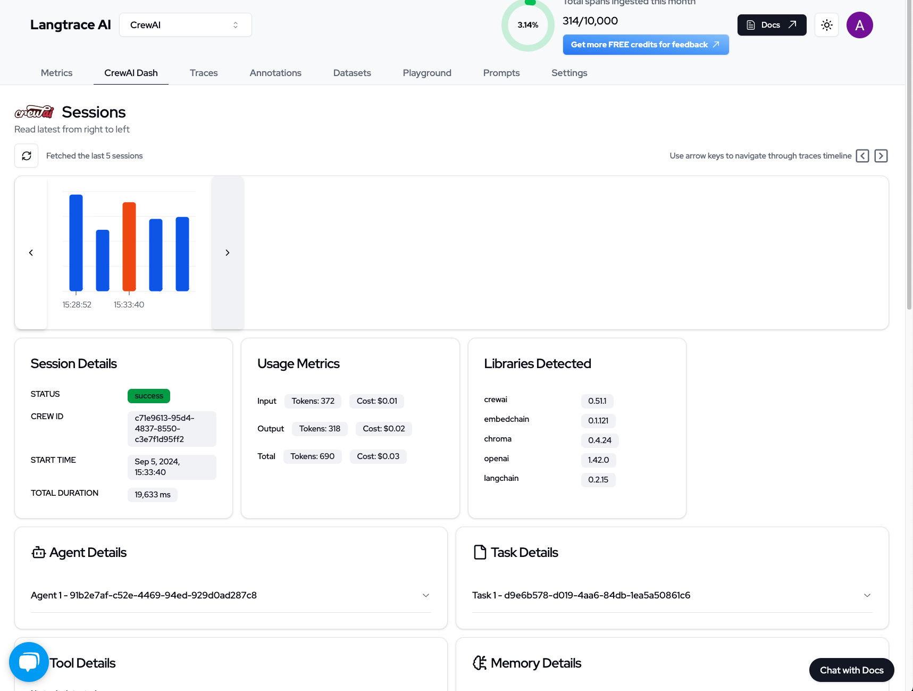
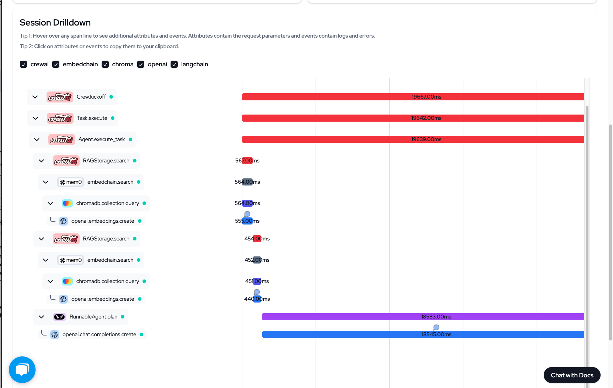
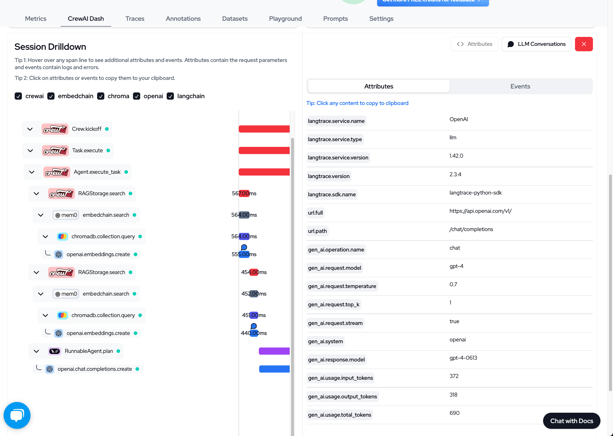

# Langtrace Entegrasyonu
CrewAI Agent'larının maliyetini, gecikmesini ve performansını, harici bir gözlemlenebilirlik aracı olan Langtrace ile nasıl izleyeceğiniz.


# Langtrace Genel Bakış

Langtrace, Büyük Dil Modelleri (LLM), LLM çerçeveleri ve Vektör Veritabanları için gözlemlenebilirlik ve değerlendirme ayarlamanıza yardımcı olan açık kaynaklı, harici bir araçtır. 
CrewAI'ya doğrudan entegre edilmemiş olsa da, CrewAI ile birlikte kullanılarak CrewAI Agent'larınızın maliyeti, gecikmesi ve performansı hakkında derinlemesine bilgi edinmenizi sağlar. 
Bu entegrasyon, hiperparametreleri kaydetmenize, performans gerilemelerini izlemenize ve Agent'larınızın sürekli iyileştirilmesi için bir süreç oluşturmanıza olanak tanır.





## Kurulum Talimatları

   
      [https://langtrace.ai/signup](https://langtrace.ai/signup) adresini ziyaret ederek kaydolun.
   
   
      Proje türünü `CrewAI` olarak ayarlayın ve bir API anahtarı oluşturun.
   
   
      Aşağıdaki komutu kullanın:

    ```bash
    pip install langtrace-python-sdk
    ```
   
   
      CrewAI içe aktarmalarından önce, betiğinizin başında Langtrace'i içe aktarın ve başlatın:

    ```python
    from langtrace_python_sdk import langtrace
    langtrace.init(api_key='')

    # Şimdi CrewAI modüllerini içe aktarın
    from crewai import Agent, Task, Crew
    ```
   
 

### Özellikler ve CrewAI'ye Uygulanmaları

1. **LLM Token ve Maliyet Takibi**

   - Her CrewAI agent etkileşimi için token kullanımı ve ilişkili maliyetleri izleyin.

2. **Çalışma Adımları için İzleme Grafiği**

   - CrewAI görevlerinizin yürütme akışını, gecikmeyi ve günlükleri içeren görselleştirin.
   - Agent iş akışlarınızdaki darboğazları belirlemek için kullanışlıdır.

3. **Manuel Açıklama ile Veri Küresi Düzenleme**

   - Gelecekteki eğitim veya değerlendirme için CrewAI görev çıktılarınızdan veri kümeleri oluşturun.

4. **Prompt Sürümleme ve Yönetimi**

   - CrewAI agent'larınızda kullanılan farklı prompt versiyonlarının kaydını tutun.
   - Agent performansını A/B testi ve optimize etmek için kullanışlıdır.

5. **Model Karşılaştırmalarıyla Prompt Oyun Alanı**

   - Agent'larınızı dağıtmadan önce farklı prompt'ları ve modelleri test edin ve karşılaştırın.

6. **Testler ve Değerlendirmeler**

   - CrewAI agent'larınız ve görevleriniz için otomatik testler ayarlayın.