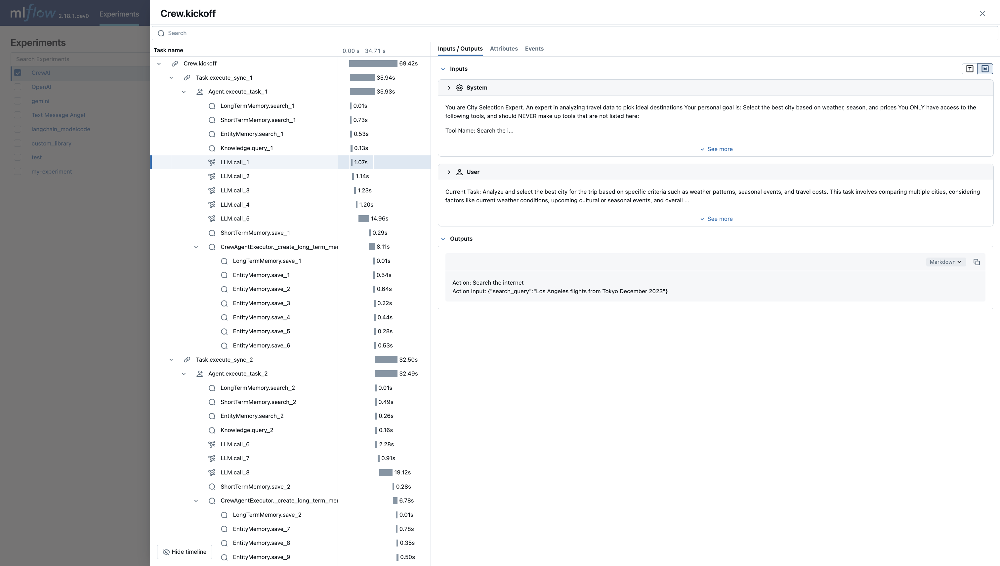

# MLflow Genel Bakış

[MLflow](https://mlflow.org/) makine öğrenimi uygulayıcılarının ve ekiplerinin makine öğrenimi sürecinin karmaşıklıklarını yönetmelerine yardımcı olan açık kaynaklı bir platformdur.

LLM gözlemlenebilirliğini (LLM observability) Üretken Yapay Zeka (Generative AI) uygulamalarınızdaki hizmetlerin yürütülmesi hakkında ayrıntılı bilgileri yakalayarak izleme (tracing) özelliği sağlar. İzleme, bir isteğin her bir ara adımına ilişkin girdi, çıktı ve meta verileri kaydetmenin bir yolunu sunarak hataların ve beklenmedik davranışların kaynağını kolayca belirlemenizi sağlar.


### Özellikler

- **İzleme Panosu**: Ayrıntılı panolarla crewAI ajanlarınızın faaliyetlerini izleyin; panolarda kapsamların girdileri, çıktıları ve meta verileri yer alır.
- **Otomatik İzleme**: crewAI ile tamamen otomatikleştirilmiş bir entegrasyon, `mlflow.crewai.autolog()` çalıştırılarak etkinleştirilebilir.
- **Küçük çaba gerektiren Manuel İzleme Enstrümantasyonu**: MLflow'un yüksek seviyeli akıcı API'leri gibi dekoratörler, fonksiyon sarmalayıcıları ve bağlam yöneticileri aracılığıyla izleme enstrümantasyonunu özelleştirin.
- **OpenTelemetry Uyumluluğu**: MLflow İzleme, izleri çeşitli arka uçlara (Jaeger, Zipkin ve AWS X-Ray gibi) aktarmak için kullanılabilecek bir OpenTelemetry Toplayıcısına aktarmayı destekler.
- **Ajanları Paketleme ve Dağıtma**: crewAI ajanlarınızı çeşitli dağıtım hedefleriyle bir çıkarım sunucusuna paketleyin ve dağıtın.
- **LLM'leri Güvenli Bir Şekilde Barındırma**: MFflow geçidi aracılığıyla çeşitli sağlayıcılardan çok sayıda LLM'yi tek bir birleşik uç noktada barındırın.
- **Değerlendirme**: Çeşitli ölçütler kullanarak crewAI ajanlarınızı `mlflow.evaluate()` kullanışlı API'si ile değerlendirin.

## Kurulum Talimatları

```shell
# crewAI entegrasyonu mlflow>=2.19.0 sürümünde mevcuttur
pip install mlflow
```

```shell
# Bu işlem isteğe bağlıdır, ancak daha iyi görselleştirme ve daha geniş özellikler için MLflow izleme sunucusunu kullanmak önerilir.
mlflow server
```

Uygulama kodunuza aşağıdaki iki satırı ekleyin:

```python
import mlflow

mlflow.crewai.autolog()

# İsteğe bağlı: Bir izleme sunucunuz varsa bir izleme URI'si ve bir deney adı ayarlayın
mlflow.set_tracking_uri("http://localhost:5000")
mlflow.set_experiment("CrewAI")
```

CrewAI Ajanları için izleme kullanımı örneği:

```python
from crewai import Agent, Crew, Task
from crewai.knowledge.source.string_knowledge_source import StringKnowledgeSource
from crewai_tools import SerperDevTool, WebsiteSearchTool

from textwrap import dedent

content = "Kullanıcının adı John. 30 yaşında ve San Francisco'da yaşıyor."
string_source = StringKnowledgeSource(
    content=content, metadata={"preference": "personal"}
)

search_tool = WebsiteSearchTool()


class TripAgents:
    def city_selection_agent(self):
        return Agent(
            role="Şehir Seçim Uzmanı",
            goal="Hava durumu, mevsim ve fiyatlar dikkate alınarak en iyi şehri seçin",
            backstory="İdeal destinasyonları seçmek için seyahat verilerini analiz etmede uzman",
            tools=[
                search_tool,
            ],
            verbose=True,
        )

    def local_expert(self):
        return Agent(
            role="Bu Şehirdeki Yerel Uzman",
            goal="Seçilen şehir hakkında EN İYİ bilgiler sağlayın",
            backstory="""Şehrin cazibe merkezleri ve gelenekleri hakkında kapsamlı bilgiye sahip
            bilgili bir yerel rehber""",
            tools=[search_tool],
            verbose=True,
        )


class TripTasks:
    def identify_task(self, agent, origin, cities, interests, range):
        return Task(
            description=dedent(
                f"""
                Belirli kriterler olan hava durumu kalıpları, mevsimsel
                etkinlikler ve seyahat maliyetleri dikkate alınarak seyahat için en iyi şehri analiz edin ve seçin. Bu görev,
                birden fazla şehri karşılaştırmayı, mevcut hava koşullarını, yaklaşan kültürel veya mevsimsel etkinlikleri ve
                genel seyahat masraflarını dikkate almayı içerir.
                Son cevabınız, seçilen şehir hakkında ayrıntılı bir
                rapor ve bulduğunuz her şeyin yanı sıra uçuş maliyetleri, hava durumu
                tahmini ve cazibe merkezlerini içermelidir.

                Seyahat başlangıç noktası: {origin}
                Şehir Seçenekleri: {cities}
                Seyahat Tarihi: {range}
                Seyahatçi İlgi Alanları: {interests}
              """
            ),
            agent=agent,
            expected_output="Uçuş maliyetleri, hava durumu tahmini ve cazibe merkezleri dahil olmak üzere seçilen şehir hakkında ayrıntılı rapor",
        )

    def gather_task(self, agent, origin, interests, range):
        return Task(
            description=dedent(
                f"""
                Bu şehirdeki yerel uzman olarak, oraya seyahat etmeyi ve
                MÜKEMMEL bir seyahat geçirmeyi amaçlayan biri için kapsamlı
                bir rehber derlemelisiniz!
                Ana cazibe merkezleri, yerel gelenekler, özel etkinlikler ve günlük
                etkinlik önerileri hakkında bilgi toplayın.
                Gitmeniz gereken en iyi yerleri, yalnızca bir yerelinin bilebileceği
                türde yerleri bulun.
                Bu rehber, kültürel bilgiler ve pratik ipuçlarıyla zengin,
                seyahat deneyimini geliştirmek için tasarlanmış kapsamlı bir şehir
                rehberi sağlamalıdır.

                Seyahat Tarihi: {range}
                Seyahat başlangıç noktası: {origin}
                Seyahatçi İlgi Alanları: {interests}
                """
            ),
            agent=agent,
            expected_output="Gizli mücevherler, kültürel merkezler ve pratik seyahat ipuçları içeren kapsamlı şehir rehberi",
        )


class TripCrew:
    def __init__(self, origin, cities, date_range, interests):
        self.cities = cities
        self.origin = origin
        self.interests = interests
        self.date_range = date_range

    def run(self):
        agents = TripAgents()
        tasks = TripTasks()

        city_selector_agent = agents.city_selection_agent()
        local_expert_agent = agents.local_expert()

        identify_task = tasks.identify_task(
            city_selector_agent,
            self.origin,
            self.cities,
            self.interests,
            self.date_range,
        )
        gather_task = tasks.gather_task(
            local_expert_agent, self.origin, self.interests, self.date_range
        )

        crew = Crew(
            agents=[city_selector_agent, local_expert_agent],
            tasks=[identify_task, gather_task],
            verbose=True,
            memory=True,
            knowledge={
                "sources": [string_source],
                "metadata": {"preference": "personal"},
            },
        )

        result = crew.kickoff()
        return result


trip_crew = TripCrew("California", "Tokyo", "12 Aralık - 20 Aralık", "spor")
result = trip_crew.run()

print(result)
```

[MLflow İzleme Belgelerine](https://mlflow.org/docs/latest/llms/tracing/index.html) daha fazla yapılandırma ve kullanım senaryosu için bakın.

Şimdi crewAI ajanlarınız için izler MLflow tarafından yakalanmıştır.
Ajanlarınızla ilgili izleri görüntülemek ve fikir edinmek için MLflow izleme sunucusunu ziyaret edin.

İzleri görüntülemek için `127.0.0.1:5000` adresini tarayıcınızda açın.

