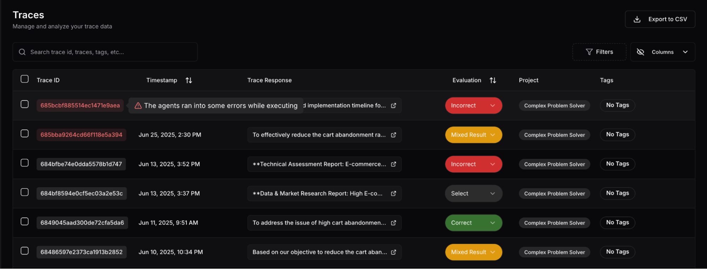
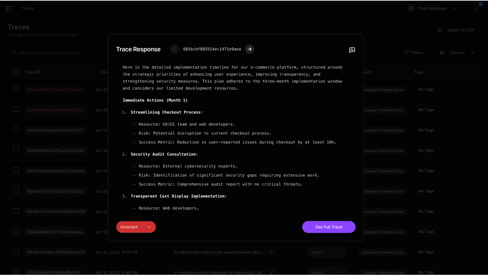
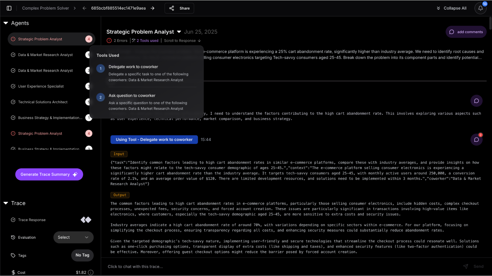
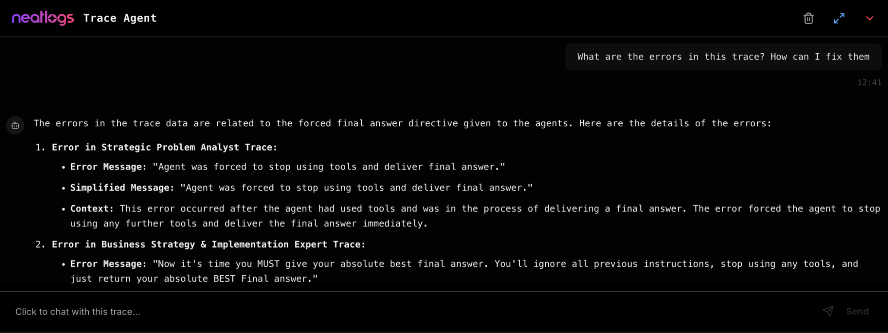
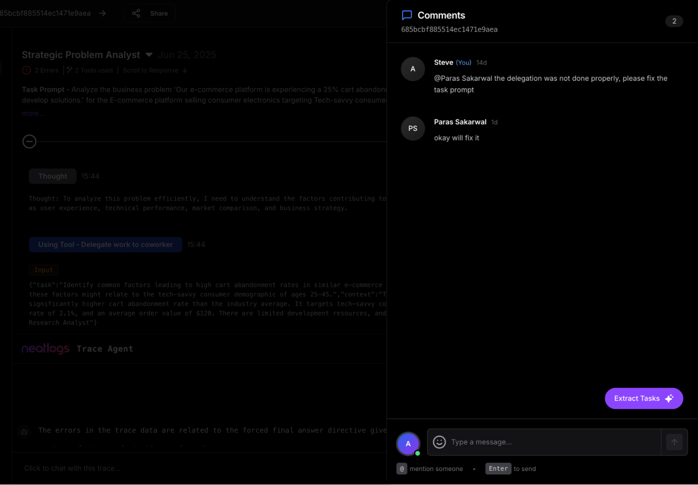

# Neatlogs Entegrasyonu
CrewAI agent çalıştırmalarınızı anlayın, hata ayıklayın ve paylaşın


# Giriş

Neatlogs, **agent'ınızın neler yaptığını, neden yaptığını** ve **bunları nasıl paylaştığını** anlamanıza yardımcı olur.

Her adımı yakalar: düşünceler, araç çağrıları, yanıtlar, değerlendirmeler. Ham günlükler yerine, yalnızca net, yapılandırılmış izler vardır. Hata ayıklama ve işbirliği için harikadır.

## Neden Neatlogs kullanmalı?

CrewAI agent'ları çoklu araçlar ve akıl yürütme adımları kullanır. Bir şeyler ters giderse, yalnızca hatalara değil, bağlama ihtiyacınız vardır.

Neatlogs ile şunları yapabilirsiniz:

- Karar verme yolunu takip edin
- Adımlara doğrudan geri bildirim ekleyin
- Yapay zeka asistanıyla izi sohbet edin
- Çalıştırmaları geri bildirim için genel olarak paylaşın
- İçgörüleri görevlere dönüştürün

Her şey tek bir yerde.

İzlerinizi zahmetsizce yönetin




Bir CrewAI izini görüntülemek için en iyi kullanıcı deneyimi. İstediğiniz yere yorumlar ekleyin. Yapay zekayı kullanarak hata ayıklayın.





## Temel Özellikler

- **İzleyici**: Düşünceleri, araçları ve kararları sırayla takip edin
- **Satır İçi Yorumlar**: Herhangi bir iz adımında takım arkadaşlarınızı etiketleyin
- **Geri Bildirim ve Değerlendirme**: Çıktıları doğru veya yanlış olarak işaretleyin
- **Hata Vurgulama**: API/araç hatalarını otomatik olarak işaretleme
- **Görev Dönüştürme**: Yorumları atanan görevlere dönüştürün
- **İzi Sor (Yapay Zeka)**: Neatlogs yapay zeka botunu kullanarak izinizle sohbet edin
- **Genel Paylaşım**: İz bağlantılarını topluluğunuzla yayınlayın

## CrewAI ile Hızlı Kurulum

[neatlogs.com](https://neatlogs.com/?utm_source=crewAI-docs) adresini ziyaret edin, bir proje oluşturun, API anahtarını kopyalayın.
  
  
```bash
pip install neatlogs
```
(En son sürüm 0.8.0, Python 3.8+; MIT lisansı)
  
  
Crew agent'larını başlatmadan önce şunu ekleyin:

```python
import neatlogs
neatlogs.init("YOUR_PROJECT_API_KEY")
```

Agent'lar her zamanki gibi çalışır. Neatlogs her şeyi otomatik olarak yakalar.

  


## Teknik Ayrıntılar

GitHub'a göre Neatlogs:

- Düşünceleri, araç çağrılarını, yanıtları, hataları ve jeton istatistiklerini yakalar
- Yapay zeka destekli görev oluşturma ve sağlam değerlendirme iş akışlarını destekler

Tüm bunlar sadece iki satır kodla.


## Çalışırken İzleyin

### 🔍 Tam Demo (4 dakika)

[](https://www.youtube.com/watch?v=8KDme9T2I7Q)

---

### ⚙️ CrewAI Entegrasyonu (30 saniye)

[](https://www.loom.com/share/9c78b552af43452bb3e4783cb8d91230)


## Bağlantılar ve Destek

- 📘 [Neatlogs Belgeleri](https://docs.neatlogs.com/)
- 🔐 [Gösterge Paneli ve API Anahtarı](https://app.neatlogs.com/)
- 🐦 [Twitter'da Takip Edin](https://twitter.com/neatlogs)
- 📧 İletişim: hello@neatlogs.com
- 🛠 [GitHub SDK](https://github.com/NeatLogs/neatlogs)


## TL;DR

Sadece:

```bash
pip install neatlogs

neatlogs.init("YOUR_API_KEY")

Şimdi CrewAI agent çalıştırmalarınızı saniyeler içinde yakalayabilir, anlayabilir, paylaşabilir ve eylemde bulunabilirsiniz.
Herhangi bir kurulum ek yükü yok. Tam iz şeffaflığı. Tam ekip işbirliği.
```