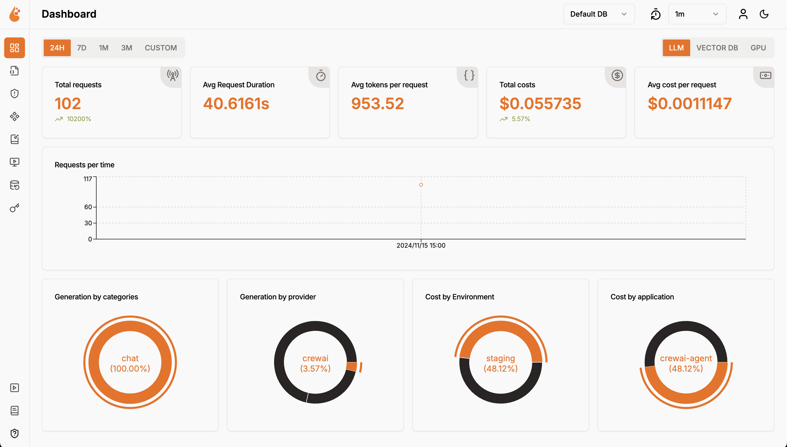
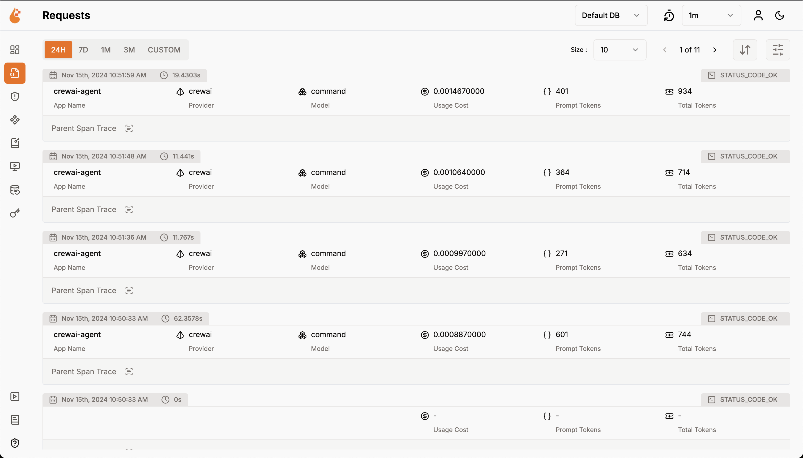
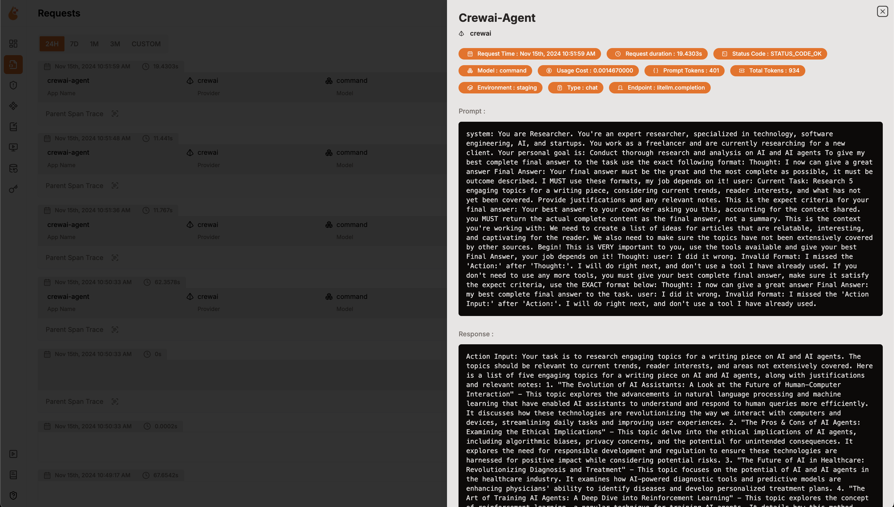

# OpenLIT Entegrasyonu
Agent'larınızı tek bir kod satırıyla izlemeye başlamak için OpenTelemetry ile OpenLIT.


# OpenLIT Genel Bakış

[OpenLIT](https://github.com/openlit/openlit?src=crewai-docs), yapay zeka agent'ları, LLM'ler, VectorDB'ler ve GPU'lar performansını sadece **bir** satır kodla izlemeyi kolaylaştıran açık kaynaklı bir araçtır.

Maliyet, gecikme, etkileşimler ve görev dizileri gibi önemli parametreleri izlemek için OpenTelemetry-native izleme ve ölçümler sağlar.
Bu kurulum, hiperparametreleri izlemenize ve performans sorunlarını belirlemenize olanak tanır, böylece agent'larınızı zamanla geliştirmek ve ince ayar yapmak için yollar bulmanıza yardımcı olur.


  
  
  


### Özellikler

- **Analitik Gösterge Paneli**: Ölçümleri, maliyetleri ve kullanıcı etkileşimlerini izleyen ayrıntılı gösterge panelleriyle Agent'larınızın sağlığını ve performansını izleyin.
- **OpenTelemetry-native Gözlemlenebilirlik SDK'sı**: Grafana, DataDog ve daha fazlası gibi mevcut gözlemlenebilirlik araçlarınıza izlemeleri ve ölçümleri göndermek için satıcıdan bağımsız SDK'lar.
- **Özel ve İnce Ayarlı Modeller için Maliyet Takibi**: Hassas bütçeleme için özel fiyatlandırma dosyalarını kullanarak belirli modeller için maliyet tahminlerini özelleştirin.
- **İstisna İzleme Gösterge Paneli**: Yaygın istisnaları ve hataları izleyerek bir izleme paneliyle sorunları hızla tespit edin ve çözün.
- **Uyumluluk ve Güvenlik**: Argo dili ve PII sızıntıları gibi olası tehditleri tespit edin.
- **Prompt Enjeksiyon Tespiti**: Olası kod enjeksiyonunu ve gizli anahtar sızıntılarını belirleyin.
- **API Anahtarları ve Gizli Anahtarlar Yönetimi**: LLM API anahtarlarınızı ve gizli anahtarlarınızı merkezi olarak güvenli bir şekilde yönetin ve güvensiz uygulamalardan kaçının.
- **Prompt Yönetimi**: Agent'larınız arasında tutarlı ve kolay erişim için PromptHub'ı kullanarak Agent prompt'larını yönetin ve sürümleyin.
- **Model Oyun Alanı**: CrewAI agent'larınız için dağıtımdan önce farklı modelleri test edin ve karşılaştırın.

## Kurulum Talimatları


    
      
        
```shell
git clone git@github.com:openlit/openlit.git
```
        
        
[OpenLIT Repo](https://github.com/openlit/openlit) kök dizininden aşağıdaki komutu çalıştırın:
```shell
docker compose up -d
```
        
      
    
    
```shell
pip install openlit
```
    
    
Aşağıdaki iki satırı uygulamanızın koduna ekleyin:
      
        
```python
import openlit
openlit.init(otlp_endpoint="http://127.0.0.1:4318")
```
          
Bir CrewAI Agent'ı izlemek için örnek kullanım:
    
```python
from crewai import Agent, Task, Crew, Process
import openlit

openlit.init(disable_metrics=True)
# Agent'larınızı tanımlayın
researcher = Agent(
    role="Araştırmacı",
    goal="Yapay zeka ve yapay zeka agent'ları hakkında kapsamlı araştırma ve analiz yürütün",
    backstory="Teknoloji, yazılım mühendisliği, yapay zeka ve startup'lar konusunda uzmanlaşmış deneyimli bir araştırmacısınız. Freelancer olarak çalışıyor ve şu anda yeni bir müşteriniz için araştırma yapıyorsunuz.",
    allow_delegation=False,
    llm='command-r'
    )


    # Görevinizi tanımlayın
    task = Task(
        description="5 ilginç makale fikri listesi oluşturun, ardından her fikrin potansiyelini gösteren büyüleyici bir paragraf yazın ve bu konuda tam bir makale için notlarınızı iade edin.",
        expected_output="Her biri bir paragraf ve eşlik eden notlarla 5 madde işaretli liste.",
    )

    # Yönetici agent'ını tanımlayın
    manager = Agent(
         role="Proje Yöneticisi",
        goal="Ekibi verimli bir şekilde yönetin ve yüksek kaliteli görev tamamlama sağlayın",
        backstory="Karmaşık projeleri denetleme ve ekipleri başarıya yönlendirme konusunda yetenekli deneyimli bir proje yöneticisisiniz. Göreviniz, ekip üyelerinin çabalarını koordine etmek, her görevin zamanında ve en yüksek standartta tamamlanmasını sağlamaktır.",
        allow_delegation=True,
        llm='command-r'
    )

    # Özel bir yönetici ile ekibinizi oluşturun
    crew = Crew(
        agents=[researcher],
        tasks=[task],
        manager_agent=manager,
        process=Process.hierarchical,
        )

    # Ekibin çalışmasını başlatın
    result = crew.kickoff()

print(result)
```
        
        

Aşağıdaki iki satırı uygulamanızın koduna ekleyin:
```python
import openlit
openlit.init()
```

OTEL dışa aktarma uç noktasını yapılandırmak için aşağıdaki komutu çalıştırın:
```shell
export OTEL_EXPORTER_OTLP_ENDPOINT = "http://127.0.0.1:4318"
```

Bir CrewAI Asenkron Agent'ı izlemek için örnek kullanım:

```python
import asyncio
from crewai import Crew, Agent, Task
import openlit

openlit.init(otlp_endpoint="http://127.0.0.1:4318")

# Kod yürütmeyi etkinleştirilmiş bir agent oluşturun
coding_agent = Agent(
role="Python Veri Analisti",
goal="Verileri analiz edin ve Python kullanarak içgörüler sağlayın",
backstory="Güçlü Python becerilerine sahip deneyimli bir veri analistisiniz.",
allow_code_execution=True,
llm="command-r"
    )

# Kod yürütme gerektiren bir görev oluşturun
data_analysis_task = Task(
description="Verilen veri kümesini analiz edin ve katılımcıların ortalama yaşını hesaplayın. Yaşlar: {ages}",
agent=coding_agent,
expected_output="Her biri bir paragraf ve eşlik eden notlarla 5 madde işaretli liste.",
)

# Bir ekip oluşturun ve görevi ekleyin
analysis_crew = Crew(
agents=[coding_agent],
asks=[data_analysis_task]
)

# Ekibin asenkron olarak yürütülmesini kickoff eden asenkron fonksiyon
async def async_crew_execution():
result = await analysis_crew.kickoff_async(inputs={"ages": [25, 30, 35, 40, 45]})
print("Ekip Sonucu:", result)

# Asenkron fonksiyonu çalıştırın
asyncio.run(async_crew_execution())
```
        
      
Agent Gözlemlenebilirlik verileri artık toplandı ve OpenLIT'e gönderildiğinde, bir sonraki adım bu verileri görselleştirmek ve analiz etmek, Agent'ınızın performansı, davranışı hakkında içgörüler elde etmek ve iyileştirme alanlarını belirlemektir.

Sadece tarayıcınızda `127.0.0.1:3000` adresine gidin ve keşfetmeye başlayın. Varsayılan kimlik bilgilerini kullanarak oturum açabilirsiniz
- **E-posta**: `user@openlit.io`
- **Parola**: `openlituser`
      
      

