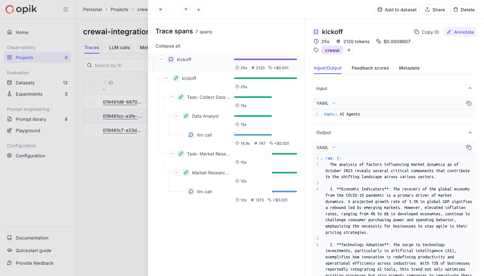

# Opik Genel Bakış

[Comet Opik](https://www.comet.com/docs/opik/) ile kapsamlı izleme, otomatik değerlendirme ve üretim odaklı panolarla LLM uygulamalarınızı, RAG sistemlerinizi ve agent odaklı iş akışlarınızı hata ayıklayın, değerlendirin ve izleyin.

 

  

 

Opik, CrewAI uygulamanızın geliştirme sürecinin her aşaması için kapsamlı destek sağlar:

- **Log İzlemeleri ve Aralıklı Veriler**: LLM çağrılarını ve uygulama mantığını otomatik olarak izleyerek geliştirme ve üretim sistemlerini hata ayıklayın ve analiz edin. Yanıtları manuel veya programlı olarak işaretleyin, görüntüleyin ve projeler arasında karşılaştırın.
- **LLM Uygulamanızın Performansını Değerlendirin**: Özel bir test kümesine karşı değerlendirme yapın ve yerleşik değerlendirme metriklerini çalıştırın veya SDK veya kullanıcı arayüzünde kendi metriklerinizi tanımlayın.
- **CI/CD Boru Hattınız İçinde Test Edin**: PyTest üzerine inşa edilmiş Opik'in LLM birim testleriyle güvenilir performans temel çizgileri oluşturun. Üretimde sürekli izleme için çevrimiçi değerlendirmeler çalıştırın.
- **Üretim Verilerini İzleyin ve Analiz Edin**: Modellerinizin üretimde görülmemiş veriler üzerindeki performansını anlayın ve yeni geliştirme döngüleri için veri kümeleri oluşturun.

## Kurulum
Comet, Opik platformunun barındırılmış bir sürümünü sunar veya platformu yerel olarak çalıştırabilirsiniz. 

Barındırılmış sürümü kullanmak için, [ücretsiz bir Comet hesabı oluşturun](https://www.comet.com/signup?utm_medium=github&utm_source=crewai_docs) ve API anahtarınızı edinin.

Opik platformunu yerel olarak çalıştırmak için, daha fazla bilgi için [kurulum kılavuzumuzu](https://www.comet.com/docs/opik/self-host/overview/) inceleyin.

Bu kılavuz için CrewAI'nin hızlı başlangıç örneğini kullanacağız.

 

  ```shell
  pip install crewai crewai-tools opik --upgrade
  ```
  

  ```python
  import opik
  opik.configure(use_local=False)
  ```
  

  İlk olarak, LLM sağlayıcınız için API anahtarlarımızı ortam değişkenleri olarak ayarlıyoruz:

  ```python
  import os
  import getpass

  if "OPENAI_API_KEY" not in os.environ:
    os.environ["OPENAI_API_KEY"] = getpass.getpass("Enter your OpenAI API key: ")
  ```
  

  İlk adım, projemizi oluşturmaktır. CrewAI'nin belgelerinden bir örnek kullanacağız:

  ```python
  from crewai import Agent, Crew, Task, Process


  class YourCrewName:
      def agent_one(self) -> Agent:
          return Agent(
              role="Data Analyst",
              goal="Analyze data trends in the market",
              backstory="An experienced data analyst with a background in economics",
              verbose=True,
          )

      def agent_two(self) -> Agent:
          return Agent(
              role="Market Researcher",
              goal="Gather information on market dynamics",
              backstory="A diligent researcher with a keen eye for detail",
              verbose=True,
          )

      def task_one(self) -> Task:
          return Task(
              name="Collect Data Task",
              description="Collect recent market data and identify trends.",
              expected_output="A report summarizing key trends in the market.",
              agent=self.agent_one(),
          )

      def task_two(self) -> Task:
          return Task(
              name="Market Research Task",
              description="Research factors affecting market dynamics.",
              expected_output="An analysis of factors influencing the market.",
              agent=self.agent_two(),
          )

      def crew(self) -> Crew:
          return Crew(
              agents=[self.agent_one(), self.agent_two()],
              tasks=[self.task_one(), self.task_two()],
              process=Process.sequential,
              verbose=True,
          )

  ```

  Şimdi Opik'in izleyicisi aktarabilir ve ekibimizi çalıştırabiliriz:

  ```python
  from opik.integrations.crewai import track_crewai

  track_crewai(project_name="crewai-integration-demo")

  my_crew = YourCrewName().crew()
  result = my_crew.kickoff()

  print(result)
  ```
  CrewAI uygulamanızı çalıştırdıktan sonra aşağıdaki öğeleri görüntülemek için Opik uygulamasını ziyaret edin:
  - LLM izlemeleri, aralıklı veriler ve bunların meta verileri
  - Agent etkileşimleri ve görev yürütme akışı
  - Gecikme ve jeton kullanımı gibi performans metrikleri
  - (Yerleşik veya özel) Değerlendirme metrikleri

## Kaynaklar

- [🦉 Opik Belgeleri](https://www.comet.com/docs/opik/)
- [👉 Opik + CrewAI Colab](https://colab.research.google.com/github/comet-ml/opik/blob/main/apps/opik-documentation/documentation/docs/cookbook/crewai.ipynb)
- [🐦 X](https://x.com/cometml)
- [💬 Slack](https://slack.comet.com/)