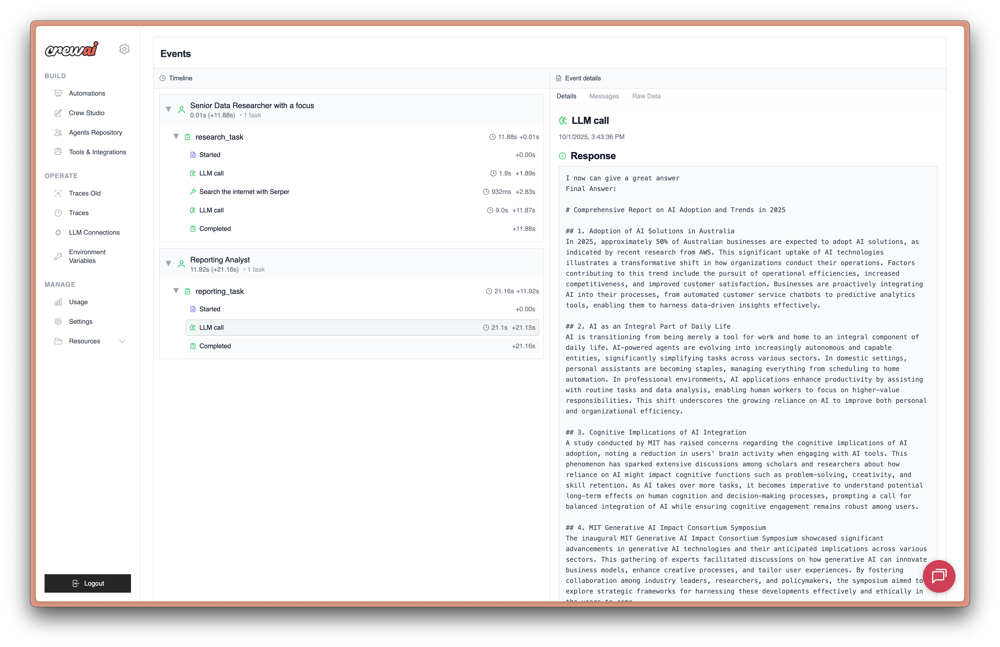
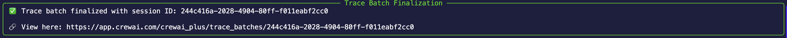

# CrewAI Yerleşik İzleme

CrewAI, Crews ve Flows'larınızı gerçek zamanlı olarak izlemenize ve hata ayıklamanıza olanak tanıyan yerleşik izleme yetenekleri sunar. Bu kılavuz, CrewAI'ın entegre gözlemlenebilirlik platformunu kullanarak hem **Crews** hem de **Flows** için izlemeyi nasıl etkinleştireceğinizi göstermektedir.

> **CrewAI İzleme Nedir?** CrewAI'ın yerleşik izlemesi, agent kararları, görev yürütme zaman çizelgeleri, araç kullanımı ve LLM çağrıları dahil olmak üzere AI agent'larınız için kapsamlı bir gözlemlenebilirlik sağlar - bunların hepsi [CrewAI AMP platformu](https://app.crewai.com) aracılığıyla erişilebilir.



## Ön Koşullar

CrewAI izlemesini kullanmaya başlamadan önce şunlara ihtiyacınız vardır:

1. **CrewAI AMP Hesabı**: [app.crewai.com](https://app.crewai.com) adresinde ücretsiz bir hesap oluşturun
2. **CLI Kimlik Doğrulama**: Yerel ortamınızı kimlik doğrulamak için CrewAI CLI'yı kullanın

```bash
crewai login
```

## Kurulum Talimatları

### Adım 1: CrewAI AMP Hesabınızı Oluşturun

[app.crewai.com](https://app.crewai.com) adresini ziyaret edin ve ücretsiz hesabınızı oluşturun. Bu, izlemeleri görüntüleyebileceğiniz, ölçümleri inceleyebileceğiniz ve crews'larınızı yönetebileceğiniz CrewAI AMP platformuna erişmenizi sağlayacaktır.

### Adım 2: CrewAI CLI'yı Yükleyin ve Kimlik Doğrulamasını Yapın

Henüz yapmadıysanız, CrewAI'yı CLI araçlarıyla yükleyin:

```bash
uv add 'crewai[tools]'
```

Ardından CLI'nızı CrewAI AMP hesabınızla kimlik doğrulatın:

```bash
crewai login
```

Bu komut şunları yapacaktır:

1. Tarayıcınızı kimlik doğrulama sayfasına açar
2. Bir cihaz kodu girmenizi ister
3. Yerel ortamınızı CrewAI AMP hesabınızla kimlik doğrular
4. Yerel geliştirme ortamınız için izleme yeteneklerini etkinleştirir

### Adım 3: Crew'nuzda İzemeyi Etkinleştirin

Crew'nuz için izlemeyi etkinleştirmek için `tracing` parametresini `True` olarak ayarlayın:

```python
from crewai import Agent, Crew, Process, Task
from crewai_tools import SerperDevTool

# Agent'larınızı tanımlayın
researcher = Agent(
    role="Senior Research Analyst",
    goal="Uncover cutting-edge developments in AI and data science",
    backstory="""You work at a leading tech think tank.
    Your expertise lies in identifying emerging trends.
    You have a knack for dissecting complex data and presenting actionable insights.""",
    verbose=True,
    tools=[SerperDevTool()],
)

writer = Agent(
    role="Tech Content Strategist",
    goal="Craft compelling content on tech advancements",
    backstory="""You are a renowned Content Strategist, known for your insightful and engaging articles.
    You transform complex concepts into compelling narratives.""",
    verbose=True,
)

# Agent'larınız için görevler oluşturun
research_task = Task(
    description="""Conduct a comprehensive analysis of the latest advancements in AI in 2024.
    Identify key trends, breakthrough technologies, and potential industry impacts.""",
    expected_output="Full analysis report in bullet points",
    agent=researcher,
)

writing_task = Task(
    description="""Using the insights provided, develop an engaging blog
    post that highlights the most significant AI advancements.
    Your post should be informative yet accessible, catering to a tech-savvy audience.""",
    expected_output="Full blog post of at least 4 paragraphs",
    agent=writer,
)

# Crew'nuzda izlemeyi etkinleştirin
crew = Crew(
    agents=[researcher, writer],
    tasks=[research_task, writing_task],
    process=Process.sequential,
    tracing=True,  # Yerleşik izlemeyi etkinleştirin
    verbose=True
)

# Crew'nuzu çalıştırın
result = crew.kickoff()
```

### Adım 4: Flow'nuzda İzemeyi Etkinleştirin

Benzer şekilde, CrewAI Flows için izlemeyi etkinleştirebilirsiniz:

```python
from crewai.flow.flow import Flow, listen, start
from pydantic import BaseModel

class ExampleState(BaseModel):
    counter: int = 0
    message: str = ""

class ExampleFlow(Flow[ExampleState]):
    def __init__(self):
        super().__init__(tracing=True)  # Flow için izlemeyi etkinleştirin

    @start()
    def first_method(self):
        print("Starting the flow")
        self.state.counter = 1
        self.state.message = "Flow started"
        return "continue"

    @listen("continue")
    def second_method(self):
        print("Continuing the flow")
        self.state.counter += 1
        self.state.message = "Flow continued"
        return "finish"

    @listen("finish")
    def final_method(self):
        print("Finishing the flow")
        self.state.counter += 1
        self.state.message = "Flow completed"

# Flow'u oluşturun ve izleme etkinleştirilmiş olarak çalıştırın
flow = ExampleFlow(tracing=True)
result = flow.kickoff()
```

### Adım 5: İzlemeleri CrewAI AMP Gösterge Tablosunda Görüntüleyin

Crew veya Flow'u çalıştırdıktan sonra, CrewAI uygulamanız tarafından oluşturulan izlemeleri CrewAI AMP gösterge tablosunda görüntüleyebilirsiniz. Agent etkileşimlerinin, araç kullanımlarının ve LLM çağrılarının ayrıntılı adımlarını görmelisiniz.
İzlemeleri görüntülemek için aşağıdaki bağlantıya tıklayın veya gösterge tablosundaki izlemeler sekmesine [buradan](https://app.crewai.com/crewai_plus/trace_batches) gidin.



### Alternatif: Ortam Değişkeni Yapılandırması

İzemeyi genel olarak etkinleştirmek için bir ortam değişkeni ayarlayabilirsiniz:

```bash
export CREWAI_TRACING_ENABLED=true
```

Veya `.env` dosyanıza ekleyin:

```env
CREWAI_TRACING_ENABLED=true
```

Bu ortam değişkeni ayarlandığında, `tracing=True`'yi açıkça ayarlamadan bile tüm Crews ve Flows otomatik olarak izlemeyi etkinleştirecektir.

## İzlemelerinizi Görüntüleme

### CrewAI AMP Gösterge Tablosuna Erişin

1. [app.crewai.com](https://app.crewai.com) adresini ziyaret edin ve hesabınızla oturum açın
2. Proje gösterge tablonuza gidin
3. Yürütme ayrıntılarını görüntülemek için **İzlemeler** sekmesine tıklayın

### İzlemelerde Neleri Göreceksiniz

CrewAI izlemesi şunlara ilişkin kapsamlı görünürlük sağlar:

- **Agent Kararları**: Agent'ların görevlerde nasıl mantık yürüttüğünü ve karar verdiğini görün
- **Görev Yürütme Zaman Çizelgesi**: Görev sıraları ve bağımlılıklarının görsel gösterimi
- **Araç Kullanımı**: Hangi araçların çağrıldığını ve sonuçlarını izleyin
- **LLM Çağrıları**: İstekleri ve yanıtlar dahil olmak üzere tüm dil modeli etkileşimlerini izleyin
- **Performans Ölçümleri**: Yürütme süreleri, token kullanımı ve maliyetler
- **Hata Takibi**: Ayrıntılı hata bilgileri ve yığın izlemeleri

### İzleme Özellikleri

- **Yürütme Zaman Çizelgesi**: Yürütmenin farklı aşamalarında tıklayın
- **Ayrıntılı Günlükler**: Hata ayıklama için kapsamlı günlükleri erişin
- **Performans Analitiği**: Yürütme kalıplarını analiz edin ve performansı optimize edin
- **Dışarı Aktarma Yetenekleri**: Daha fazla analiz için izlemeleri dışa aktarın

### Kimlik Doğrulama Sorunları

Kimlik doğrulama sorunlarıyla karşılaşırsanız:

1. Oturum açtığınızdan emin olun: `crewai login`
2. İnternet bağlantınızı kontrol edin
3. [app.crewai.com](https://app.crewai.com) adresinde hesabınızı doğrulayın

### İzlemeler Görünmüyor

İzlemelerin gösterge tablosunda görünmemesi durumunda:

1. `tracing=True`'nun Crew/Flow'unuzda ayarlandığından emin olun
2. Ortam değişkenleri kullanıyorsanız `CREWAI_TRACING_ENABLED=true` olduğundan emin olun
3. `crewai login` ile kimlik doğrulatıldığınızdan emin olun
4. Crew/Flow'unuzun gerçekten çalıştığından emin olun