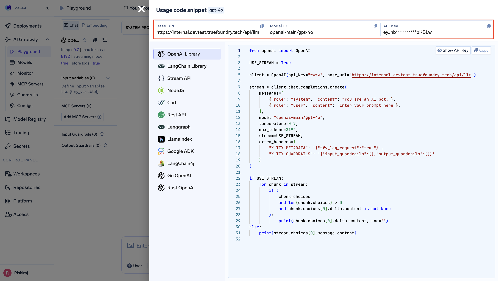
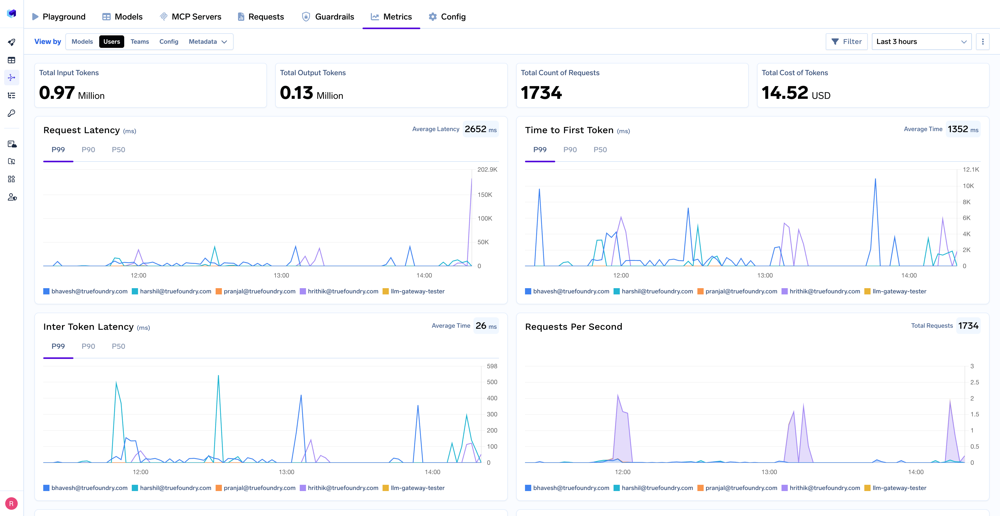
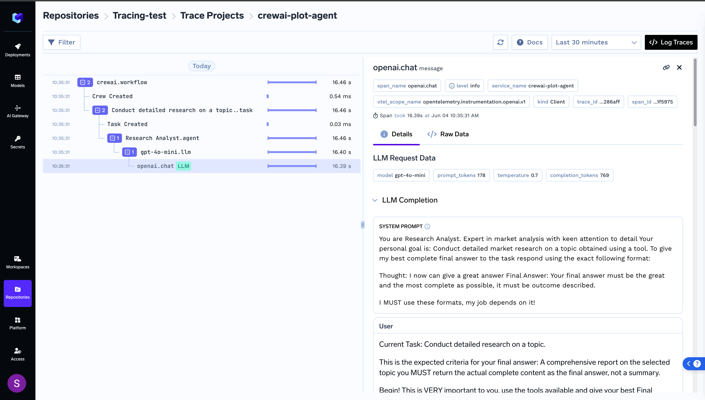

# TrueFoundry Entegrasyonu
TrueFoundry, CrewAI gibi agentik çerçevelerle entegre olabilen ve AI Uygulamalarınız için yönetim ve gözlemlenebilirlik sağlayan, kurumsal kullanıma hazır bir [AI Gateway](https://www.truefoundry.com/ai-gateway) sunar. TrueFoundry AI Gateway, LLM erişimi için birleşik bir arayüz görevi görerek:

- **Birleşik API Erişimi**: OpenAI, Claude, Gemini, Groq, Mistral gibi 250'den fazla LLM'ye tek bir API aracılığıyla bağlanın
- **Düşük Gecikme Süresi**: Akıllı yönlendirme ve yük dengelemesi ile 3ms'den düşük dahili gecikme süresi
- **Kurumsal Güvenlik**: RBAC ve denetim günlüğü ile SOC 2, HIPAA, GDPR uyumluluğu
- **Kota ve maliyet yönetimi**: Token tabanlı kotalar, hız sınırlaması ve kapsamlı kullanım takibi
- **Gözlemlenebilirlik**: Özelleştirilebilir saklama süresi ile eksiksiz istek/yanıt günlüğü, ölçümler ve izlemeler

## TrueFoundry'nin CrewAI ile Entegrasyonu

### Kurulum & Yapılandırma

```bash
pip install crewai
```

1. Bir [TrueFoundry hesabına kaydolun](https://www.truefoundry.com/register)
2. Burada belirtilen adımları izleyin: [Hızlı başlangıç](https://docs.truefoundry.com/gateway/quick-start)



```python
from crewai import LLM

# TrueFoundry AI Gateway ile bir LLM örneği oluşturun
truefoundry_llm = LLM(
    model="openai-main/gpt-4o",  # Benzer şekilde, herhangi bir sağlayıcıdan herhangi bir modeli çağırabilirsiniz
    base_url="your_truefoundry_gateway_base_url",
    api_key="your_truefoundry_api_key"
)

# CrewAI agent'larınızda kullanın
from crewai import Agent

@agent
def researcher(self) -> Agent:
    return Agent(
        config=self.agents_config['researcher'],
        llm=truefoundry_llm,
        verbose=True
    )
```

### Tam CrewAI Örneği

```python
from crewai import Agent, Task, Crew, LLM

# TrueFoundry ile LLM'yi yapılandırın
llm = LLM(
    model="openai-main/gpt-4o",
    base_url="your_truefoundry_gateway_base_url", 
    api_key="your_truefoundry_api_key"
)

# Agent'lar oluşturun
researcher = Agent(
    role='Araştırma Analisti',
    goal='Detaylı pazar araştırması yapın',
    backstory='Detaylara dikkat eden uzman pazar analisti',
    llm=llm,
    verbose=True
)

writer = Agent(
    role='İçerik Yazarı', 
    goal='Kapsamlı raporlar oluşturun',
    backstory='Deneyimli teknik yazar',
    llm=llm,
    verbose=True
)

# Görevler oluşturun
research_task = Task(
    description='2024 için yapay zeka pazarındaki trendleri araştırın',
    agent=researcher,
    expected_output='Kapsamlı araştırma özeti'
)

writing_task = Task(
    description='Pazar araştırması raporu oluşturun',
    agent=writer,
    expected_output='Yapılandırılmış ve içgörüler içeren bir rapor',
    context=[research_task]
)

# Ekip oluşturun ve çalıştırın
crew = Crew(
    agents=[researcher, writer],
    tasks=[research_task, writing_task],
    verbose=True
)

result = crew.kickoff()
```

### Gözlemlenebilirlik ve Yönetim

CrewAI agent'larınızı TrueFoundry'nin ölçümler sekmesi aracılığıyla izleyin:


Truefoundry'nin AI gateway'i ile aşağıdaki öğeleri izleyebilir ve analiz edebilirsiniz:

- **Performans Ölçümleri**: İstek Gecikmesi, İlk Token'a Zaman (TTFS) ve Token Arası Gecikme (ITL) gibi temel gecikme süresi ölçümlerini P99, P90 ve P50 yüzdelik dilimleri ile izleyin
- **Maliyet ve Token Kullanımı**: Giriş/çıkış token'larının ve her model için ilişkili maliyetlerin ayrıntılı dökümü ile uygulamanızın maliyeti hakkında bilgi edinin
- **Kullanım Kalıpları**: Kullanıcı etkinliği, model dağıtımı ve ekip tabanlı kullanım üzerine ayrıntılı analizlerle uygulamanızın nasıl kullanıldığını anlayın
- **Hız sınırı ve Yük dengeleme**: Modelleriniz için hız sınırlaması, yük dengeleme ve yedekleme ayarlayabilirsiniz

## İzleme

İzleme hakkında daha ayrıntılı bilgi için, lütfen [getting-started-tracing](https://docs.truefoundry.com/docs/tracing/tracing-getting-started) bölümüne bakın. İzleme için, Traceloop SDK'yı ekleyebilirsiniz:

```bash
pip install traceloop-sdk
```

```python
from traceloop.sdk import Traceloop

# Gelişmiş izlemeyi başlatın
Traceloop.init(
    api_endpoint="https://your-truefoundry-endpoint/api/tracing",
    headers={
        "Authorization": f"Bearer {your_truefoundry_pat_token}",
        "TFY-Tracing-Project": "your_project_name",
    },
)
```

Bu, CrewAI iş akışınızın tamamı için ek izleme korelasyonu sağlar.
