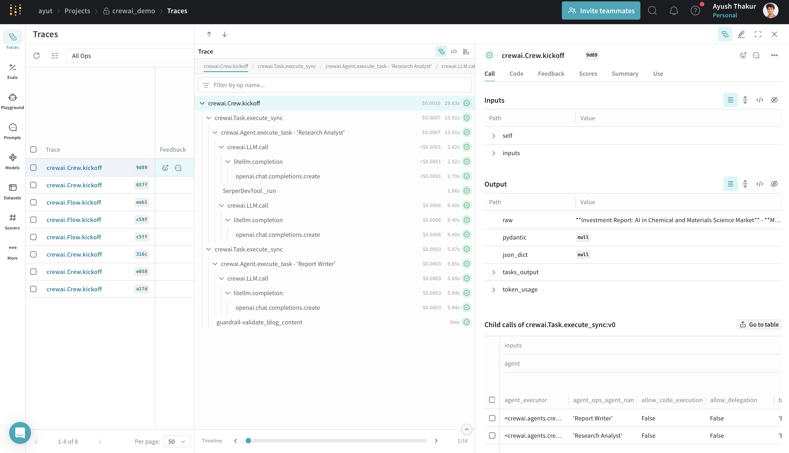

# Weave Genel Bakış

[Weights & Biases (W&B) Weave](https://weave-docs.wandb.ai/) , LLM tabanlı uygulamaların izlenmesi, denemeler yapılması, değerlendirilmesi, konuşlandırılması ve iyileştirilmesi için bir çerçevedir. 


Weave, CrewAI uygulama geliştirme sürecinin her aşaması için kapsamlı destek sağlar:

- **İzleme & İzleme**: Üretim sistemlerini hata ayıklamak ve analiz etmek için LLM çağrılarını ve uygulama mantığını otomatik olarak izleyin
- **Sistemli Yineleme**: İstekleri, veri kümelerini ve modelleri iyileştirin ve yineleyin
- **Değerlendirme**: Sistemli olarak aracı performansı değerlendirmek ve iyileştirmek için özel veya önceden hazırlanmış derecelendiricileri kullanın
- **Koruma**: İçerik denetimi ve istek güvenliği için ön ve son koruyucularla araçlarınızı koruyun

Weave, CrewAI uygulamalarınız için otomatik olarak izleme yakalar, böylece aracınızın performansını, etkileşimlerini ve yürütme akışını izleyebilir ve analiz edebilirsiniz. Bu, daha iyi değerlendirme veri kümeleri oluşturmanıza ve araç iş akışlarınızı optimize etmenize yardımcı olur.

## Kurulum Talimatları


    
```shell
pip install crewai weave
```

    
[Weights & Biases hesabına kaydol](https://wandb.ai) henüz kaydolmadıysanız. İzlemelerinizi ve metriklerinizi görüntülemek için buna ihtiyacınız olacak.
    
    
Uygulamanıza aşağıdaki kodu ekleyin:

```python
import weave

# Proje adınızla Weave'i başlatın
weave.init(project_name="crewai_demo")
```
      
Başlatma işleminden sonra, izlemelerinizi ve metriklerinizi görüntüleyebileceğiniz bir URL sağlanacaktır.
    
    
```python
from crewai import Agent, Task, Crew, LLM, Process

# Sıfır sıcaklık değeri ile deterministik çıktıları sağlamak için bir LLM oluşturun
llm = LLM(model="gpt-4o", temperature=0)

# Aracı oluşturun
researcher = Agent(
    role='Araştırma Analisti',
    goal='En iyi yatırım fırsatlarını bulun ve analiz edin',
    backstory='Finansal analiz ve pazar araştırmalarında uzman',
    llm=llm,
    verbose=True,
    allow_delegation=False,
)

    writer = Agent(
        role='Rapor Yazarı',
        goal='Açık ve öz yatırım raporları yazın',
        backstory='Ayrıntılı finansal raporlar oluşturma konusunda deneyimli',
        llm=llm,
        verbose=True,
        allow_delegation=False,
      )

      # Görevleri oluşturun
      research_task = Task(
          description='{konu} üzerinde derinlemesine araştırma yapın',
          expected_output='Önemli oyuncuları, pazar büyüklüğünü ve büyüme eğilimlerini içeren kapsamlı pazar verileri.',
          agent=researcher
      )

      writing_task = Task(
          description='Araştırmaya göre ayrıntılı bir rapor yazın',
          expected_output='Rapor kolay okunabilir ve anlaşılır olmalıdır. Gerekirse madde işaretleri kullanın.',
          agent=writer
      )

      # Bir ekip oluşturun
      crew = Crew(
          agents=[researcher, writer],
          tasks=[research_task, writing_task],
          verbose=True,
          process=Process.sequential,
      )

      # Ekibi çalıştırın
      result = crew.kickoff(inputs={"topic": "Malzeme biliminde yapay zeka"})
      print(result)
```
    
    
CrewAI uygulamanızı çalıştırdıktan sonra, izlemelerinizi ve metriklerinizi görüntülemek için başlatma sırasında sağlanan Weave URL'sini ziyaret edin:
- LLM çağrıları ve meta verileri
- Aracı etkileşimleri ve görev yürütme akışı
- Gecikme ve belirteç kullanımı gibi performans metrikleri
- Yürütme sırasında meydana gelen hatalar veya sorunlar

      

      
    


## Özellikler

- Weave, tüm CrewAI işlemlerini otomatik olarak yakalar: aracı etkileşimleri ve görev yürütmeleri; meta verileri ve belirteç kullanımı ile LLM çağrıları; araç kullanımı ve sonuçlar.
- Bu entegrasyon, tüm CrewAI yürütme yöntemlerini destekler: `kickoff()`, `kickoff_for_each()`, `kickoff_async()`, ve `kickoff_for_each_async()`.
- Tüm [crewAI-tools](https://github.com/crewAIInc/crewAI-tools) işlemlerinin otomatik izlenmesi.
- Dekoratör düzeltme (`@start`, `@listen`, `@router`, `@or_`, `@and_`) ile Akış özelliği desteği.
- CrewAI `Görev` nesnesine iletilen özel koruyucuları `@weave.op()` ile izleyin.

Desteklenenler hakkında daha ayrıntılı bilgi için, [Weave CrewAI belgelerine](https://weave-docs.wandb.ai/guides/integrations/crewai/#getting-started-with-flow) bakın.

## Kaynaklar

- [📘 Weave Belgeleri](https://weave-docs.wandb.ai)
- [📊 Weave x CrewAI örnek panosu](https://wandb.ai/ayut/crewai_demo/weave/traces?cols=%7B%22wb_run_id%22%3Afalse%2C%22attributes.weave.client_version%22%3Afalse%2C%22attributes.weave.os_name%22%3Afalse%2C%22attributes.weave.os_release%22%3Afalse%2C%22attributes.weave.os_version%22%3Afalse%2C%22attributes.weave.source%22%3Afalse%2C%22attributes.weave.sys_version%22%3Afalse%7D&peekPath=%2Fayut%2Fcrewai_demo%2Fcalls%2F0195c838-38cb-71a2-8a15-651ecddf9d89)
- [🐦 X](https://x.com/weave_wb)