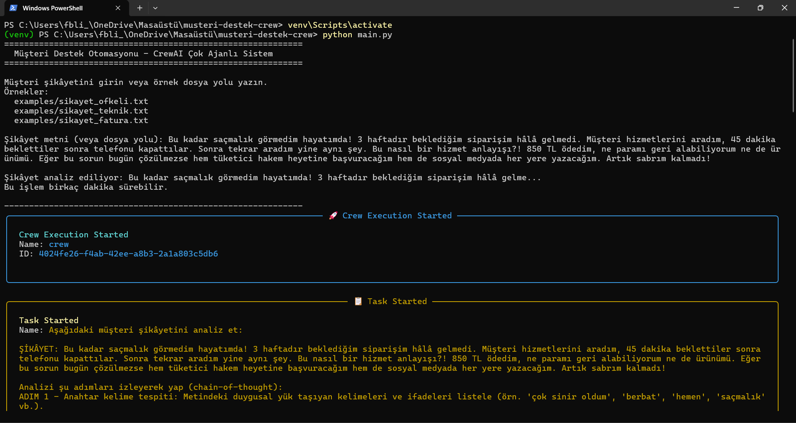

# CrewAI Müşteri Destek Otomasyonu

Bir müşteri şikâyeti girildiğinde 4 yapay zeka ajanı sırayla (kısmen paralel) çalışarak **duygu analizi**, **kategori tespiti**, **yanıt taslağı** ve **eskalasyon kararı** üreten çok ajanlı sistem.


---

## Problem Tanımı

Bu uygulama, büyük ölçekli işletmelerin müşteri hizmetleri departmanlarında yaşanan şu sorunları çözmektedir:

| Sorun | Açıklama |
|---|---|
| **Yüksek iş yükü** | Temsilciler her gün yüzlerce şikâyeti manuel olarak incelemek zorunda kalır |
| **Tutarsız sınıflandırma** | Farklı temsilciler aynı şikâyeti farklı kategorilere atayarak hatalı yönlendirmelere yol açar |
| **Gecikmiş yanıtlar** | Manuel inceleme süreçleri müşteri bekleme sürelerini uzatır ve memnuniyeti düşürür |
| **Eskalasyon hataları** | Kritik şikâyetler gözden kaçabilir ya da yanlış departmana iletilebilir |
| **Ton uyumsuzluğu** | Öfkeli müşteriye soğuk, sakin müşteriye aşırı duygusal yanıt verilmesi deneyimi olumsuz etkiler |

**Çözüm:** Şikâyet analizi, sınıflandırma, yanıt oluşturma ve eskalasyon kararlarını uçtan uca otomatikleştiren 4 ajanlı bir sistem.

---

## Prompt Stratejisi

Bu projede beş farklı prompt mühendisliği tekniği bir arada kullanılmıştır:

### 1. Role Prompting
Her ajana güçlü bir uzman kimliği ve backstory verilir. Ajan bu kimlikle hareket ederek daha uzmanlaşmış ve tutarlı çıktılar üretir.

```
"Sen, 10 yıllık deneyime sahip bir müşteri psikolojisi ve duygu analizi uzmanısın.
Binlerce müşteri şikâyetini analiz etmiş..."
```

### 2. Chain-of-Thought (Adım Adım Düşünme)
Duygu Analizcisi'ne görevi 5 belirli adımda gerçekleştirmesi talimatı verilir. Bu sayede ajan kararını nasıl verdiğini açıklar ve çıktı denetlenebilir hale gelir.

```
ADIM 1 - Anahtar kelime tespiti
ADIM 2 - Duygu türü belirleme
ADIM 3 - Yoğunluk skoru (1-10)
ADIM 4 - Skor gerekçesi
ADIM 5 - Tek cümlelik özet
```

### 3. Structured Output (Yapılandırılmış Çıktı)
Her görevin `expected_output` alanında çıktının hangi başlıkları ve bilgileri içermesi gerektiği açıkça tanımlanır. Ajan bu şablonu takip ederek tutarlı, ayrıştırılabilir sonuçlar üretir.

### 4. Context Chaining (Bağlam Zinciri)
CrewAI'nin `context` parametresi ile her ajan önceki ajanların çıktılarını doğrudan girdi olarak alır. Yanıt Yazarı hem duygu skorunu hem kategoriyi bilir; Eskalasyon Yöneticisi tüm önceki çıktıları değerlendirir.

```python
yanit_taslagi = Task(
    context=[duygu_analizi, kategori_tespiti],
    ...
)
```

### 5. Tone Conditioning (Ton Koşullaması)
Yanıt Yazarı'na duygu skoruna göre hangi tonu kullanacağı prompt içinde açıkça belirtilir:

| Duygu Skoru | Seçilen Ton |
|---|---|
| 1 – 3 | Arkadaşça, bilgilendirici |
| 4 – 6 | Anlayışlı, profesyonel |
| 7 – 10 | Güçlü empati, sakin ama kararlı |

---

## Teknik Mimari

### Kullanılan LLM ve Kütüphaneler

| Bileşen | Detay |
|---|---|
| **Framework** | CrewAI >= 1.11.0 |
| **Dil** | Python 3.11 |
| **Varsayılan LLM** | Ollama — `gemma3:12b` (yerel, ücretsiz) |
| **Alternatif LLM** | OpenAI `gpt-4o-mini`, Anthropic `claude-haiku-4-5` |
| **LLM Soyutlaması** | `crewai.LLM` (litellm tabanlı) |

### Önemli CrewAI Özellikleri

**Paralel görev çalışması (`async_execution=True`):**
Duygu Analizcisi ve Kategori Uzmanı birbirinden bağımsız olduğu için eş zamanlı başlatılır. Toplam çalışma süresi yaklaşık yarıya düşer.

```python
duygu_analizi = Task(..., async_execution=True)
kategori_tespiti = Task(..., async_execution=True)
```

**Bağlam aktarımı (`context`):**
Her ajan önceki ajanların çıktılarını otomatik olarak alır; manuel veri aktarımı gerekmez.

**Sıralı süreç (`Process.sequential`):**
Görevler tanımlanan sırada yürütülür. Async görevler tamamlanmadan bağımlı görevler başlamaz.

**LLM esnekliği:**
`.env` dosyasındaki tek bir değişkenle (`LLM_PROVIDER`) kod değişikliği yapmadan farklı LLM sağlayıcılarına geçiş yapılabilir.

### Çıktı Formatı

Her çalışma `output/rapor_YYYYMMDD_HHMMSS.md` olarak kaydedilir. Dosya şunları içerir: şikâyet metni, duygu analizi, kategori raporu, yanıt taslağı, eskalasyon kararı.

---

## Ekran Görüntüsü / Demo



**Örnek terminal çıktısı (fatura şikâyeti):**

```
╔══════════════════════════════════════╗
  Müşteri Destek Otomasyonu - CrewAI
╚══════════════════════════════════════╝

[Duygu Analizcisi]  → Skor: 6/10 | Duygu: Hayal kırıklığı + Endişe
[Kategori Uzmanı]   → Fatura & Ödeme > Çift Ödeme | Aciliyet: Yüksek
[Yanıt Yazarı]      → Ton: Orta (4-6) | Empati + Çözüm taslağı üretildi
[Eskalasyon]        → Evet | P2 | Finans & Muhasebe

Rapor kaydedildi: output/rapor_20260331_181951.md
```

---

## Agent Akış Diyagramı

```
Müşteri Şikâyeti
       │
       ├──────────────────────────────┐
       ▼                              ▼
 [1] Duygu Analizcisi         [2] Kategori Uzmanı
  (async — paralel)            (async — paralel)
       │                              │
       └──────────────┬───────────────┘
                      ▼
              [3] Yanıt Yazarı
                      │
                      ▼
           [4] Eskalasyon Yöneticisi
                      │
                      ▼
             output/rapor_*.md
```

---

## Agentlar

| # | Agent | Rol | Görev |
|---|-------|-----|-------|
| 1 | **Duygu Analizcisi** | Müşteri Duygu Analizi Uzmanı | Duygu türü (öfke/hayal kırıklığı/endişe/sakin) ve yoğunluk skoru (1-10) |
| 2 | **Kategori Uzmanı** | Müşteri Hizmetleri Kategori Analisti | Ana kategori, alt kategori ve aciliyet seviyesi (düşük/orta/yüksek/acil) |
| 3 | **Yanıt Yazarı** | Kıdemli Müşteri İlişkileri Uzmanı | Duygu skoruna göre ton seçerek empati içeren yanıt taslağı |
| 4 | **Eskalasyon Yöneticisi** | Müşteri Destek Süpervizörü | Eskalasyon kararı (Evet/Hayır), öncelik (P1-P4), departman ataması |

### Kategoriler

| Ana Kategori | Örnekler |
|---|---|
| Teknik Destek | Uygulama/site hatası, ürün arızası, kullanım sorunu |
| Fatura & Ödeme | Yanlış tutar, çift ödeme, fatura hatası |
| İade & Değişim | Ürün iadesi, değişim talebi, hasarlı ürün |
| Kargo & Teslimat | Geç teslimat, kayıp kargo, yanlış adres |
| Genel Bilgi | Soru, öneri, dilek |

### Eskalasyon Kriterleri

- Duygu skoru **8 veya üzeri**
- Finansal kayıp **200 TL üzeri**
- Teknik arıza veya güvenlik sorunu
- Hukuki tehdit içeriyor
- Birinci seviye destek çözemiyor

---

## Kullanılan Prompt Mühendisliği Teknikleri

| Teknik | Nerede Kullanıldı |
|---|---|
| **Role Prompting** | Her agent'a güçlü bir uzman kimliği ve backstory verildi |
| **Chain-of-Thought** | Duygu analizcisi 5 adımda düşünür: anahtar kelime → duygu → skor → gerekçe → özet |
| **Structured Output** | Her task'ın `expected_output` alanı çıktı formatını açıkça tanımlar |
| **Context Chaining** | `context=[task1, task2]` ile önceki agent çıktıları sonraki agent'a aktarılır |
| **Tone Conditioning** | Yanıt yazarı duygu skoruna göre otomatik ton seçer (1-3: arkadaşça, 4-6: anlayışlı, 7-10: empati odaklı) |

---

## Kurulum

### Gereksinimler

- Python 3.11 (CrewAI, Python 3.14 ile uyumlu **değildir**)
- [Ollama](https://ollama.com) (varsayılan) veya OpenAI/Anthropic API anahtarı

### Adımlar

```bash
# 1. Projeyi klonla veya indir
cd musteri-destek-crew

# 2. Virtual environment oluştur (Python 3.11 ile)
py -3.11 -m venv venv

# 3. Aktif et
# Windows:
venv\Scripts\activate
# Linux/Mac:
source venv/bin/activate

# 4. Bağımlılıkları yükle
pip install -r requirements.txt

# 5. .env dosyasını oluştur
copy .env.example .env
```

### LLM Yapılandırması (`.env`)

**Ollama (varsayılan — ücretsiz, yerel):**
```env
LLM_PROVIDER=ollama
OLLAMA_MODEL=gemma3:12b
OLLAMA_BASE_URL=http://localhost:11434/v1
```

**OpenAI:**
```env
LLM_PROVIDER=openai
OPENAI_API_KEY=sk-...
OPENAI_MODEL=gpt-4o-mini
```

**Anthropic:**
```env
LLM_PROVIDER=anthropic
ANTHROPIC_API_KEY=sk-ant-...
ANTHROPIC_MODEL=claude-haiku-4-5-20251001
```

Ollama kullanıyorsan modeli önce çekmeyi unutma:
```bash
ollama pull gemma3:12b
```

---

## Kullanım

```bash
python main.py
```

Çalışınca şikâyet metnini doğrudan yazabilir veya örnek dosya yolu girebilirsin:

```
Şikâyet metni (veya dosya yolu): examples/sikayet_ofkeli.txt
```

### Örnek Şikâyetler

| Dosya | İçerik |
|---|---|
| `examples/sikayet_ofkeli.txt` | Geç teslimat + kötü müşteri hizmetleri deneyimi |
| `examples/sikayet_teknik.txt` | Garantili ürün arızası |
| `examples/sikayet_fatura.txt` | Çift ödeme / fazla tahsilat |

### Çıktı

Her çalışma sonunda `output/rapor_YYYYMMDD_HHMMSS.md` dosyası oluşturulur.

---

## Örnek Çıktı

**Şikâyet:** *"340 TL fazladan çekildi, iade edin."*

```
Duygu Analizi:
  - Duygu türü : Hayal kırıklığı + Endişe
  - Yoğunluk   : 6 / 10

Kategori:
  - Ana        : Fatura & Ödeme
  - Alt        : Çift Ödeme
  - Aciliyet   : Yüksek

Yanıt Taslağı:
  "Böyle bir sorunla karşılaşmanızdan üzüntü duyuyoruz.
   340 TL iade işlemi başlatılacaktır..."

Eskalasyon:
  - Karar      : Evet
  - Öncelik    : P2 (2 saat içinde)
  - Departman  : Finans & Muhasebe
```

---

## Proje Yapısı

```
musteri-destek-crew/
├── config.py          # LLM yapılandırması (Ollama/OpenAI/Anthropic)
├── agents.py          # 4 agent tanımı
├── tasks.py           # 4 task (1 ve 2 async_execution=True)
├── crew.py            # Crew birleştirme ve çalıştırma
├── main.py            # Giriş noktası
├── requirements.txt
├── .env.example
├── output/            # Üretilen raporlar
└── examples/          # Örnek şikâyet dosyaları
    ├── sikayet_ofkeli.txt
    ├── sikayet_teknik.txt
    └── sikayet_fatura.txt
```

---

## Teknolojiler

- [CrewAI](https://github.com/crewAIInc/crewAI) — Çok ajanlı orkestrasyon framework'ü
- [Ollama](https://ollama.com) — Yerel LLM çalıştırma
- Python 3.11
